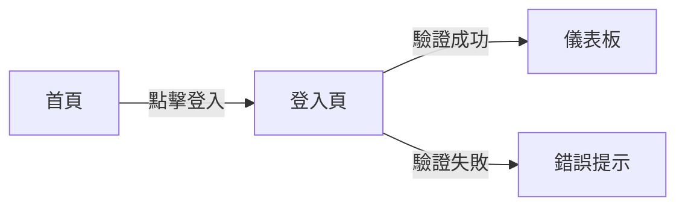

# [Product/Feature Name] PRD

| Attribute | Details |
| :--- | :--- |
| **Status** | Draft / Review / Approved |
| **Author** | [Name] |
| **Reviewers** | [Names] |
| **Last Updated** | YYYY-MM-DD |

## 1. Introduction
### 1.1 Problem Statement
描述目前使用者遇到的痛點或是市場機會。

### 1.2 Goals & Objectives
*   目標 1: e.g., 提升使用者留存率 10%。
*   目標 2: e.g., 減少操作步驟從 5 步到 2 步。

### 1.3 Success Metrics (KPIs)
如何衡量此功能的成功？(e.g., DAU, 轉化率, 載入時間)

## 2. User Stories
| ID | As a (Role) | I want to (Action) | So that (Benefit) | Priority |
| :--- | :--- | :--- | :--- | :--- |
| US-01 | 一般使用者 | 點擊一鍵備份按鈕 | 將所有書籤存到雲端 | High |
| US-02 | 管理員 | 查看每週備份統計 | 了解系統負載 | Medium |

## 3. Functional Requirements
### 3.1 Feature A
詳細描述 Feature A 的行為。
*   **FR-01**: 系統必須...
*   **FR-02**: 當使用者...

### 3.2 Feature B
...

## 4. User Experience (UI/UX)
描述介面流程或附上設計連結。

## 5. Non-Functional Requirements
*   **Security**: e.g., 密碼存儲需加密。
*   **Performance**: e.g., API 響應 < 200ms。
*   **Compatibility**: e.g., 支援 iOS 15+, Android 10+。

## 6. Analytics & Tracking
*   Track Event: `button_click` {source: "home"}
*   Track Event: `api_error` {code: 500}

## 7. Out of Scope
*   不支援 IE 瀏覽器。
