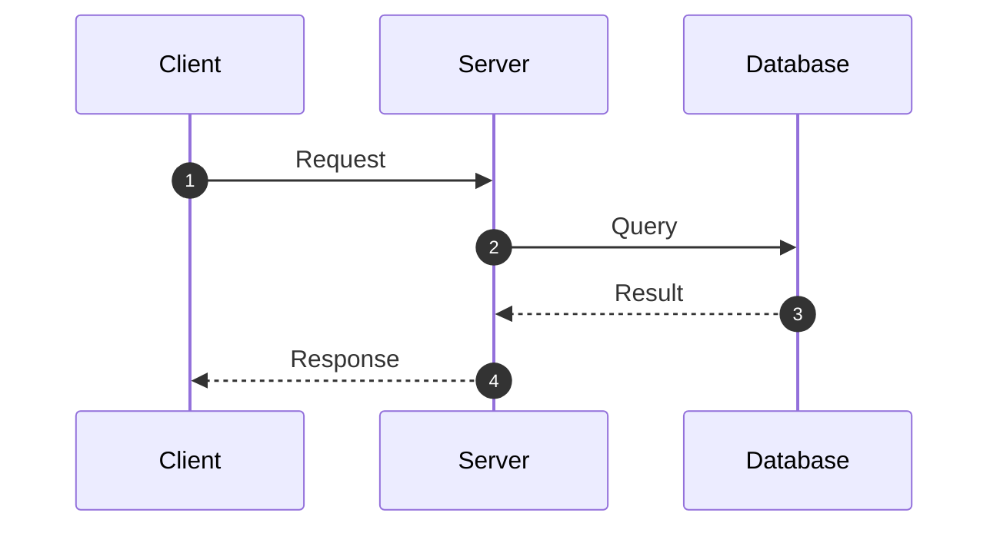
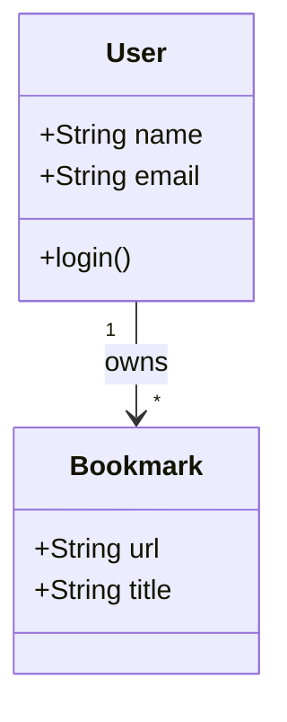
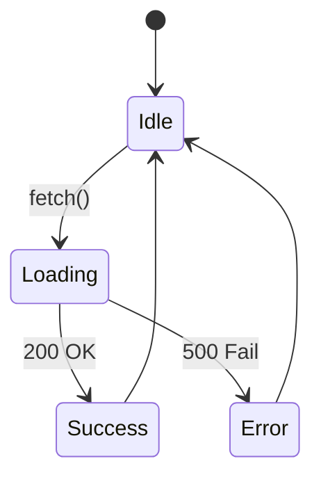
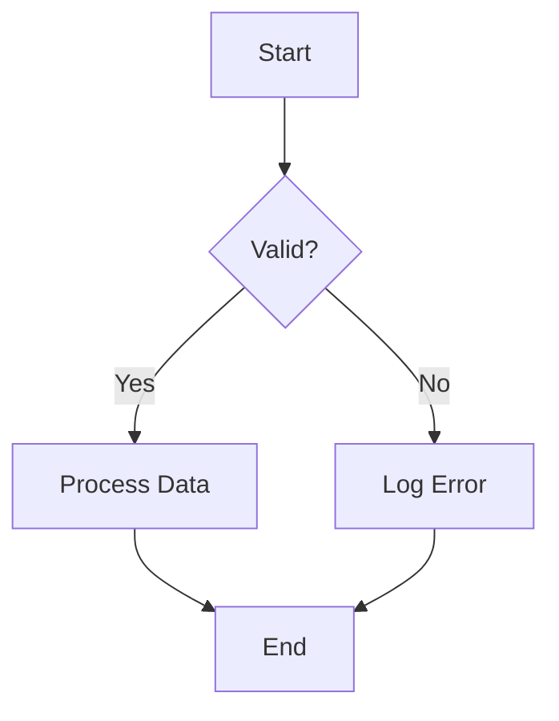

# Mermaid Diagram Guide for System Analysis

## 1. Sequence Diagram (循序圖)
用於展示物件之間的交互順序，適合 API 調用流程或訊息傳遞。

## 2. Class Diagram (類別圖)
用於展示資料結構或類別關係。

## 3. State Diagram (狀態圖)
用於展示物件的生命週期狀態變化。

## 4. Flowchart (流程圖)
用於展示演算法或業務邏輯判斷。

