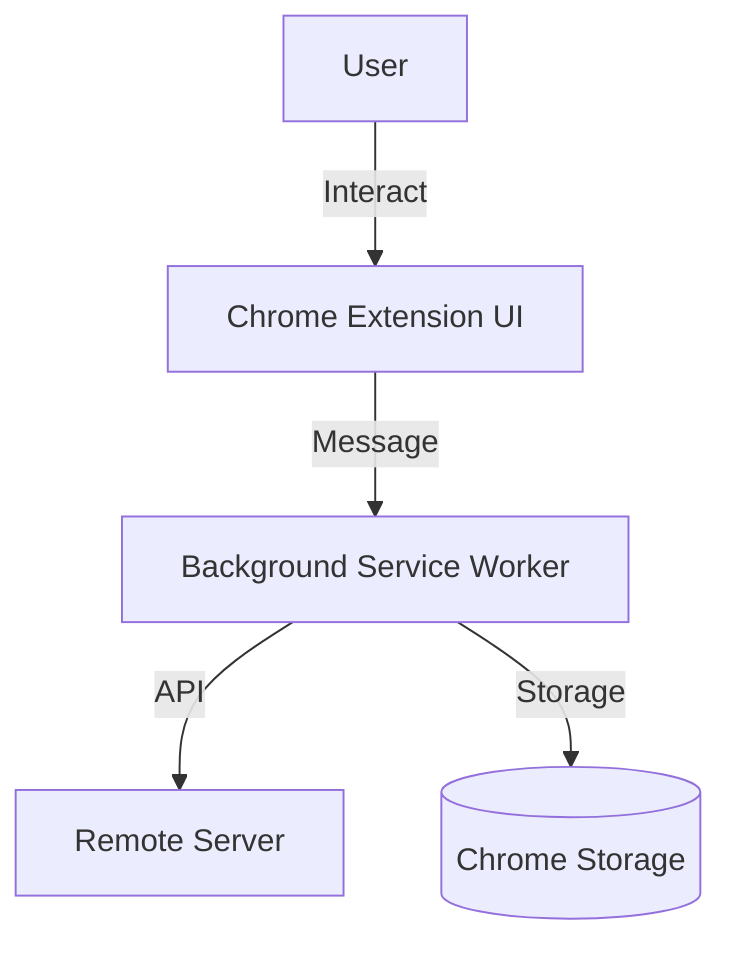
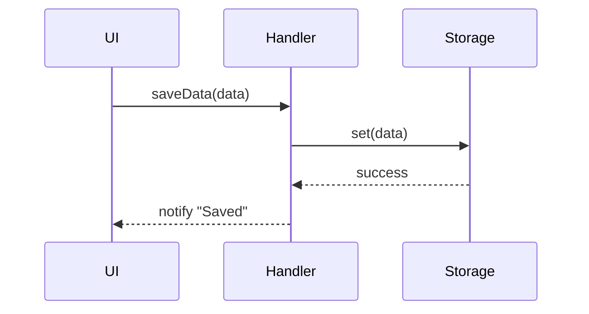

# [System Name/Feature] System Design Document

| Attribute | Details |
| :--- | :--- |
| **Status** | Draft / Review / Approved |
| **Author** | [Name] |
| **Related PRD** | [Link to PRD] |

## 1. Overview
### 1.1 Scope
本文件涵蓋的技術範圍，以及不包含的部分。

### 1.2 Architecture Diagram
高層架構圖 (Context Diagram or Container Diagram)。



## 2. Component Design
### 2.1 [Module A]
*   **Description**: 功能描述。
*   **Responsibilities**: 職責清單。
*   **Dependencies**: 依賴的其他模組。
*   **Interfaces**: 暴露的 Public Methods。

### 2.2 [Module B]
...

## 3. Data Design
### 3.1 Data Models (Schema)
定義核心資料結構。

```json
// UserSettings
{
  "theme": "dark",
  "notifications": true,
  "lastSync": 1678900000
}
```

### 3.2 Storage Strategy
*   **Persistent**: `chrome.storage.local` (User data)
*   **Session**: `sessionStorage` (Temporary state)

## 4. Interface Design (API)
### 4.1 Internal API (Message Passing)
定義 Extension 內部的通訊協議。

*   **Request**: `GET_USER_DATA`
    *   Payload: `{ userId: string }`
*   **Response**:
    *   Success: `{ user: UserProfile }`
    *   Error: `{ error: string }`

## 5. Sequence Flows
關鍵業務流程的循序圖。



## 6. Security & Performance
*   **Security**: 輸入驗證 (Sanitization), 權限檢查。
*   **Performance**: 大量資料的分頁加載, 緩存策略。
