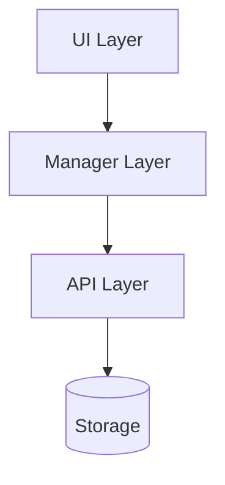
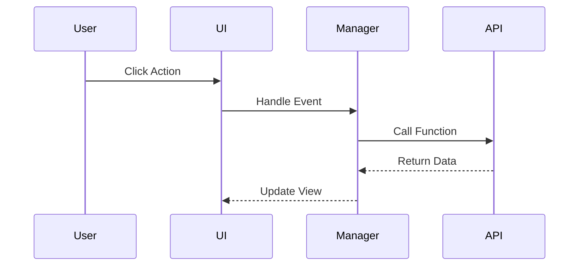

# SDD Phase 2: Design (SA)

> 此文件為 SDD 流程的 Phase 2 快速參考指南，詳細內容請參考 **SA Skill**。

## 📚 完整資源

- **Skill 文件**: [`.agent/skills/sa/SKILL.md`](../../sa/SKILL.md)
- **完整模板**: [`.agent/skills/sa/references/system_design_doc.md`](../../sa/references/system_design_doc.md)
- **圖表指南**: [`.agent/skills/sa/references/diagram_guide.md`](../../sa/references/diagram_guide.md)

---

## 快速檢查清單

在撰寫 `SA_spec.md` 時，確保包含以下核心區塊：

- [ ] **Header**: Version, Status, Related PRD (with version)
- [ ] **Requirement Traceability**: 每個 FR 必須對應到 SA Section
- [ ] **Architecture Diagram**: 高層架構圖 (Mermaid)
- [ ] **Component Design**: 模組職責與介面定義
- [ ] **Data Design**: Schema 變更與儲存策略
- [ ] **Sequence Flows**: 關鍵流程的循序圖
- [ ] **Testing Strategy**: Test Impact Analysis

---

## Requirement Traceability 範例

| Req ID | PRD Section | SA Section | Implementation File | Test File |
|--------|-------------|------------|---------------------|-----------|
| FR-01  | PRD 3.1     | SA 3.1     | `tabRenderer.js`    | `tab.test.js` |
| FR-02  | PRD 3.2     | SA 3.2     | `bookmarkRenderer.js` | `bookmark.test.js` |

---

## 常用 Mermaid 圖表

### Architecture Diagram

### Sequence Diagram

---

## Test Impact Analysis 範例

| Test File | Impact | Action Required |
|-----------|--------|-----------------|
| `perf_benchmark.test.js` | Import path change | Update imports from `tabRenderer` to `otherWindowRenderer` |
| `other_windows.test.js` | DOM structure dependency | Ensure CSS selectors remain unchanged |

---

## 版本控制

- SA 必須標註對應的 PRD 版本 (e.g., `PRD Version: v1.0`)
- SA 進入 **Frozen** 狀態後，需遵循 Change Request 流程
