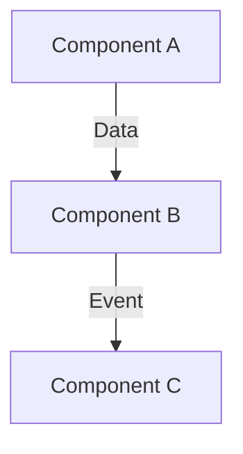
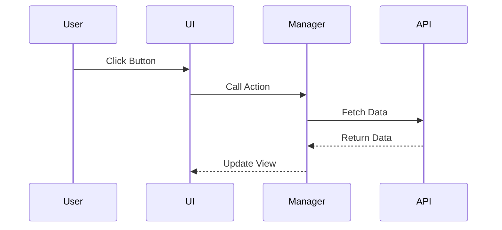

# [Feature Name] Technical Design

**Source Requirements**: [Link to requirements.md]

## Architecture Overview
High-level description of the technical implementation.



## Data Structures / Schema Changes
### LocalStorage / Chrome Storage
```json
{
  "key": "value"
}
```

### Interfaces (TypeScript/JSDoc)
```javascript
/**
 * @typedef {Object} UserProfile
 * @property {string} id
 * @property {string} name
 */
```

## Component Design
### [Component/Module Name]
- **Responsibilities**:
- **Public API**:
    - `method1(arg)`: description
- **Files Modified**:
    - `path/to/file.js`

## Sequence Diagrams
Interactions between components.


