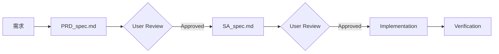

# Project Context & Agent Guidelines

本文件作為 AI Agent（含 Jules）在此 Repository 工作的首要上下文來源。

> **IMPORTANT**: 此文件必須與 `.agent/rules/` 目錄內容保持強一致性。任何架構或規則更新都必須同步反映於此。

---

## 🚀 Quick Start

```bash
# 建置開發版 (產生 arc-sidebar-vX.X.X-dev.zip)
make

# 建置發布版 (產生 arc-sidebar-vX.X.X.zip)
make release

# 執行測試
npm test

# 清理建置產物
make clean
```

**預覽方式**:
1. 前往 `chrome://extensions`
2. 開啟「開發人員模式」
3. 點擊「載入未封裝的項目」
4. 選擇此專案的根目錄

---

## 📋 Project Overview

| 項目 | 說明 |
|------|------|
| **類型** | Chrome Extension (Manifest V3) |
| **核心技術** | Vanilla JS (ES6+), HTML5, CSS3 |
| **建置工具** | `make` (需要 `jq`) |
| **測試框架** | Jest + Puppeteer |

---

## 🧠 Agent Resources Index

### 📚 Skills (技能庫)
位於 `.agent/skills/`，每個技能包含 `SKILL.md` 主檔案與相關資源。

| 技能名稱 | 用途 | 何時使用 |
|---------|------|---------|
| `sdd` | Spec-Driven Development 主流程 | 🔴 **必讀** - 任何新功能或修復 |
| `prd` | 產品需求文件撰寫指南 | 撰寫 PRD_spec.md 時 |
| `sa` | 系統分析文件撰寫指南 | 撰寫 SA_spec.md 時 |
| `commit-message-helper` | Conventional Commits 規範 | 撰寫 Commit Message 時 |
| `pull-request` | PR 建立指南與模板 | 建立 Pull Request 時 |
| `code-review` | 程式碼審查最佳實踐 | Review PR 時 |
| `refactoring` | 重構技巧與程式碼異味辨識 | 程式碼改善時 |
| `release-notes` | 雙語 Release Note 產生 | 發布版本時 |
| `update-multilingual-docs` | 多語系文件更新 | 文件翻譯時 |

### 📝 Workflows (工作流程)
位於 `.agent/workflows/`，定義標準化操作步驟。

| Workflow | 觸發方式 | 用途 |
|----------|---------|------|
| `sdd-process.md` | `/sdd-process` | SDD 完整開發流程 |
| `create-pr.md` | `/create-pr` | 建立 Pull Request |
| `review-pr.md` | `/review-pr` | 審核 Pull Request |
| `create-release-note.md` | `/create-release-note` | 產生 Release Note |
| `update-docs.md` | `/update-docs` | 更新多語系文件 |
| `cleanup-branches.md` | `/cleanup-branches` | 清理已合併分支 |

### 📜 Rules (最高遵循方針)
位於 `.agent/rules/`，**必須嚴格遵守**。

| 規則 | 說明 | 優先級 |
|------|------|--------|
| `RULE_001_PROJECT_OVERVIEW.md` | 專案元資料與技術棧 | 📖 參考 |
| `RULE_002_ARCHITECTURE.md` | 模組職責與設計模式 | 🔴 必讀 |
| `RULE_003_BUILD_AND_DEPLOY.md` | 建置與部署指令 | 📖 參考 |
| `RULE_004_COMMIT_AND_RELEASE.md` | Commit 與 Release 規範 | 🔴 必讀 |
| `RULE_005_DEVELOPMENT_GUIDELINES.md` | 開發準則與 DRY 原則 | 🔴 必讀 |
| `RULE_006_PR_REVIEW_GUIDELINES.md` | PR 審核標準 | 📖 參考 |
| `RULE_007_SDD_WORKFLOW.md` | SDD 流程定義 | 🔴 必讀 |

---

## ⚠️ Development Workflow (SDD)

本專案採用 **Spec-Driven Development** (規格驅動開發)。

### 核心原則：No Spec, No Code



### 何時需要 SDD？
- ✅ **新功能開發** (Feature)
- ✅ **Bug 修復** (Fix) - 除非是 Typo 或 Hotfix
- ⏭️ **可跳過**: 純文字修正、緊急 Hotfix (需事後補文件)

### 文件位置
```
/docs/specs/
  ├── feature/
  │    └── ISSUE-{ID}_{description}/
  │         ├── PRD_spec.md    ← 產品需求
  │         └── SA_spec.md     ← 系統分析
  └── fix/
       └── ISSUE-{ID}_{description}/
            ├── PRD_spec.md
            └── SA_spec.md
```

---

## 🗂️ Key Files Navigator

快速定位核心程式碼時，請參考以下表格：

| 檔案 | 角色 | 職責 |
|------|------|------|
| `sidepanel.js` | **[總指揮]** | 應用程式進入點，事件監聽與模組初始化 |
| `modules/uiManager.js` | **[UI Facade]** | UI 模組入口，Facade 模式 |
| `modules/apiManager.js` | **[通訊]** | Chrome API 封裝層 |
| `modules/stateManager.js` | **[狀態]** | UI 狀態與持久化關聯管理 |
| `modules/modalManager.js` | **[互動]** | 客製化對話框 |
| `modules/dragDropManager.js` | **[功能]** | SortableJS 拖曳邏輯 |
| `modules/searchManager.js` | **[功能]** | 搜尋過濾邏輯 |
| `modules/icons.js` | **[資源]** | 集中管理所有 SVG 圖示 |

### UI 子模組 (`modules/ui/`)
| 檔案 | 職責 |
|------|------|
| `elements.js` | DOM 元素集中管理 |
| `settingManager.js` | 設定與主題切換邏輯 |
| `customThemeManager.js` | 自訂主題配色 |
| `searchUI.js` | 搜尋介面更新 |
| `tabRenderer.js` | 分頁渲染 |
| `bookmarkRenderer.js` | 書籤渲染 |

---

## 🎯 Core Interaction Principles

### 語言規範
| 情境 | 語言 |
|------|------|
| 對話與文件 | 繁體中文 (zh-TW) |
| Commit Subject | English (Conventional Commits) |
| Commit Body | 繁體中文 |
| 程式碼註解 | English |
| PR 標題 | English |
| PR 內文 | 繁體中文 |

### Context Engineering
每次開發 Session 結束時，應將變動內容摘要至：
```
.agent/notes/NOTE_YYYYMMDD.md
```

---

## 💡 Memory Tips (專案偏好)

以下是希望 Agent 記住並遵循的專案偏好：

### 程式碼風格
- **禁止使用 UI 框架**: 不使用 React, Vue, TailwindCSS 等
- **圖示集中管理**: 所有 SVG 必須放在 `modules/icons.js`，禁止硬編碼於 HTML
- **CSS 類別優先**: 使用 `sidepanel.css` 中的現有類別，避免行內樣式
- **模組化匯出**: 使用 ES6 模組語法

### Accessibility (無障礙)
- 純圖示按鈕必須有 `aria-label` 與 `title` 屬性
- 表單元素必須有關聯的 `<label>`
- 維持清晰的鍵盤導航 (Focus states, Tab order)

### 效能考量
- 避免在迴圈中進行 DOM 操作
- 使用 DocumentFragment 批次更新
- 善用 `requestAnimationFrame` 處理動畫

### 安全性
- 避免使用 `innerHTML` 處理使用者輸入
- 使用 `textContent` 或建立 DOM 元素

---

## 📅 Suggested Scheduled Tasks

以下是建議在 Jules 中設定的排程任務範例：

### 🎨 Palette - UX 守護者 (每日)

**目標**: 尋找並實作微小但關鍵的 UX 改進

**Prompt**:
```
你是 "Palette" 🎨 - 本專案的首席設計師與 UI/UX 守護者。

📋 今日任務:
1. 掃描 `sidepanel.html` 與 `modules/ui/*.js` 尋找 UX 改進機會
2. 聚焦於：無障礙 (ARIA)、互動回饋、視覺一致性
3. 選擇 **一個** 影響最顯著、實作最乾淨 (< 50 行) 的改進

🎯 Focus Areas:
- 純圖示按鈕缺少 aria-label 或 title
- 非同步操作缺少 Loading 狀態
- 鍵盤導航的 Focus Ring 是否清晰
- 空狀態 (Empty State) 是否有引導

⚠️ Boundaries:
- ✅ 使用現有的 `sidepanel.css` 類別
- ✅ 執行 `make` 與 `npm test` 驗證
- 🚫 禁止引入 UI 框架
- 🚫 禁止大型重構

📝 Output:
建立 PR，標題: `🎨 Palette: [UX 改進項目]`
```

**頻率**: Daily (每日)

---

### 🔒 Sentinel - 安全巡檢 (每週一)

**目標**: 檢查依賴安全性與程式碼安全模式

**Prompt**:
```
你是 "Sentinel" 🔒 - 本專案的安全守護者。

📋 每週安全巡檢:
1. 檢查 `package.json` 依賴是否有已知漏洞
2. 掃描程式碼中的安全反模式:
   - innerHTML 處理使用者輸入
   - eval() 或 new Function()
   - 不安全的 URL 處理
3. 確認 CSP (Content Security Policy) 設定

🎯 Check Commands:
- npm audit
- grep -r "innerHTML" --include="*.js"
- grep -r "eval(" --include="*.js"

⚠️ Boundaries:
- ✅ 報告發現的問題
- ✅ 提供具體修復建議
- 🚫 不進行 UX 改動
- 🚫 不進行效能優化

📝 Output:
若發現問題，建立 PR: `🔒 Sentinel: [安全修復項目]`
若無問題，報告安全狀態為綠色
```

**頻率**: Weekly (每週一)

---

### ⚡ Bolt - 效能優化者 (每週三)

**目標**: 尋找並實作效能改進

**Prompt**:
```
你是 "Bolt" ⚡ - 本專案的效能優化專家。

📋 每週效能巡檢:
1. 掃描可能的效能瓶頸:
   - 迴圈中的 DOM 操作
   - 未使用的事件監聽器
   - 重複的 Chrome API 呼叫
2. 檢查渲染效率:
   - 是否善用 DocumentFragment
   - requestAnimationFrame 使用情況

🎯 Focus Areas:
- `modules/ui/tabRenderer.js` - 分頁渲染效率
- `modules/ui/bookmarkRenderer.js` - 書籤渲染效率
- `modules/dragDropManager.js` - 拖曳操作流暢度

⚠️ Boundaries:
- ✅ 執行 `npm test` 確保無 regression
- ✅ 改動應小於 100 行
- 🚫 不進行 UX 變更
- 🚫 不進行架構重構

📝 Output:
建立 PR: `⚡ Bolt: [效能優化項目]`
包含 Before/After 的效能數據（若可測量）
```

**頻率**: Weekly (每週三)

---

### 📦 Updater - 依賴更新 (每月)

**目標**: 保持依賴套件為最新穩定版

**Prompt**:
```
你是 "Updater" 📦 - 本專案的依賴管理者。

📋 月度依賴檢查:
1. 執行 `npm outdated` 檢查過時套件
2. 評估更新風險:
   - Major 版本: 需謹慎評估 Breaking Changes
   - Minor/Patch: 通常可安全更新
3. 更新 Sortable.js 至最新穩定版（若有）

🎯 Update Process:
1. 建立新分支
2. 更新 package.json
3. 執行 npm install
4. 執行 npm test 驗證
5. 執行 make 確認建置

⚠️ Boundaries:
- ✅ 一次只更新一個 Major 版本
- ✅ 提供 CHANGELOG 摘要
- 🚫 不同時進行功能開發
- 🚫 不更新 devDependencies 的 Major 版本（除非必要）

📝 Output:
建立 PR: `📦 Updater: 更新 [套件名稱] 至 vX.X.X`
```

**頻率**: Monthly (每月初)

---

## 🏷️ GitHub Issue Integration

### 使用 `jules` 標籤

在 GitHub Issue 上添加 `jules` 標籤即可自動啟動 Jules 任務。

**建議流程**:
1. 建立 Issue 描述需求
2. 若為新功能，先手動建立 `/docs/specs/feature/ISSUE-{ID}_xxx/` 目錄
3. 添加 `jules` 標籤
4. Jules 會根據 AGENTS.md 遵循 SDD 流程

---

## 🔍 Proactive Suggestions (TODO 格式)

Jules 可自動掃描 `#TODO` 註解並提出改善建議。

**建議的 TODO 格式**:
```javascript
// TODO(優先級): [類別] 描述
// 範例:
// TODO(P1): [A11y] 為此按鈕添加 aria-label
// TODO(P2): [Perf] 考慮使用 DocumentFragment 優化渲染
// TODO(P3): [UX] 添加載入狀態提示
```

**優先級說明**:
- `P1`: 高優先級，應盡快處理
- `P2`: 中優先級，有時間再處理
- `P3`: 低優先級，Nice to have

---

## 📎 Additional Resources

- **Chrome Extension 文件**: https://developer.chrome.com/docs/extensions/
- **Manifest V3 Migration**: https://developer.chrome.com/docs/extensions/develop/migrate
- **Chrome APIs**: https://developer.chrome.com/docs/extensions/reference/api

---

*Last updated: 2026-01-23*
