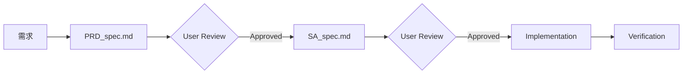

# Project Context & Agent Guidelines

本文件作為 AI Agent（含 Jules）在此 Repository 工作的首要上下文來源。

> **IMPORTANT**: 此文件必須與 `.agent/rules/` 目錄內容保持強一致性。任何架構或規則更新都必須同步反映於此。
> 同步關係與 drift 稽核 SOP 見 `.agent/skills/harness-maintenance/SKILL.md`。

---

## 🚀 Quick Start

```bash
# 建置開發版 (產生 arc-sidebar-vX.X.X-dev.zip)
make

# 建置發布版 (esbuild bundle+minify，產生 arc-sidebar-vX.X.X.zip)
make release

# 測試（E2E 全套 / CI 快驗 / 單元測試）
npm test
npm run test:ci
npm run test:unit

# 清理建置產物
make clean
```

**預覽方式**:
1. 前往 `chrome://extensions`
2. 開啟「開發人員模式」
3. 點擊「載入未封裝的項目」
4. 選擇此專案的根目錄

---

## 📋 Project Overview

| 項目 | 說明 |
|------|------|
| **類型** | Chrome Extension (Manifest V3) |
| **核心技術** | Vanilla JS (ES6+), HTML5, CSS3（禁止 UI 框架） |
| **建置工具** | `make` (需要 `jq`；release 用 esbuild) |
| **測試框架** | Jest + Puppeteer（`usecase_tests/`） |
| **本機 AI** | Chrome 內建 Gemini Nano（Prompt API + Summarizer API），零後端 |

---

## 🧠 Agent Resources Index

### 📚 Skills (技能庫)
位於 `.agent/skills/`，每個技能包含 `SKILL.md` 主檔案與相關資源。
（`.claude/skills` 與 `.gemini/skills` 為指向此處的 symlink，改一處三工具同步。）

| 技能名稱 | 用途 | 何時使用 |
|---------|------|---------|
| `sdd` | 分級 SDD 主流程（T0/T1/T2，單一事實來源） | 🔴 **必讀** - 任何新功能或修復，動工前先分級 |
| `debugging` | 除錯紀律：先重現、證據優先、高頻根因表 | 🔴 修 bug / 查問題時，動手前先讀 |
| `verification` | 交付前驗證火力表與連動檢查清單 | 🔴 任何實作收尾、送 PR 前 |
| `prd` | 產品需求文件撰寫指南（T2 Phase 1） | 撰寫 PRD_spec.md 時 |
| `sa` | 系統分析文件撰寫指南（T2 Phase 2） | 撰寫 SA_spec.md 時 |
| `commit-message-helper` | Conventional Commits 規範 | 撰寫 Commit Message 時 |
| `pull-request` | PR 建立指南與模板 | 建立 Pull Request 時 |
| `code-review` | 程式碼審查最佳實踐 | Review PR 時 |
| `refactoring` | 重構技巧與程式碼異味辨識 | 程式碼改善時 |
| `release-notes` | 雙語 Release Note 產生 | 發布版本時 |
| `update-multilingual-docs` | 多語系文件更新 | 文件翻譯時 |
| `puppeteer-test` | Puppeteer + Jest E2E 測試指南 | 撰寫 / 修 E2E 測試時 |
| `cleanup-merged-branches` | 清理已合併的本地 / 遠端分支 | merge 後清理分支時 |
| `image-master` | 影像格式 / WebP / 色彩 / WCAG 對比度 | 處理圖示 / 自訂背景圖 / Web Store 截圖時 |
| `web-design-guidelines` | sidepanel UI 與無障礙審查 | 審查 UI 程式碼 / 檢查 accessibility 時 |
| `harness-maintenance` | Agent harness / 文件 / wiki 的維護 SOP | 更新 AGENTS.md、skills、wiki，或發現文件過時時 |
| `skill-creator` | 撰寫新 skill 的 meta 指南 | 新增 / 更新 skill 時 |

> 2026-07 起 `ui-ux-pro-max` 已移除（通用 CSV 資料庫與本專案技術棧無關；刪除判準見 `harness-maintenance` skill）。

### 📝 Workflows (工作流程)
位於 `.agent/workflows/`，定義標準化操作步驟。

| Workflow | 觸發方式 | 用途 |
|----------|---------|------|
| `sdd-process.md` | `/sdd-process` | SDD 完整開發流程 |
| `create-pr.md` | `/create-pr` | 建立 Pull Request |
| `review-pr.md` | `/review-pr` | 審核 Pull Request（含 CI 測試穩定性 8 條方針） |
| `create-release-note.md` | `/create-release-note` | 產生 Release Note |
| `update-docs.md` | `/update-docs` | 更新多語系文件 |
| `cleanup-branches.md` | `/cleanup-branches` | 清理已合併分支 |
| `puppeteer-test.md` | `/puppeteer-test` | 撰寫 E2E 測試流程 |
| `create-skill.md` | `/create-skill` | 建立新 skill 的流程 |

### 📜 Rules (最高遵循方針)
位於 `.agent/rules/`，**必須嚴格遵守**。

| 規則 | 說明 | 優先級 |
|------|------|--------|
| `RULE_001_PROJECT_OVERVIEW.md` | 專案元資料與技術棧 | 📖 參考 |
| `RULE_002_ARCHITECTURE.md` | 執行 context、架構不變式、目錄地圖 | 🔴 必讀 |
| `RULE_003_BUILD_AND_DEPLOY.md` | 建置與部署指令（dev/release 差異、Makefile 打包警示） | 📖 參考 |
| `RULE_004_COMMIT_AND_RELEASE.md` | Commit 與 Release 規範 | 🔴 必讀 |
| `RULE_005_DEVELOPMENT_GUIDELINES.md` | 開發準則與 DRY 原則 | 🔴 必讀 |
| `RULE_006_PR_REVIEW_GUIDELINES.md` | PR 審核標準 | 📖 參考 |
| `RULE_007_SDD_WORKFLOW.md` | SDD 流程定義 | 🔴 必讀 |

---

## ⚠️ Development Workflow (SDD)

本專案採用 **分級 Spec-Driven Development**（規格與風險成比例）。
詳細判準與流程以 `.agent/skills/sdd/SKILL.md` 為**單一事實來源**。

### 核心原則：Spec 與風險成比例（動工前先分級）

| 層級 | 適用 | 產出 | Gate |
|------|------|------|------|
| **T0 直接做** | typo／文案／註解／樣式微調／依賴更新／根因明顯的單點小修 | 無 spec（commit body 交代背景） | PR review |
| **T1 輕量 SPEC**（預設） | 一般 bug fix、小～中型功能、局部重構 | 單檔 `SPEC.md` | 隨 PR 一起審，無事前 gate |
| **T2 完整 SDD** | storage schema／manifest 權限／跨 context 協定／資料遺失風險邏輯／大型功能面／大規模重構 | `PRD_spec.md` + `SA_spec.md` | 兩道事前 gate |

### T2 完整流程


```mermaid
graph LR
    A[需求] --> B[PRD_spec.md]
    B --> C{User Review}
    C -->|Approved| D[SA_spec.md]
    D --> E{User Review}
    E -->|Approved| F[Implementation]
    F --> G[Verification]
```

### 文件位置
```
/docs/specs/
  ├── feature/
  │    ├── ISSUE-{ID}_{description}/   ← T2
  │    │    ├── PRD_spec.md            ← 產品需求
  │    │    └── SA_spec.md             ← 系統分析
  │    └── BASE-{ID}_{description}/    ← T1
  │         └── SPEC.md                ← 單檔輕量 spec
  └── fix/
       └── ISSUE-{ID}_{description}/
            └── SPEC.md
```

---

## 🗂️ Architecture Navigator

> **檔案級職責的單一事實來源是 `GEMINI.md` 的 `key_files` 區塊**（每個模組一句話職責 + 演進歷史，持續維護）。
> 此處只放目錄級地圖幫你快速定位；架構不變式（分層規則、跨 context 協定、storage 紀律）見 `RULE_002_ARCHITECTURE.md`。

| 位置 | 內容 |
|------|------|
| `sidepanel.js` / `background.js` / `options.js` / `spotlight.js` / `offscreen.js` | 五個執行 context 的進入點（sidepanel / MV3 service worker / 設定頁 / Spotlight 彈窗 / offscreen） |
| `modules/`（根層） | 單檔管理器：apiManager（chrome.* 封裝）、stateManager、modalManager、dragDropManager、searchManager、keyboardManager、aiManager、rssManager、readingListManager、icons（M3 圖示系統）、uiManager（UI Facade） |
| `modules/ui/` | 渲染與 UI 元件：tabRenderer、bookmarkRenderer、settingManager、settingsBridge（跨 context 設定傳播）、customThemeManager、backgroundImageManager、aiGrouperUI、aiCleanupUI、hoverSummarize*、bookmarkContextMenu、contextMenuManager、driveSyncBadge、otherWindowRenderer、elements（DOM 集中管理）… |
| `modules/ui/tab/` | tabListeners（事件）、splitViewRenderer |
| `modules/commandPalette/` | Spotlight 資料/動作層：dataProvider、actions、nlSearch（AI 自然語言搜尋）、panelBridge（Spotlight→sidepanel 橋接）、searchContext |
| `modules/spotlight/` | spotlightController（Cmd+Shift+K 彈窗生命週期） |
| `modules/workspace/` | workspaceManager（CRUD + per-id storage schema v2）、workspaceLifecycle（SW 常駐快照/重綁）、workspaceUI |
| `modules/bookmark/` | Bookmark Tools：tagManager、dedupe、deadLinkChecker、tagPicker、bookmarkUtils、bookmarkToolsUI |
| `modules/readingList/` | summaryStore、summaryRecorder（加入時自動 AI 摘要） |
| `modules/sync/` | Google Drive 同步：syncProvider 介面、driveAuth（OAuth）、googleDriveProvider、syncLogic（純函式決策核心）、syncEngine（DI 編排） |
| `modules/utils/` | 純函式工具：colorUtils（WCAG 對比度）、imageUtils（WebP）、textUtils（escapeHtml）、searchUtils、domUtils、functionUtils、iconUtils、pageContentExtractor |
| `usecase_tests/unit_tests/` | .mjs 單元測試（jsdom + esbuild transform） |
| `usecase_tests/puppeteer_tests/` | E2E；`setup.js` 共用 helper；`happy_path_*` 前綴 = CI 必跑 |
| `web/` | 官方靜態網站（含 changelog、14 語 locales） |

---

## 🎯 Core Interaction Principles

### 語言規範
| 情境 | 語言 |
|------|------|
| 對話與文件 | 繁體中文 (zh-TW) |
| Commit Subject | English (Conventional Commits) |
| Commit Body | 繁體中文 |
| 程式碼註解 | English |
| PR 標題 | English |
| PR 內文 | 繁體中文 |

### Context Engineering
每次開發 Session 結束時，應將變動內容摘要至：
```
.agent/notes/NOTE_YYYYMMDD.md
```
> `.agent/notes/` 已 gitignore，僅作本地開發脈絡之用、**不入版控**。需要保留的正式設計文件請改放 `docs/specs/`（SDD 產出）。

---

## 💡 Memory Tips (專案偏好)

以下是希望 Agent 記住並遵循的專案偏好：

### 程式碼風格
- **禁止使用 UI 框架**: 不使用 React, Vue, TailwindCSS 等
- **圖示集中管理**: 所有 SVG 必須放在 `modules/icons.js`，禁止硬編碼於 HTML
- **CSS 類別優先**: 使用 `sidepanel.css` 中的現有類別，避免行內樣式
- **模組化匯出**: 使用 ES6 模組語法

### Accessibility (無障礙)
- 純圖示按鈕必須有 `aria-label` 與 `title` 屬性
- 表單元素必須有關聯的 `<label>`
- 維持清晰的鍵盤導航 (Focus states, Tab order)

### 效能考量
- 避免在迴圈中進行 DOM 操作
- 使用 DocumentFragment 批次更新；列表更新優先沿用既有 `reconcileDOM` 模式
- 善用 `requestAnimationFrame` 處理動畫

### 安全性
- 避免使用 `innerHTML` 處理使用者輸入
- 使用 `textContent` 或建立 DOM 元素

---

## 🤖 Jules Scheduled Agents

本專案有排程 AI agents（Palette 🎨 / Sentinel 🔒 / Bolt ⚡ / Updater 📦 / Tester 🧪）定期巡檢 UX、安全、效能、依賴與測試覆蓋。

- **Prompt 範本與說明**：`.jules/README.md`
- **各 agent 的工作日誌**：`.jules/{palette,sentinel,bolt,tester}.md`
- **CI 排程**：`.github/workflows/testing-enthusiast.yml`（Tester，每日）

### GitHub Issue Integration
在 GitHub Issue 上添加 `jules` 標籤即可自動啟動 Jules 任務。Jules 會根據本檔案遵循 SDD 流程；T2 案件建議先手動建立 `/docs/specs/` 目錄。

---

## 🔍 Proactive Suggestions (TODO 格式)

Agent 可自動掃描 `#TODO` 註解並提出改善建議。

**建議的 TODO 格式**:
```javascript
// TODO(P1): [A11y] 為此按鈕添加 aria-label
// TODO(P2): [Perf] 考慮使用 DocumentFragment 優化渲染
// TODO(P3): [UX] 添加載入狀態提示
```

優先級：`P1` 盡快處理 / `P2` 有時間再處理 / `P3` Nice to have。

---

## 📎 Additional Resources

- **人類導向專案文件（Wiki 原始檔）**: `docs/wiki/`（push main 後自動同步至 GitHub Wiki）
- **Chrome Extension 文件**: https://developer.chrome.com/docs/extensions/
- **Manifest V3 Migration**: https://developer.chrome.com/docs/extensions/develop/migrate
- **Chrome APIs**: https://developer.chrome.com/docs/extensions/reference/api

---

*Last updated: 2026-07-03 (Harness 總盤點 — 目錄級 Navigator 指向 GEMINI.md key_files、新增 debugging/verification/harness-maintenance skills、移除 ui-ux-pro-max、Jules prompts 移至 .jules/README.md)*
