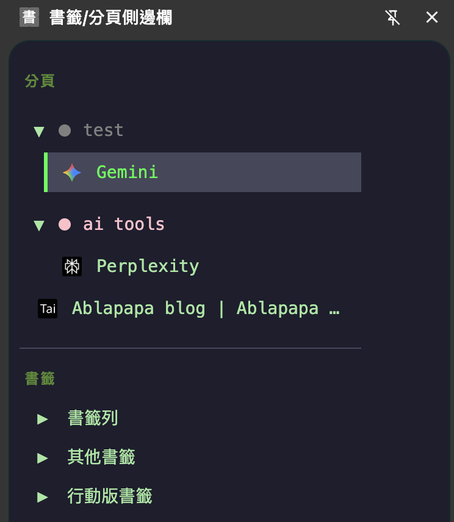

# Arc-Style Chrome Sidebar

這是一個 Chrome 擴充功能專案，旨在透過側邊欄介面，在 Chrome 瀏覽器中提供類似 Arc 瀏覽器的垂直分頁管理體驗。

---

## 功能特色

* **垂直分頁管理**：在側邊欄以垂直列表形式顯示所有開啟的分頁。
* **分頁群組整合**：支援原生分頁群組，並以可摺疊的介面呈現，包含群組顏色與標題。
* **書籤樹檢視**：完整載入使用者書籤，並以可摺疊的資料夾結構顯示。
* **暗黑主題介面**：採用高對比的暗色系主題，適合長時間使用。
* **即時狀態同步**：側邊欄內容會即時反應分頁和群組的建立、關閉、更新等狀態變化。
* **互動式操作**：支援在側邊欄中切換分頁、關閉分頁、以及展開/收合群組與資料夾。
* **預設圖示處理**：為載入中或缺少圖示的分頁提供預設圖示，以避免介面閃爍。

---

## 技術棧

* **Manifest V3**: Chrome 擴充功能標準。
* **HTML5**: 側邊欄介面結構。
* **CSS3**: 介面樣式與佈局。
* **JavaScript (ES6+)**: 核心邏輯與 Chrome API 互動。
* **Chrome APIs**:
    * `chrome.sidePanel`
    * `chrome.tabs`
    * `chrome.tabGroups`
    * `chrome.bookmarks`

---

## 安裝說明

1.  將本專案下載至本機。
2.  開啟 Chrome 瀏覽器，前往 `chrome://extensions`。
3.  啟用右上角的「開發人員模式」。
4.  點擊「載入未封裝項目」。
5.  選擇本專案的根目錄資料夾 (`arc-like-chrome-extension/`)。
6.  安裝完成後，即可在瀏覽器工具列點擊圖示啟用側邊欄。

---

## 未來開發方向

* [x] **搜尋功能**：過濾分頁與書籤。
* [ ] **釘選分頁**：將重要分頁固定於列表頂部。
* [x] **拖曳排序**：支援手動拖曳重新排列分頁與群組。
* [ ] **主題化選項**：提供淺色模式或其他色彩主題的切換功能。
* [ ] **設定頁面**：建立選項頁面以供使用者進行個人化設定。

---
本專案採用 MIT 授權。