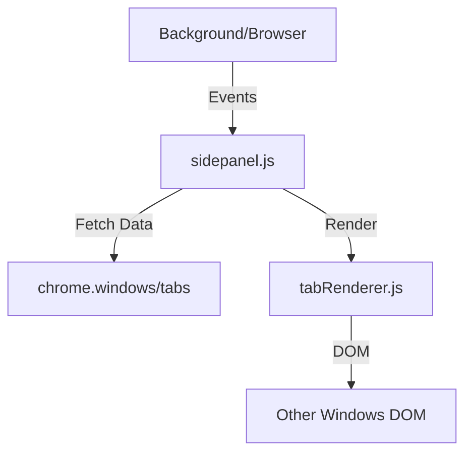
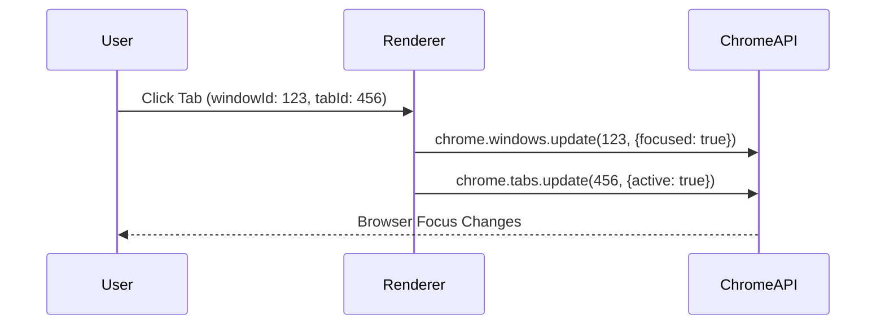

# [Feature] Other Windows Tabs System Design

| Attribute | Details |
| :--- | :--- |
| **Status** | Approved (Reverse Engineered) |
| **Author** | AntiGravity Agent |
| **Related PRD** | `./PRD_spec.md` |

## 1. Overview
### 1.1 Scope
本功能實作「其他視窗」的唯讀列表顯示與跳轉邏輯。

### 1.2 Architecture Diagram

## 2. Component Design
### 2.1 SidePanel Controller (`sidepanel.js`)
*   **Responsibilities**:
    *   監聽 `chrome.windows.onCreated/onRemoved` 事件。
    *   調用 `updateTabList` 觸發重繪。
    *   區分 Current Window 與 Other Windows 的數據獲取。

### 2.2 Tab Renderer (`modules/ui/tabRenderer.js`)
*   **Responsibilities**:
    *   新增 `renderOtherWindows(windows)` 方法。
    *   生成唯讀的 DOM 結構 (禁用 SortableJS)。
    *   綁定 Click Event 用於切換視窗焦點。

### 2.3 API Manager (`modules/apiManager.js`)
*   **Interfaces**:
    *   `getOtherWindows()`: 封裝 `chrome.windows.getAll({populate: true})` 並過濾掉 `chrome.windows.WINDOW_ID_CURRENT`。

## 3. Data Design
### 3.1 Data Flow
1.  `sidepanel.js` 初始化或接收到事件。
2.  呼叫 `chrome.windows.getAll({populate: true})` 獲取所有視窗數據。
3.  過濾數據：`windows.filter(w => w.id !== currentWindowId)`.
4.  傳遞給 `tabRenderer` 進行渲染。

## 4. Interface Design (API)
### 4.1 Chrome APIs
*   `chrome.windows.getAll({populate: true})`: 獲取包含 Tabs 的視窗物件。
*   `chrome.windows.update(windowId, {focused: true})`: 聚焦視窗。
*   `chrome.tabs.update(tabId, {active: true})`: 聚焦分頁。

## 5. Sequence Flows
### 5.1 Switch to Tab in Other Window

## 6. Security & Performance
*   **Performance**: 由於 `populate: true` 開銷較大，應由事件觸發更新，而非頻繁輪詢 (Polling)。
