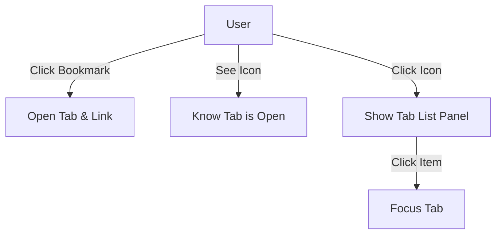

# [Feature] Bookmark-Tab Linking PRD

| Attribute | Details |
| :--- | :--- |
| **Status** | Approved (Reverse Engineered) |
| **Author** | AntiGravity Agent |
| **Original Spec** | `docs/feat-spec/bookmark-tab-linking-spec.md` |
| **Last Updated** | 2026-01-21 |

## 1. Introduction
### 1.1 Problem Statement
使用者可能會針對同一書籤開啟多次，或忘記已開啟該書籤的分頁，導致分頁重複堆積。缺乏書籤與實際開啟分頁之間的連結，使得管理效率低落。

### 1.2 Goals & Objectives
*   **目標 1 (建立關聯)**: 自動記錄 "透過書籤開啟的分頁" 或 "被拖曳成書籤的分頁" 之間的關聯。
*   **目標 2 (視覺回饋)**: 在書籤旁顯示 "已開啟" 指示器。
*   **目標 3 (快速管理)**: 提供介面讓使用者快速檢視並跳轉到已關聯的分頁。

### 1.3 Success Metrics (KPIs)
*   重複開啟相同書籤的次數降低。
*   使用者使用 "跳轉至已開啟分頁" 功能的頻率。

## 2. User Stories
| ID | As a (Role) | I want to (Action) | So that (Benefit) | Priority |
| :--- | :--- | :--- | :--- | :--- |
| US-01 | 使用者 | 點擊書籤時自動建立關聯 | 系統知道這個新分頁屬於該書籤 | High |
| US-02 | 使用者 | 看到書籤旁的標記 | 知道我已經開啟過這個網頁了，不需再開一次 | High |
| US-03 | 使用者 | 點擊標記查看列表 | 快速切換到已開啟的相關分頁 | Medium |

## 3. Functional Requirements
### 3.1 Create Linking (建立關聯)
*   **FR-01 (Click)**: 當使用者點擊書籤時，系統必須程式化開啟新分頁，並記錄 `Launch Request` (BookmarkID -> TabID)。
*   **FR-02 (Drag)**: 當使用者將分頁拖曳為新書籤時，系統必須記錄該原始分頁與新書籤的關聯。

### 3.2 Maintain Linking (維護關聯)
*   **FR-03 (Tab Closed)**: 分頁關閉時，必須移除關聯。
*   **FR-04 (Tab Navigated)**: 分頁 URL 改變時 (使用者導航到別處)，必須移除關聯。
*   **FR-05 (Bookmark Deleted)**: 書籤刪除時，必須清除所有相關分頁紀錄。
*   **FR-06 (Bookmark Edited)**: 書籤 URL 修改時，必須斷開現有關聯。

### 3.3 UI Interaction
*   **FR-07 (Indicator)**: 書籤若有關聯分頁，必須顯示圖示。
*   **FR-08 (Panel)**: 點擊圖示顯示關聯分頁列表 (包含 Title, Favicon, Group)。

## 4. User Experience (UI/UX)

## 5. Non-Functional Requirements
*   **Persistence**: 瀏覽器重啟後，關聯狀態不得遺失 (需儲存於 Local Storage)。
*   **Consistency**: 資料必須即時同步，避免顯示已關閉的分頁。

## 6. Out of Scope
*   跨裝置同步關聯狀態。
