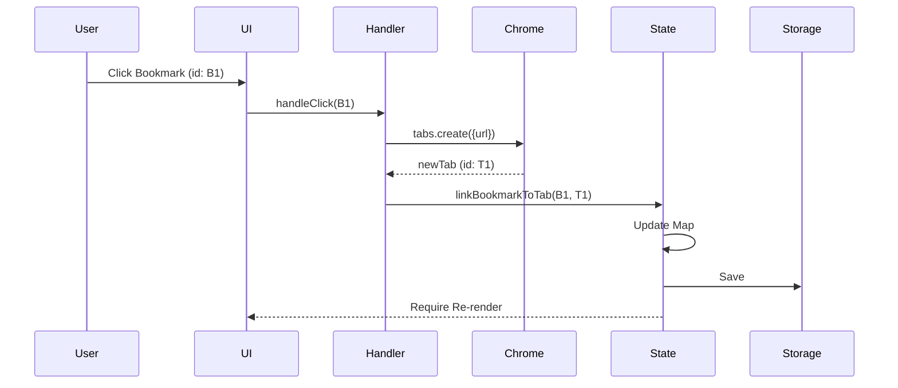

# [Feature] Bookmark-Tab Linking System Design

| Attribute | Details |
| :--- | :--- |
| **Status** | Approved (Reverse Engineered) |
| **Author** | AntiGravity Agent |
| **Related PRD** | `./PRD_spec.md` |

## 1. Overview
### 1.1 Scope
本功能涉及 `stateManager` (資料核心), `apiManager` (Chrome API), `dragDropManager` (拖曳邏輯), 與 `uiManager` (渲染)。

### 1.2 Architecture Diagram
```mermaid
graph TD
    UI[UI Layer] -->|Click/Drag| Handler[Logic Handlers]
    Handler -->|Update| State[stateManager.js]
    State -->|Persist| Storage[chrome.storage.local]
    Browser events -->|Monitor| State
```

## 2. Component Design
### 2.1 State Manager (`modules/stateManager.js`)
*   **Data Store**: `bookmarkTabMap` (In-memory cache & Persisted).
*   **Methods**:
    *   `linkBookmarkToTab(bookmarkId, tabId)`
    *   `unlinkTab(tabId)`
    *   `getTabsForBookmark(bookmarkId)`

### 2.2 API Manager (`modules/apiManager.js`)
*   **Event Listeners**:
    *   `chrome.tabs.onRemoved` -> `state.unlinkTab`
    *   `chrome.tabs.onUpdated` -> `state.unlinkTab` (if URL changed)
    *   `chrome.bookmarks.onRemoved` -> Cleanup map.

### 2.3 UI Manager (`modules/uiManager.js`)
*   **Rendering**:
    *   在渲染書籤時檢查 `state.getTabsForBookmark`。
    *   若有結果，插入 `linked-icon` DOM 元素。

## 3. Data Design
### 3.1 Schema
```json
// chrome.storage.local
{
  "bookmark_tab_links": {
    "bookmark_id_1": [101, 102], // Tab IDs
    "bookmark_id_2": [205]
  }
}
```

## 4. Interface Design (API)
### 4.1 Internal API
```javascript
export async function linkBookmarkToTab(bmId, tabId) { ... }
export async function getLinkedTabs(bmId) { ... }
```

## 5. Sequence Flows
### 5.1 Link Creation (Click)


## 6. Security & Performance
*   **Performance**: 狀態變更頻率不高，直接寫入 Storage 應無效能問題。但讀取時依賴 In-memory Cache。
