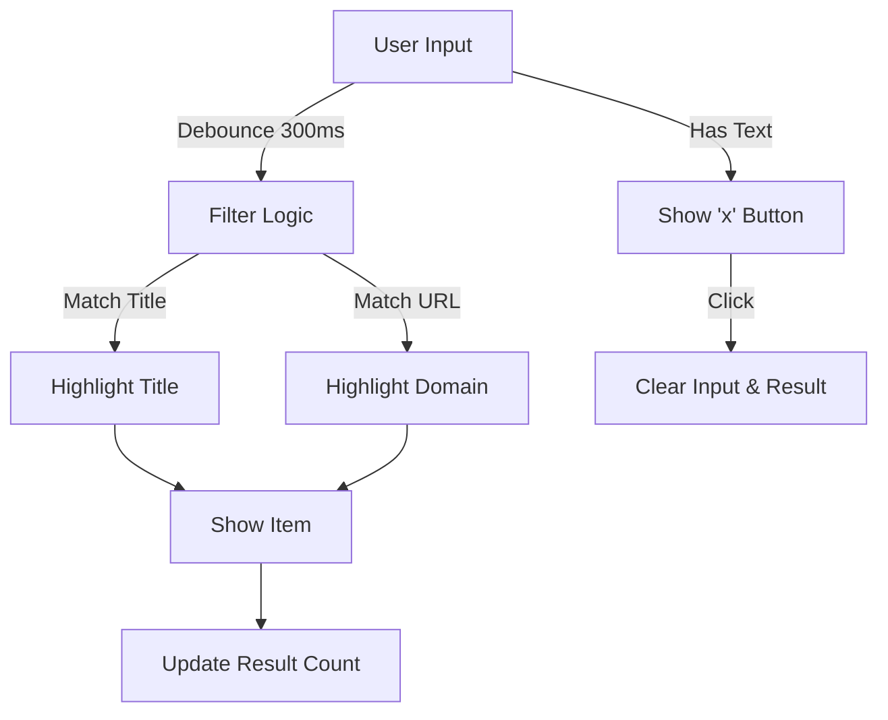

# [Feature] Search Enhancement PRD

| Attribute | Details |
| :--- | :--- |
| **Status** | Approved (Reverse Engineered) |
| **Author** | AntiGravity Agent |
| **Original Spec** | `docs/feat-spec/search-enhancement-spec.md` |
| **Last Updated** | 2026-01-21 |

## 1. Introduction
### 1.1 Problem Statement
目前的搜尋功能過於基礎，僅支援單一關鍵字的標題匹配。使用者難以透過模糊的關鍵字組合或 URL 記憶來找到目標分頁，降低了大量分頁管理的效率。

### 1.2 Goals & Objectives
*   **目標 1**: 支援多關鍵字 (OR Logic) 與 URL 內容搜尋。
*   **目標 2**: 提供清晰的視覺回饋（文字高亮、結果計數）。
*   **目標 3**: 確保搜尋效能流暢 (Debounce)。

### 1.3 Success Metrics (KPIs)
*   使用者成功找到目標分頁的平均時間減少。
*   清除按鈕的使用率（代表使用者進行多次搜尋的流暢度）。

## 2. User Stories
| ID | As a (Role) | I want to (Action) | So that (Benefit) | Priority |
| :--- | :--- | :--- | :--- | :--- |
| US-01 | 使用者 | 輸入 "google github" | 同時找到標題含 google 或 github 的所有分頁 | High |
| US-02 | 使用者 | 輸入域名 (e.g., "stackoverflow") | 即使標題沒寫，也能透過網址找到該分頁 | High |
| US-03 | 使用者 | 看到搜尋結果的關鍵字亮起 | 快速確認這是不是我要找的內容 | High |
| US-04 | 使用者 | 一鍵點擊清除按鈕 | 快速重新開始下一次搜尋 | Medium |

## 3. Functional Requirements
### 3.1 Advanced Search Logic
*   **FR-01 (Multi-keyword)**: 系統必須支援以空白分隔關鍵字，並採用 OR 邏輯匹配。
*   **FR-02 (URL Search)**: 搜尋範圍必須涵蓋分頁與書籤的 URL (Domain 部分)。
*   **FR-03 (Display)**: 僅在 URL 匹配且標題未匹配時，顯示 Domain 資訊。

### 3.2 UI Enhancements
*   **FR-04 (Highlight)**: 必須高亮顯示匹配的文字，並區分標題匹配 (Title Match) 與 URL 匹配 (URL Match) 的樣式。
*   **FR-05 (Clear Button)**: 搜尋框有輸入時顯示清除按鈕，點擊後清空並重置列表。
*   **FR-06 (Count)**: 顯示 "X 個分頁、Y 個書籤" 或 "未找到結果"。
*   **FR-07 (Recursive)**: 搜尋須遞迴檢查資料夾，若子項目匹配則自動展開父資料夾。

## 4. User Experience (UI/UX)

## 5. Non-Functional Requirements
*   **Performance (Debounce)**: 搜尋觸發必須延遲 300ms，避免連續 DOM 操作。
*   **Accessibility**: 支援高對比度高亮色（適配各主題）。
*   **i18n**: 結果計數訊息需支援繁中與英文。

## 6. Out of Scope
*   虛擬捲動 (Virtual Scrolling)。
*   正則表達式搜尋。
*   搜尋歷史紀錄。
