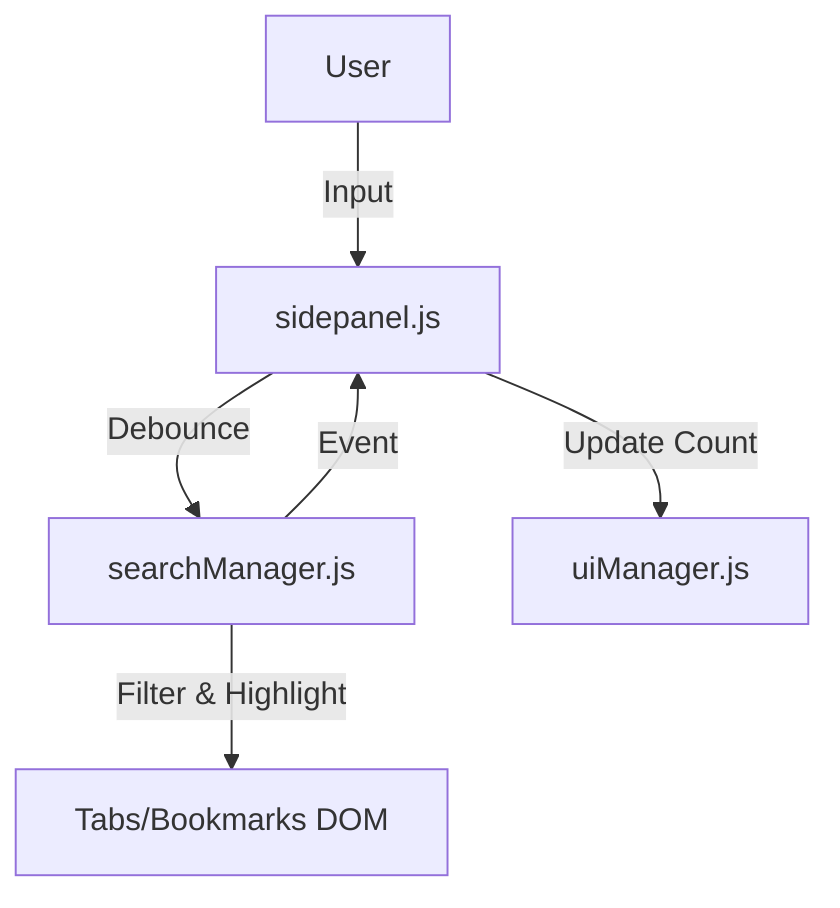
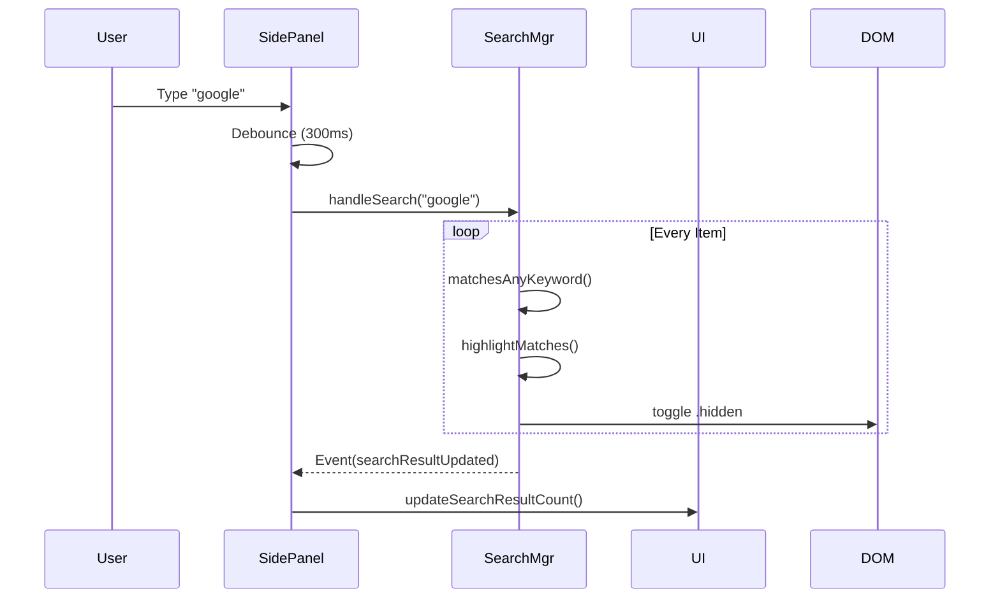

# [Feature] Search Enhancement System Design

| Attribute | Details |
| :--- | :--- |
| **Status** | Approved (Reverse Engineered) |
| **Author** | AntiGravity Agent |
| **Related PRD** | `./PRD_spec.md` |

## 1. Overview
### 1.1 Scope
主要修改 `modules/searchManager.js` 實作核心邏輯，並調整 `sidepanel.js` 與 `uiManager.js` 進行事件串接與 UI 更新。

### 1.2 Architecture Diagram

## 2. Component Design
### 2.1 Search Manager (`searchManager.js`)
*   **Methods**:
    *   `handleSearch(query)`: 入口函數。
    *   `matchesAnyKeyword(text, keywords)`: 多關鍵字匹配邏輯。
    *   `highlightMatches(element, keywords)`: DOM 高亮處理。
    *   `extractDomain(url)`: URL 解析工具。

### 2.2 UI Manager (`uiManager.js`)
*   **Methods**:
    *   `updateSearchResultCount(tabCount, bmCount)`: 更新計數器文字 (i18n)。

## 3. Data Design
### 3.1 DOM Attribution
*   `data-url`: 儲存於 DOM 節點，用於快速存取 URL。
*   `data-original-text`: (Optional) 儲存高亮前的原始 HTML，方便清除高亮。

## 4. Interface Design (API)
### 4.1 Events
*   `searchResultUpdated`: `{ detail: { tabCount, bookmarkCount } }`
    *   發送者: `searchManager`
    *   接收者: `sidepanel.js`

## 5. Sequence Flows
### 5.1 Search Execution

## 6. Security & Performance
*   **Debounce**: 300ms 延遲。
*   **DOM Manipulation**: 使用 `classList.toggle` 最小化 Reflow。
*   **RegExp Safety**: 使用 `escapeRegExp` 處理使用者輸入的特殊字符。
