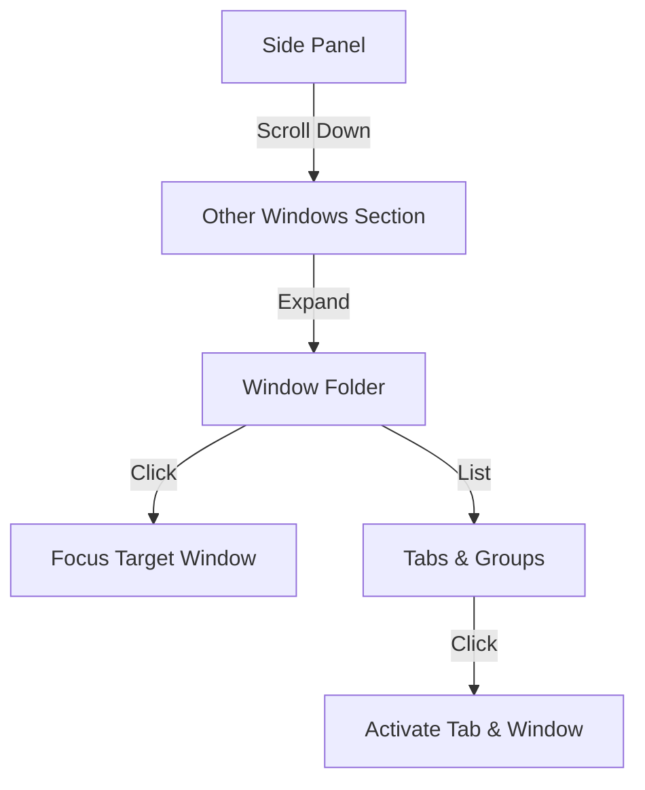

# [Feature] Other Windows Tabs PRD

| Attribute | Details |
| :--- | :--- |
| **Status** | Approved (Reverse Engineered) |
| **Author** | AntiGravity Agent |
| **Original Spec** | `docs/feat-spec/002_other_windows_tabs.md` |
| **Last Updated** | 2026-01-21 |

## 1. Introduction
### 1.1 Problem Statement
使用者開啟多個 Chrome 視窗時，必須頻繁切換視窗才能找到想要的分頁，造成工作流中斷。

### 1.2 Goals & Objectives
*   **目標 1**: 在側邊欄中直接顯示其他開啟視窗的分頁列表。
*   **目標 2**: 允許使用者點擊並快速跳轉到該視窗/分頁。
*   **目標 3**: 確保唯讀狀態，避免誤觸修改其他視窗的結構。

### 1.3 Success Metrics (KPIs)
*   減少 `Alt+Tab` (Window Switch) 的使用頻率。
*   提升多分頁管理效率。

## 2. User Stories
| ID | As a (Role) | I want to (Action) | So that (Benefit) | Priority |
| :--- | :--- | :--- | :--- | :--- |
| US-01 | 重度使用者 | 在側邊欄看到其他視窗的分頁 | 不用切換視窗就能知道開啟了什麼 | High |
| US-02 | 使用者 | 點擊側邊欄的某一分頁 | 瀏覽器自動跳轉並聚焦該視窗分頁 | High |
| US-03 | 使用者 | 折疊「其他視窗」區塊 | 保持側邊欄整潔 | Medium |

## 3. Functional Requirements
### 3.1 Display Other Windows
*   **FR-01**: 系統必須在當前視窗列表下方顯示 "Other Windows" 區塊。
*   **FR-02**: 系統必須列出除當前視窗外的所有開啟視窗。
*   **FR-03**: 若視窗無分頁，系統必須隱藏該視窗。
*   **FR-04**: 每個視窗標題格式為 `Window {index} ({tabCount})`。

### 3.2 Tab & Group Rendering
*   **FR-05**: 系統必須垂直渲染視窗內的所有分頁。
*   **FR-06**: 屬於 Tab Group 的分頁必須巢狀顯示在 Group Header 下。
*   **FR-07**: Group Header 必須顯示標題與顏色。

### 3.3 Read-Only Interaction
*   **FR-08**: 點擊分頁時，系統必須將焦點切換至該分頁與視窗。
*   **FR-09**: 點擊視窗或群組標題時，系統必須切換折疊/展開狀態。
*   **FR-10**: 系統必須禁止在此區塊進行 Drag & Drop 排序。

### 3.4 Live Updates
*   **FR-11**: 當有視窗建立或移除時，列表必須自動更新。
*   **FR-12**: 當其他視窗的分頁狀態改變時，列表必須自動更新。

## 4. User Experience (UI/UX)

## 5. Non-Functional Requirements
*   **Performance**: 監聽 `chrome.windows` 事件需高效，避免卡頓。
*   **Consistency**: 下拉選單樣式需與主分頁列表一致。

## 6. Out of Scope
*   跨視窗拖曳分頁 (v2 考慮)。
*   關閉其他視窗的分頁。
