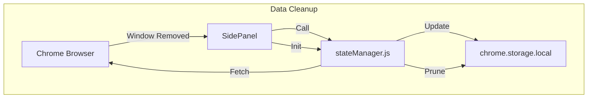
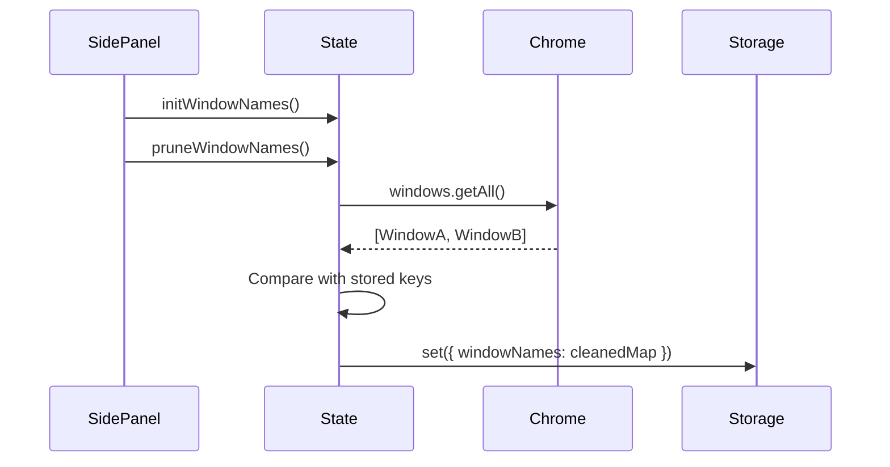

# [Feature] Window Naming Cleanup System Design

| Attribute | Details |
| :--- | :--- |
| **Status** | Approved (Reverse Engineered) |
| **Author** | AntiGravity Agent |
| **Related PRD** | `./PRD_spec.md` |

## 1. Overview
### 1.1 Scope
本功能針對 `modules/stateManager.js` 與 `sidepanel.js` 進行修改，實作視窗名稱的生命週期管理。

### 1.2 Architecture Diagram


## 2. Component Design
### 2.1 State Manager (`modules/stateManager.js`)
*   **New Methods**:
    *   `removeWindowName(windowId)`: 刪除指定 ID 的名稱並存檔。
    *   `pruneWindowNames()`: 獲取所有 Windows，比對並刪除 stale keys。

### 2.2 SidePanel Controller (`sidepanel.js`)
*   **Lifecycle Hooks**:
    *   `initialize()`: 呼叫 `state.pruneWindowNames()`。
    *   `chrome.windows.onRemoved`: 呼叫 `state.removeWindowName(windowId)`.

## 3. Data Design
### 3.1 Storage Schema
無變更，仍使用 `windowNames` map: `{ [windowId]: "Custom Name" }`.
變更在於此 Map 的維護策略。

## 4. Interface Design (API)
### 4.1 Internal API
```javascript
/**
 * Removes name for a specific window.
 * @param {number} windowId 
 */
export async function removeWindowName(windowId) { ... }

/**
 * Scans and removes names for non-existent windows.
 */
export async function pruneWindowNames() { ... }
```

## 5. Sequence Flows
### 5.1 Startup Pruning


## 6. Security & Performance
*   **Performance**: `chrome.windows.getAll` 為非同步操作，需 await 完成後再進行比對，確保正確性。
