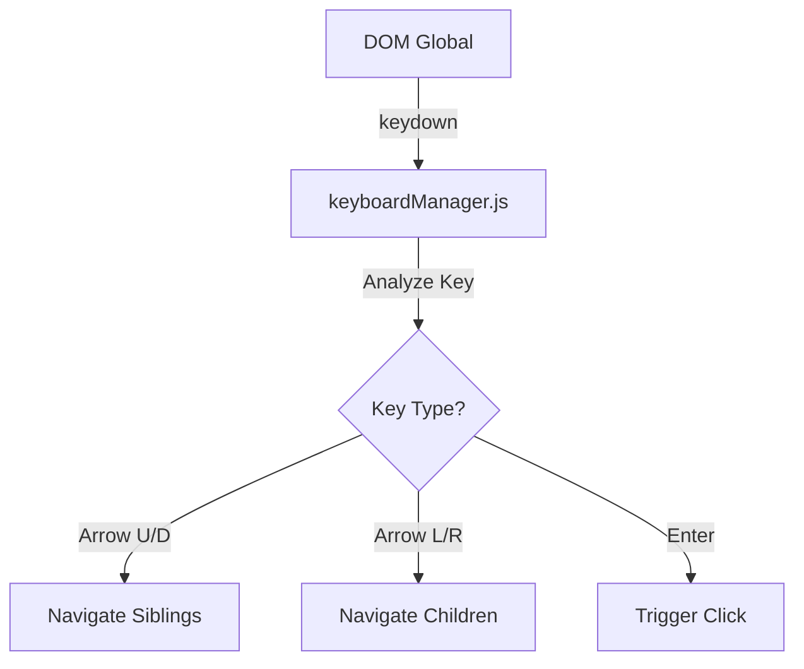
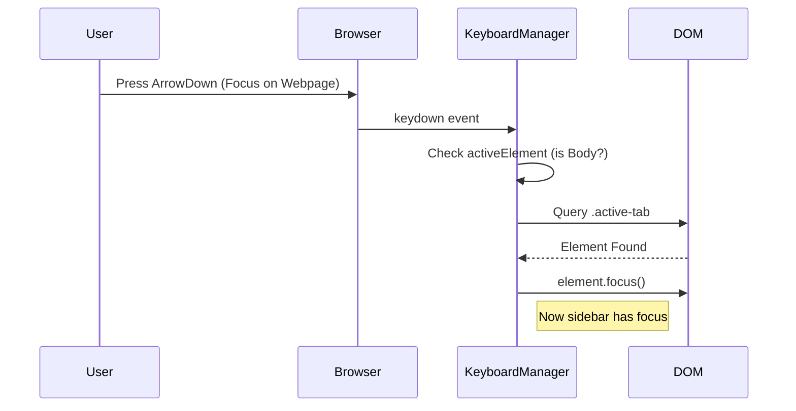

# [Feature] Keyboard Navigation System Design

| Attribute | Details |
| :--- | :--- |
| **Status** | Approved (Reverse Engineered) |
| **Author** | AntiGravity Agent |
| **Related PRD** | `./PRD_spec.md` |

## 1. Overview
### 1.1 Scope
本功能主要在 `modules/keyboardManager.js` 中實作全域鍵盤事件監聽與焦點管理邏輯。

### 1.2 Architecture Diagram


## 2. Component Design
### 2.1 Keyboard Manager (`modules/keyboardManager.js`)
*   **Responsibilities**:
    *   監聽 `document.addEventListener('keydown')`。
    *   維護 Roving Focus 狀態。
    *   處理 "First-Key Strategy" 邏輯。

### 2.2 UI Elements (`modules/ui/elements.js`)
*   **DOM Structure**:
    *   List Items (`.tab-item`, `.bookmark-item`): `tabindex="0"`.
    *   Action Buttons (`.close-btn`): `tabindex="-1"`.

## 3. Data Design
### 3.1 Focus State
不依賴持久化儲存，僅依賴 DOM 的 `document.activeElement` 與即時運算。

## 4. Interface Design (API)
### 4.1 Internal API
```javascript
// keyboardManager.js
export function initKeyboardNavigation() { ... }
export function handleKeyDown(event) { ... }
```

## 5. Sequence Flows
### 5.1 First-Key Strategy


## 6. Security & Performance
*   **Security**: 無特殊限制，僅操作 DOM 焦點。
*   **Performance**: `keydown` 事件極為頻繁，處理函式必須輕量化，避免複雜運算阻塞 Main Thread。
