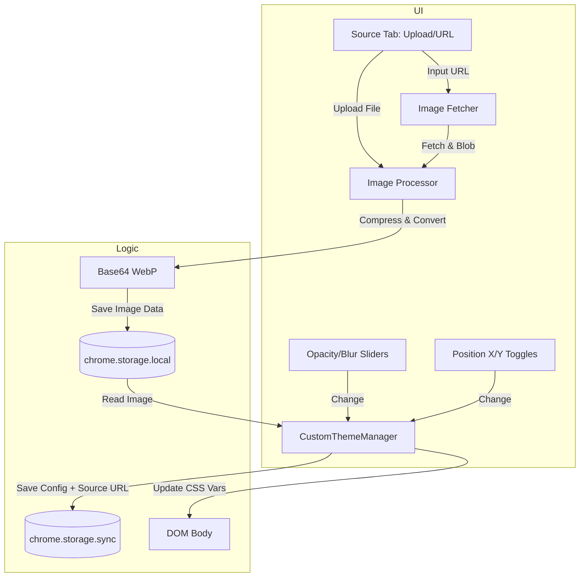

# Background Image Feature System Analysis

| Attribute | Details |
| :--- | :--- |
| **Version** | v1.0 |
| **Status** | Draft |
| **ID** | BASE-008 |
| **Author** | Agent |
| **Related PRD** | [PRD_spec.md](./PRD_spec.md) |
| **Created** | 2026-01-26 |
| **Last Updated** | 2026-01-26 |

---

## 1. Overview

### 1.1 Scope
本文件詳述「自訂背景圖片」功能的技術實作。重點在於解決 Chrome Storage 限制與圖片效能最佳化。

### 1.2 Architecture Diagram



---

## 2. Technical Design

### 2.1 Storage Strategy (Unified Local Cache)

為了避免外部連結失效 (Dead Link) 並確保效能，無論圖片來源為何，皆採用「本地快取優先」策略。

1.  **Image Data (`chrome.storage.local`)**:
    -   **統一儲存位置**: 無論是上傳或 URL，經過處理後的 WebP 圖片資料皆存於此。
    -   Key: `custom_bg_image_data`
    -   Content: Base64 Encoded WebP String.

2.  **Configuration (`chrome.storage.sync`)**:
    -   **設定同步**: 儲存 `opacity`, `blur`, `positionX`, `positionY` 等視覺設定。

### 2.2 Image Processing Pipeline

新增 `Fetcher` 步驟處理 URL：

1.  **Input**: File Object (Upload) OR URL String (Network).
2.  **Fetch (URL Node)**: 若為 URL，使用 `fetch(url)` 取得 `Blob`。需處理 CORS 問題 (可能需要透過 Background Script 或 Proxy)。
3.  **Compress & Convert**:
    -   使用 `createImageBitmap(blob)`。
    -   Draw to Canvas (WebP, quality 0.8, max-width 1920px).
4.  **Output**: Base64 String -> `storage.local`.

### 2.3 CSS Implementation

```css
body::before {
    /* ... positioning styles ... */
    background-image: var(--bg-image-url);
    background-position: var(--bg-image-pos-x, center) var(--bg-image-pos-y, center);
    background-size: cover; /* 預設覆蓋，位置調整決定焦點 */
    background-repeat: no-repeat;
    opacity: var(--bg-image-opacity, 0.5);
    filter: blur(var(--bg-image-blur, 0px));
}
```

```javascript
// On Load
const localData = await chrome.storage.local.get('custom_bg_image_data');
if (localData?.custom_bg_image_data) {
    document.body.style.setProperty('--bg-image-url', `url("${localData.custom_bg_image_data}")`);
    
    // Apply Settings
    const bgConfig = themeData.backgroundImage;
    document.body.style.setProperty('--bg-image-pos-x', bgConfig.positionX); // left, center, right
    document.body.style.setProperty('--bg-image-pos-y', bgConfig.positionY); // top, center, bottom
}
```

---

## 3. Data Design

### 3.1 Storage Schema

**`chrome.storage.local`**:
```json
{
  "custom_bg_image_data": "data:image/webp;base64,UklGRm..."
}
```

**`chrome.storage.sync`**:
```typescript
interface CustomThemeData {
  // ...other fields...
  backgroundImage: {
    hasImage: boolean;
    storageType: 'file' | 'url'; // 僅作來源標記用
    sourceUrl?: string;   // 若 storageType='url'，保留原始連結供參考
    opacity: number;      // 0-1
    blur: number;         // px
    positionX: 'left' | 'center' | 'right';
    positionY: 'top' | 'center' | 'bottom';
    updatedAt: number;    // timestamp
  }
}
```

---

## 4. Requirement Traceability

| Req ID | PRD Section | SA Section | Implementation |
| :--- | :--- | :--- | :--- |
| FR-01 | 3.1 本機上傳 | 2.2 Processing | File -> Canvas -> Local |
| FR-02 | 3.1 網路網址 | 2.2 Fetcher | URL -> Fetch -> Blob -> Canvas -> Local |
| FR-06 | 3.2 位置調整 | 2.3 CSS | CSS Vars `--bg-image-pos-x/y` |
| FR-07 | 3.3 統一快取 | 2.1 Unified Strategy | Always save to `storage.local` |
| FR-09 | 3.3 同步設定 | 3.1 Schema | Sync config (`positionX/Y`), Local data |

---

## 5. Security & Performance

### 5.1 Security
- **XSS**: 確保取出的 Base64 string 僅用於 CSS `url()`，不直接插入 DOM `innerHTML`。
- **MIME Type**: 嚴格檢查上傳檔案的 MIME type 必須為 `image/*`。

### 5.2 Performance
- **Local Storage I/O**: 讀取大字串 (Base64) 是同步或非同步操作？`chrome.storage` 是非同步。
- **Critical Path**: 擴充功能啟動時，需盡快讀取並套用背景，避免畫面閃爍 (FOUC)。建議在 `sidepanel.js` 初始化早期並行讀取 config 與 image data。

