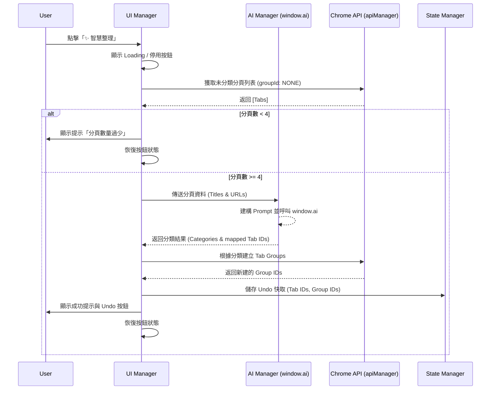

# SA: 魔法一鍵整理 (Smart Auto-Grouping)

## 1. 架構與模組設計 (Architecture & Modules)

本功能將整合至現有的側邊欄架構中，主要涉及 UI 渲染、Chrome API 操作與狀態管理。

### 1.1 核心模組影響區塊
- **`modules/ui/aiGrouperUI.js` (新增)**: 為了降低與原有程式碼的耦合，獨立出一支新的 UI 模組負責實作「✨ 智慧整理」按鈕、Loading 動畫、以及 Undo UI 提示。不直接修改 `tabRenderer.js` 內部核心邏輯。
- **`modules/apiManager.js`**: 封裝 Chrome Tab Groups 相關 API 操作（如 `chrome.tabs.group`、`chrome.tabGroups.update`、`chrome.tabs.ungroup`）。
- **`modules/aiManager.js` (新增)**: 為了維持關注點分離，新增此模組專門處理與 `window.ai` (Gemini Nano) 的溝通、Prompt 建構、以及回應解析。
- **`modules/stateManager.js`**: 記錄最近一次操作的 Undo 狀態 (包含影響的 Tab IDs 與新建的 Group IDs)。

### 1.2 系統流程 (System Flow)



## 2. API 與資料結構設計 (API & Data Design)

### 2.1 Prompt 設計 (AI Manager)
為了讓 Gemini Nano 能穩定輸出格式化結果，將設計 System Prompt 與 User Prompt，並要求輸出 JSON 格式的大綱。
**範例 Prompt 結構**:
```text
你是一個專業的分頁整理助手。請將以下分頁清單，依據語意分類成 3 到 5 個群組。
每個群組給予一個適合的 Emoji 與簡短主題名稱（如 "🛠️ 開發工具"）。
請以 JSON 陣列格式回傳，格式如下：
[
  { "theme": "🛠️ 開發工具", "tabIds": [12, 15] },
  ...
]

[分頁清單]
ID: 12 | Title: React Docs | URL: https://react.dev
ID: 15 | Title: MDN Web Docs | URL: https://developer.mozilla.org
...
```

### 2.2 Undo 狀態結構 (State Manager)
```javascript
// stateManager.js 中維護的 Undo 結構
let lastAutoGroupState = {
  canUndo: false,
  timestamp: null,
  affectedTabs: [], // 被移動的分頁 ID 陣列
  createdGroups: [] // 新建的群組 ID 陣列
};
```

### 2.3 Chrome API 封裝 (apiManager.js 新增/擴充)
- `groupTabs(tabIds: number[]): Promise<number>` (將分頁加入新群組，回傳 groupId)
- `updateTabGroup(groupId: number, options: {title: string}): Promise<void>` (設定群組名稱與顏色)
- `ungroupTabs(tabIds: number[]): Promise<void>` (將分頁移出群組)

## 3. 需求追溯矩陣 (Requirement Traceability Matrix)

| PRD 需求編號 | 需求描述 | 技術實作對應 | 測試/驗證點 |
| :--- | :--- | :--- | :--- |
| FR-1.01 | 提供「✨ 智慧整理」入口 | `tabRenderer.js` 注入整理按鈕 | 確認按鈕在側邊欄可見且可點擊 |
| FR-1.02 | 數量低於 4 個防呆提示 | 點擊事件中檢查 `apiManager.getUnclassifiedTabs().length < 4` | 測試 1~3 個未分類分頁的情況 |
| FR-1.03 | 擷取標題與網址 | 使用 `chrome.tabs.query` 過濾資料並組裝字串 | 確認 Prompt 內文包含正確的分頁資訊 |
| FR-1.04 | 處理期間的 Loading | 點擊後設定按鈕 CSS class 為 loading 狀態 | 確認等待模型回應時畫面有回饋 |
| FR-1.05 | Gemini Nano 歸類與命名 | 新增 `aiManager.js` 負責 Prompt 建構與 JSON 解析 | 確認是否產出 3~5 分類且帶有 Emoji |
| FR-1.06 | 自動移入新建群組 | 依解析結果呼叫 `chrome.tabs.group` 與 `update` 設定標題 | 觀察 Chrome 瀏覽器上方是否正確產生群組 |
| FR-1.07 | 成功提示與復原選項 | 呼叫專案既有的 Toast/Notification UI 元件，顯示 Undo 按鈕 | 確認執行成功後提示出現 5 秒，且有按鈕 |
| FR-1.08 | 支援復原 (Undo) 解散群組 | 讀取快取，對受影響 `tabIds` 呼叫 `chrome.tabs.ungroup` | 點擊 Undo 後，分頁恢復原狀且群組消失 |

## 4. 潛在副作用與進階邊界情況 (Potential Side Effects & Edge Cases)

在系統推演中，辨識出以下可能影響原有系統的行為或潛在雷區：

### 4.1 狀態競態 (Race Conditions) 導致的例外
1. **分頁在 AI 處理期間發生變化 (被手動關閉或移動)**:
   - *問題*: 當前傳送 `tabIds` 清單給 AI 分析（需等待 2~5 秒）後，若此期間內使用者已經手動關閉或將某些 Tab 移入其他 Group，此時再針對這些舊 `tabIds` 呼叫 `chrome.tabs.group` 會引發 API Error（找不到該 tabId）。
   - *對策*: 呼叫 `chrome.tabs.group` 前，必須重抓一次當下未分類的 `tabIds` 並取交集 (Intersection)，丟棄已經無效的 tabId。
2. **AI 分析期間切換工作區或視窗**:
   - *問題*: 跨視窗情況下，原視窗的 Tab ID 仍有效，但群組不應該建在錯誤的視窗。
   - *對策*: 使用 `chrome.tabs.group` 時必須明確指定 `createProperties.windowId` 為發起整理行為時的當前視窗，防止混亂。

### 4.2 Undo (復原機制) 的複雜度陷阱
3. **Undo 時群組已被手動修改**:
   - *問題*: 若執行完智慧整理後，使用者自行拖曳或解散了部分產生的群組，此時再點擊「Undo」會發生什麼事？
   - *對策*: Undo 邏輯應設計為「只還原當時被 AI 打包進去的那些特定的 Tab IDs (移出群組)」。不去強力砍掉當時新建群組的 ID，讓空群組自然消失 (Chrome 行為) 或是留著，而不是硬砍。
4. **Undo 的持久化與有效期限**:
   - *問題*: Undo UI 會一直存在還是會在重整頁面後消失？
   - *對策*: Undo UI 應設定超時機制 (例如 10 秒後淡出消失)，且不需要存入 localStorage 跨 session (因 Tab ID 在重啟後會改變)，僅限定於當下畫面提示階段有效。

### 4.3 AI 模型的不確定性 (Model Uncertainty)
5. **模型回傳無法解析的字串**:
   - *問題*: 即使用 Prompt 要求 JSON，Gemini Nano 有時仍會帶有 Markdown code block (````json ... ````) 或額外前後文對話。
   - *對策*: `aiManager.js` 必須具備清洗邏輯，利用 Regex `/\[\s*\{.*\}\s*\]/s` extraction 來精準提取陣列內容，並加上 `try...catch` 進行 `JSON.parse`。若失敗需進入容錯處理 (例如 fallback 為一個名為「📦 未知分類」的群組)。
6. **被歸類的分頁數超出 Token 上限**:
   - *問題*: `window.ai` 的 token `maxTokens` 限制，如果送進去 50 個 `Title` 和 `URL` 會發生卡死或超出。
   - *對策*: 在組裝 Prompt 之前，對未分類列表進行「前 N 個」截斷（如只取前 30 個分頁處理），並縮短過長的 Title 和 URL。超過 30 個的分頁在此次操作先被忽略不丟給 AI，確保核心系統穩定不死機。

### 4.4 其他周邊影響 (Peripheral Side Effects)
7. **無痕模式 (Incognito) 的限制**:
   - *問題*: 無痕模式下的分頁群組行為可能受到瀏覽器限制或無法保存。
   - *對策*: `apiManager` 需在無痕視窗中判定是否跳過或提供相應的提示。
8. **擴充功能重疊衝突**:
   - *問題*: 其他例如 "Tab Suspender" 已經將分頁休眠（URL 可能變成 chrome-extension://...），這會影響 AI 抓取的 URL 識別。
   - *對策*: 盡可能單純使用 Title 判讀，或者解析休眠頁面的真實 URL，但在 MVP 階段先將其視為一般 Title 即可。
