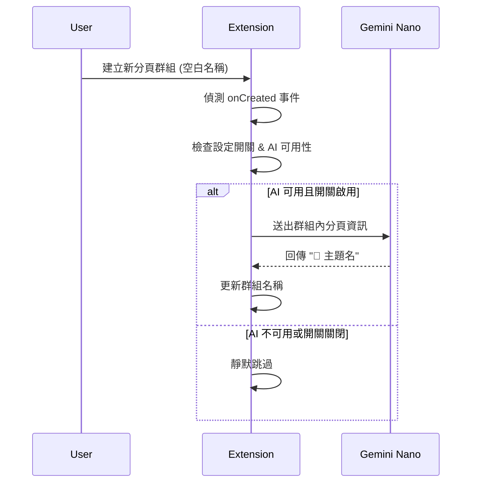
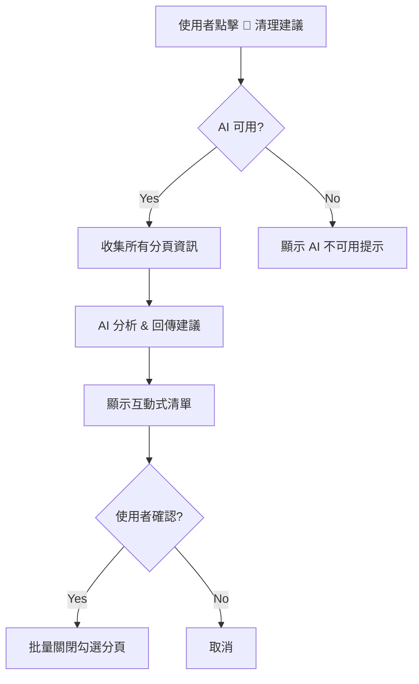

# PRD: Zero-Config Local AI 全面進化

| Attribute | Details |
| :--- | :--- |
| **Version** | v1.0 |
| **Status** | Draft |
| **Author** | Antigravity Agent |
| **Reviewers** | Tai |
| **Created** | 2026-02-27 |
| **Last Updated** | 2026-02-27 |
| **Strategic Context** | 產品戰略一：優化 API Key 門檻 |

## 1. Introduction

### 1.1 Problem Statement

目前市面上許多 AI 功能（Tab Grouping、Tab Cleanup、Group Naming）要求使用者自行申請並輸入 Gemini API Key，甚至需綁定信用卡。根據使用者回饋，大量使用者安裝後很快就解除安裝，高門檻的 AI 設定是一大原因。

我們的套件目前已使用 Chrome 內建 Gemini Nano (`globalThis.LanguageModel`)，實現了「0 設定免 API Key」的 AI 智慧整理。但目前 AI 功能僅限於「一鍵分組 (Smart Auto-Grouping)」單一場景，尚未形成完整的 AI 功能矩陣，無法最大化我們的核心優勢。

### 1.2 Goals & Objectives

- **目標 1**: 將 Local AI 從單點功能（分組）擴展為多場景 AI 助手，建立完整的「Zero-Config AI」功能矩陣。
- **目標 2**: 新增「AI 群組自動命名 (Auto Group Naming)」——當使用者手動建立分頁群組時，自動以 AI 生成 Emoji + 簡短描述。
- **目標 3**: 新增「AI 分頁清理建議 (Tab Cleanup Suggestion)」——AI 辨識閒置/不再需要的分頁，建議使用者關閉。
- **目標 4**: 在 README、官網、Chrome Web Store 描述中，明確標示「Zero-Config / 免 API Key」作為核心行銷訊息。

### 1.3 Success Metrics (KPIs)

- AI 功能使用率：每週至少 30% 的活躍用戶觸發過任一 AI 功能。
- 留存率：安裝後 7 天的留存率提升 10%。
- 關鍵字搜尋排名：「Chrome AI tab manager no API key」排名前 5。

## 2. User Stories

| ID | As a (Role) | I want to (Action) | So that (Benefit) | Priority |
| :--- | :--- | :--- | :--- | :--- |
| US-01 | 一般使用者 | 手動建立一個分頁群組時，系統自動幫我用 AI 取一個有意義的名稱 | 我不用花時間想群組名稱，工作流不中斷 | High |
| US-02 | 重度使用者 | 一鍵讓 AI 掃描所有分頁並建議哪些可以關閉 | 我能快速釋放記憶體、保持專注 | High |
| US-03 | 輕度使用者 | 安裝擴充功能後不需要任何設定就能用 AI 功能 | 我不慌張、不困惑、開箱即用 | Critical |
| US-04 | 潛在使用者 | 在 Chrome Web Store 頁面看到明確的「免 API Key」標示 | 我能在無負擔的情況下快速體驗 AI 功能 | Medium |

## 3. Functional Requirements

### 3.1 AI 群組自動命名 (Auto Group Naming)

| 需求編號 | 需求描述 | 優先級 |
| :--- | :--- | :--- |
| FR-1.01 | 當使用者透過 Chrome 原生操作或本套件 UI 建立一個新的分頁群組且該群組**沒有名稱**（空白）時，系統**應**自動觸發 AI 命名流程。 | High |
| FR-1.02 | 系統**應**擷取該群組內所有分頁的標題與網址作為 Prompt 輸入。 | High |
| FR-1.03 | AI **應**回傳格式為「1 個 Emoji + 簡短主題名稱」的群組名稱（與使用者 UI 語系一致）。 | High |
| FR-1.04 | 系統**應**在 AI 處理完成後，自動將該名稱套用到群組上（透過 `chrome.tabGroups.update()`）。 | High |
| FR-1.05 | 系統**應**提供設定開關，允許使用者停用 AI 自動命名（預設為啟用）。 | Medium |
| FR-1.06 | 若 AI 模型不可用（`availability()` 回傳 `'no'`），系統**不應**報錯，而是靜默跳過命名流程。 | High |

### 3.2 AI 分頁清理建議 (Tab Cleanup Suggestion)

| 需求編號 | 需求描述 | 優先級 |
| :--- | :--- | :--- |
| FR-2.01 | 系統**應**在側邊欄設定區或上方工具列提供「🧹 清理建議」操作入口。 | High |
| FR-2.02 | 系統**應**將所有分頁的標題、網址與最後存取時間傳送給 Local AI 進行分析。 | High |
| FR-2.03 | AI **應**回傳一個建議關閉的分頁 ID 列表，附帶簡短的理由（如「超過 1 小時未存取」、「與其他分頁內容重複」）。 | High |
| FR-2.04 | 系統**應**以可互動的清單（含核取方塊）呈現 AI 建議，讓使用者選擇性關閉。 | High |
| FR-2.05 | 系統**應**提供「全選 / 全不選」快捷操作。 | Medium |
| FR-2.06 | 系統**應**在使用者確認關閉後，批量關閉被勾選的分頁。 | High |
| FR-2.07 | 若無可建議關閉的分頁，系統**應**顯示友善提示如「你的分頁很整潔！」 | Low |

### 3.3 行銷訊息強化

| 需求編號 | 需求描述 | 優先級 |
| :--- | :--- | :--- |
| FR-3.01 | README.md **應**新增「Zero-Config AI」章節，強調開箱即用的優勢。 | Medium |
| FR-3.02 | 官網首頁的 AI 區塊**應**加入醒目的 Badge 標示「🔒 100% Local · 0 API Key」。 | Medium |
| FR-3.03 | Chrome Web Store 描述**應**在前三行提及「免 API Key」與「離線 AI」關鍵字。 | Medium |

## 4. Acceptance Criteria

### AC for FR-1.01 ~ FR-1.04: AI 自動命名

```gherkin
Given 使用者建立了一個新的分頁群組，包含 3 個關於 JavaScript 教學的分頁
  And 該群組名稱為空白
  And Gemini Nano 模型狀態為 'readily'
When 群組建立事件觸發
Then 系統在 3 秒內自動將群組名稱更新為類似 "📘 JavaScript 教學" 的格式
  And 群組名稱使用使用者的 UI 語系
```

### AC for FR-1.05: 設定開關

```gherkin
Given 使用者在設定面板中將「AI 自動命名」選項關閉
When 使用者建立一個新的空白群組
Then 系統不觸發 AI 命名流程
  And 群組名稱保持空白
```

### AC for FR-1.06: AI 不可用降級

```gherkin
Given Gemini Nano 模型狀態為 'no'（不可用）
When 使用者建立一個新的空白群組
Then 系統靜默跳過命名流程，不顯示任何錯誤訊息
  And 群組名稱保持空白
```

### AC for FR-2.01 ~ FR-2.06: AI 清理建議

```gherkin
Given 使用者開啟了 15 個分頁，其中 5 個超過 2 小時未存取
  And Gemini Nano 模型狀態為 'readily'
When 使用者點擊「🧹 清理建議」按鈕
Then 系統顯示一個互動式清單，列出 AI 建議關閉的分頁
  And 每個項目附帶簡短的關閉理由
  And 使用者可以勾選/取消勾選個別項目
When 使用者點擊「確認關閉」
Then 系統批量關閉被勾選的分頁
```

## 5. User Experience (UI/UX)

### 5.1 AI 自動命名流程



### 5.2 Tab Cleanup 流程



## 6. Non-Functional Requirements

- **Privacy**: 所有 AI 運算 100% 使用 Chrome 內建 `globalThis.LanguageModel`，嚴禁任何外部 API 呼叫。
- **Performance**: AI 自動命名應在 3 秒內完成；Tab Cleanup 分析應在 5 秒內完成。
- **Graceful Degradation**: AI 不可用時，所有功能正常運作，僅 AI 增強功能靜默跳過。
- **Compatibility**: 支援 Chrome 131+ (LanguageModel API GA 版本)。

## 7. Out of Scope

- 使用外部 AI API（GPT、Claude 等）作為備援方案。
- AI 自動化執行（自動關閉分頁），僅提供建議。
- 跨瀏覽器 AI（僅限 Chrome/Chromium）。
- 自訂 AI Prompt 模板（針對重度用戶的功能延伸）。

---

## Revision History

| Version | Date | Author | Changes |
|---------|------|--------|---------|
| v1.0 | 2026-02-27 | Antigravity Agent | Initial draft |
