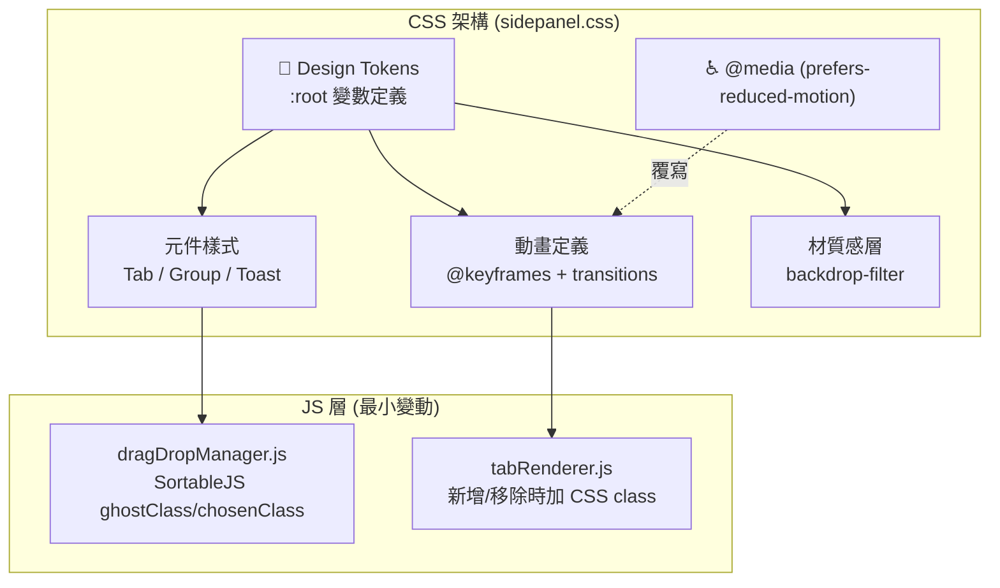
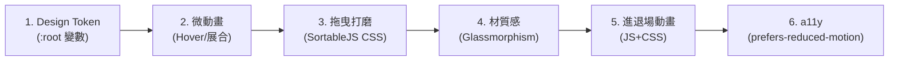

# SA: Opinionated Design — 極簡美學打磨系統設計

| Attribute | Details |
| :--- | :--- |
| **Version** | v1.0 |
| **Status** | Draft |
| **Author** | Antigravity Agent |
| **Related PRD** | [PRD_spec.md](./PRD_spec.md) |
| **PRD Version** | v1.0 |
| **Created** | 2026-02-27 |
| **Last Updated** | 2026-02-27 |

## 1. Overview

### 1.1 Scope

本文件涵蓋 PRD BASE-011 定義的四大改善領域的技術實作方案：

1. **微動畫系統 (Micro-Animation System)** — CSS transitions + `@keyframes`
2. **拖曳體驗打磨 (Drag & Drop Polish)** — SortableJS 樣式覆寫 + CSS 特效
3. **材質感設計 (Glassmorphism)** — `backdrop-filter` + 層次化背景
4. **Design Token 系統** — CSS Custom Properties 統一化

**不涵蓋**: 新增使用者可設定的選項、新增 JavaScript 模組邏輯（僅 CSS 變更與 SortableJS 樣式微調）。

### 1.2 Architecture Diagram



## 2. Requirement Traceability

| Req ID | PRD Section | SA Section | Implementation File | Test File |
|--------|-------------|------------|---------------------|-----------| 
| FR-1.01 | PRD 3.1 | SA 3.1 | `sidepanel.css` | Manual |
| FR-1.02 | PRD 3.1 | SA 3.2 | `sidepanel.css` | Manual |
| FR-1.03 | PRD 3.1 | SA 3.1 | `sidepanel.css` | Manual |
| FR-1.04 | PRD 3.1 | SA 3.3 | `sidepanel.css`, `tabRenderer.js` | Manual |
| FR-1.05 | PRD 3.1 | SA 3.3 | `sidepanel.css`, `tabRenderer.js` | Manual |
| FR-1.06 | PRD 3.1 | SA 3.5 | `sidepanel.css` | Manual |
| FR-2.01 | PRD 3.2 | SA 3.4 | `sidepanel.css` | Manual |
| FR-2.02 | PRD 3.2 | SA 3.4 | `sidepanel.css` | Manual |
| FR-2.03 | PRD 3.2 | SA 3.4 | `sidepanel.css` | Manual |
| FR-2.04 | PRD 3.2 | SA 3.4 | `sidepanel.css` | Manual |
| FR-3.01 | PRD 3.3 | SA 3.6 | `sidepanel.css` | Manual |
| FR-3.02 | PRD 3.3 | SA 3.6 | `sidepanel.css` | Manual |
| FR-3.03 | PRD 3.3 | SA 3.6 | `sidepanel.css` | Manual |
| FR-4.01 | PRD 3.4 | SA 3.7 | `sidepanel.css` | Manual |
| FR-4.02 | PRD 3.4 | SA 3.7 | `sidepanel.css` (refactor) | Manual |
| FR-4.03 | PRD 3.4 | SA 3.7 | `sidepanel.css` | Manual |

## 3. Component Design

### 3.1 微動畫：分頁 Hover 與 Active Indicator

**影響檔案**: `sidepanel.css`

```css
/* Design Token 引用 */
.tab-item {
  transition: transform var(--arc-anim-duration-fast) var(--arc-anim-easing-out),
              box-shadow var(--arc-anim-duration-fast) var(--arc-anim-easing-out);
  will-change: transform;
}

.tab-item:hover {
  transform: translateX(var(--arc-hover-shift, 3px));
  box-shadow: var(--arc-shadow-hover);
}

.tab-item.active {
  /* Active indicator — 用 ::before pseudo-element 做左側色條 */
}

.tab-item.active::before {
  transition: top var(--arc-anim-duration-normal) var(--arc-anim-easing-spring);
}
```

**設計決策**: 使用 `transform` 和 `opacity` 實現動畫，這些屬性可直接在 GPU 合成層處理，不觸發 Layout Reflow，確保 ≥ 55 FPS。

### 3.2 微動畫：群組展開/收合

**影響檔案**: `sidepanel.css`

目前群組展開/收合使用 `display: none` 切換。改為使用 CSS `grid` 動畫技術：

```css
.group-content {
  display: grid;
  grid-template-rows: 1fr;
  transition: grid-template-rows var(--arc-anim-duration-normal) var(--arc-anim-easing-out);
  overflow: hidden;
}

.group-content.collapsed {
  grid-template-rows: 0fr;
}

.group-content > .group-content-inner {
  min-height: 0;
  overflow: hidden;
}
```

**設計決策**: `grid-template-rows: 0fr → 1fr` 是目前 CSS 實現平滑高度動畫的最佳方式，無需 JavaScript 計算實際高度。需要在群組 DOM 結構中新增一個 inner wrapper `<div>`。

### 3.3 微動畫：分頁進場/退場

**影響檔案**: `sidepanel.css`, `tabRenderer.js`

```css
@keyframes arc-tab-enter {
  from {
    opacity: 0;
    transform: translateY(-8px) scale(0.97);
  }
  to {
    opacity: 1;
    transform: translateY(0) scale(1);
  }
}

@keyframes arc-tab-exit {
  from {
    opacity: 1;
    transform: scale(1);
    max-height: 40px; /* 依實際分頁高度 */
  }
  to {
    opacity: 0;
    transform: scale(0.95);
    max-height: 0;
    padding: 0;
    margin: 0;
  }
}

.tab-item.entering {
  animation: arc-tab-enter var(--arc-anim-duration-normal) var(--arc-anim-easing-out) forwards;
}

.tab-item.exiting {
  animation: arc-tab-exit var(--arc-anim-duration-fast) var(--arc-anim-easing-in) forwards;
  pointer-events: none;
}
```

**JS 變更 (tabRenderer.js)**:
- `createTabElement()`: 新建的分頁元素加上 `.entering` class，動畫結束後移除。
- 分頁關閉：不直接移除 DOM，先加 `.exiting` class，`animationend` 事件後移除 DOM。

> [!IMPORTANT]
> 退場動畫必須偵聽 `animationend` 事件來移除 DOM，並使用 `setTimeout` 做 fallback (防止事件未觸發)。

### 3.4 拖曳體驗打磨

**影響檔案**: `sidepanel.css`, `dragDropManager.js`（CSS class 設定）

SortableJS 提供 `ghostClass`, `chosenClass`, `dragClass` 三個 CSS class 鉤子，目前專案可能未充分利用。

```css
/* 被拖曳元素 (浮起效果) */
.sortable-chosen {
  transform: scale(1.03);
  box-shadow: var(--arc-shadow-drag);
  backdrop-filter: blur(4px);
  z-index: 100;
  transition: transform var(--arc-anim-duration-fast) var(--arc-anim-easing-spring);
}

/* 佔位符 (虛線框) */
.sortable-ghost {
  opacity: 0.4;
  border: 2px dashed var(--arc-color-accent);
  background: var(--arc-color-accent-subtle);
  border-radius: var(--arc-radius-md);
}

/* Drop Zone 高亮 (書籤資料夾) */
.bookmark-folder.drop-target {
  animation: arc-pulse 1s ease-in-out infinite;
  background-color: var(--arc-color-accent-subtle);
}

@keyframes arc-pulse {
  0%, 100% { box-shadow: 0 0 0 0 var(--arc-color-accent-subtle); }
  50% { box-shadow: 0 0 0 4px var(--arc-color-accent-subtle); }
}
```

**JS 變更 (dragDropManager.js)**:
- 確認 SortableJS 初始化時設定了 `ghostClass: 'sortable-ghost'`, `chosenClass: 'sortable-chosen'`。
- 拖曳結束時，元素以 spring easing "落定"（透過 CSS transition 自然處理 scale 歸位）。

### 3.5 無障礙：`prefers-reduced-motion`

**影響檔案**: `sidepanel.css`

```css
@media (prefers-reduced-motion: reduce) {
  *,
  *::before,
  *::after {
    animation-duration: 0.01ms !important;
    animation-iteration-count: 1 !important;
    transition-duration: 0.01ms !important;
  }
}
```

**設計決策**: 使用全域 `*` 選擇器一次性覆寫所有動畫，簡潔且防遺漏。`0.01ms` 而非 `0s` 是為了確保 `animationend`/`transitionend` 事件仍然觸發（JS 邏輯依賴這些事件）。

### 3.6 材質感設計 (Glassmorphism)

**影響檔案**: `sidepanel.css`

```css
/* 側邊欄整體 (僅在有背景圖片時啟用) */
body.has-bg-image .sidebar-container {
  backdrop-filter: blur(var(--arc-glass-blur, 12px));
  -webkit-backdrop-filter: blur(var(--arc-glass-blur, 12px));
}

/* Toast 通知 */
.toast-container {
  background: var(--arc-glass-bg);
  backdrop-filter: blur(8px);
  -webkit-backdrop-filter: blur(8px);
  border: 1px solid var(--arc-glass-border);
}

/* Modal 對話框 */
.modal-overlay {
  background: var(--arc-glass-bg);
  backdrop-filter: blur(8px);
  -webkit-backdrop-filter: blur(8px);
}

/* 深色模式層次化灰色 */
[data-theme="dark"] {
  --arc-color-surface-0: hsl(0 0% 8% / 0.95);
  --arc-color-surface-1: hsl(0 0% 12% / 0.9);
  --arc-color-surface-2: hsl(0 0% 16% / 0.85);
}
```

**降級策略**:
```css
@supports not (backdrop-filter: blur(1px)) {
  .toast-container,
  .modal-overlay {
    background: var(--arc-color-surface-1);
  }
}
```

### 3.7 Design Token 系統

**影響檔案**: `sidepanel.css` (新增 `:root` 區塊)

```css
:root {
  /* === Colors === */
  --arc-color-primary: hsl(220 60% 50%);
  --arc-color-accent: hsl(220 80% 60%);
  --arc-color-accent-subtle: hsl(220 80% 60% / 0.15);
  --arc-color-text: hsl(0 0% 95%);
  --arc-color-text-secondary: hsl(0 0% 65%);
  --arc-color-surface-0: hsl(0 0% 12%);
  --arc-color-surface-1: hsl(0 0% 16%);
  --arc-color-surface-2: hsl(0 0% 20%);

  /* === Spacing === */
  --arc-space-xs: 4px;
  --arc-space-sm: 8px;
  --arc-space-md: 12px;
  --arc-space-lg: 16px;
  --arc-space-xl: 24px;

  /* === Radius === */
  --arc-radius-sm: 4px;
  --arc-radius-md: 8px;
  --arc-radius-lg: 12px;
  --arc-radius-full: 9999px;

  /* === Animation === */
  --arc-anim-duration-fast: 120ms;
  --arc-anim-duration-normal: 250ms;
  --arc-anim-duration-slow: 400ms;
  --arc-anim-easing-out: cubic-bezier(0.16, 1, 0.3, 1);
  --arc-anim-easing-in: cubic-bezier(0.7, 0, 0.84, 0);
  --arc-anim-easing-spring: cubic-bezier(0.34, 1.56, 0.64, 1);

  /* === Shadows === */
  --arc-shadow-sm: 0 1px 3px hsl(0 0% 0% / 0.12);
  --arc-shadow-hover: 0 2px 8px hsl(0 0% 0% / 0.2);
  --arc-shadow-drag: 0 8px 24px hsl(0 0% 0% / 0.3);

  /* === Glassmorphism === */
  --arc-glass-blur: 12px;
  --arc-glass-bg: hsl(0 0% 15% / 0.7);
  --arc-glass-border: hsl(0 0% 100% / 0.08);

  /* === Hover === */
  --arc-hover-shift: 3px;
}
```

**設計決策**: 
- 命名規範 `--arc-{category}-{name}` 確保不與既有變數衝突。
- 現有的主題系統（Light/Dark/Custom HSL）已透過 CSS 變數運作，Design Token 會**共存**而非取代，逐步遷移。
- 遷移策略：先定義 Token，新樣式引用 Token，逐步將舊 hardcode 值替換為 Token 引用。

## 4. 實作順序



**理由**: Token 是基礎，先建立後其他步驟才能引用。微動畫是純 CSS 改動風險最低。進退場動畫需 JS 改動放最後。

## 5. Testing Strategy

### 5.1 Test Impact Analysis

| Test File | Impact | Action Required |
|-----------|--------|-----------------| 
| `benchmark/modal_perf.test.js` | 低 — Modal CSS 改為毛玻璃不影響測試邏輯 | 無需修改 |
| 新增 | - | 見下方 |

### 5.2 Verification Plan

由於此戰略主要為 **CSS 視覺變更**，自動化測試的覆蓋效益有限，以手動視覺驗收為主：

#### Manual Verification

1. **Hover 微動畫**: 滑鼠移入/移出分頁，確認有 3px 右移 + 陰影加深，時間 ≤ 150ms。
2. **群組展合動畫**: 點擊群組標題展開/收合，確認有平滑高度過渡（不跳動）。
3. **拖曳效果**: 拖曳分頁確認有放大 + 陰影效果；拖入書籤資料夾確認有 pulse 高亮。
4. **毛玻璃效果**: 設定背景圖片後，確認側邊欄有模糊背景效果。
5. **深色模式**: 切換至深色模式確認有層次化灰色，非純黑。
6. **`prefers-reduced-motion`**: macOS System Preferences → Accessibility → Display → Reduce motion → 確認所有動畫停用。
7. **降級測試**: 在 DevTools 中停用 `backdrop-filter`，確認 Toast/Modal 降級為純色背景。

## 6. Security & Performance

- **Performance**: 所有新增動畫僅使用 `transform`, `opacity`, `grid-template-rows` 屬性，不觸發 Layout Reflow。`will-change: transform` 僅在需要時啟用。
- **Memory**: 無新增 JavaScript 狀態或記憶體需求。
- **Bundle Size**: 僅增加 CSS (~2KB gzip)，無新增 JS 依賴。

---

## Revision History

| Version | Date | Author | Changes |
|---------|------|--------|---------|
| v1.0 | 2026-02-27 | Antigravity Agent | Initial draft |
