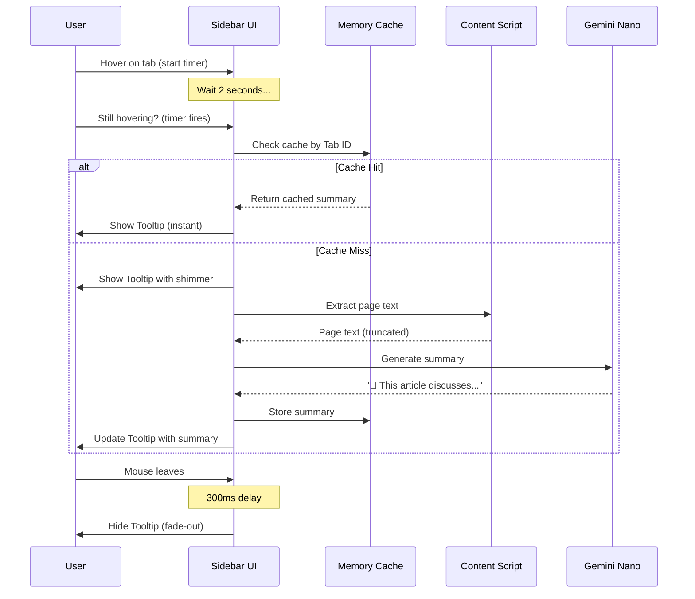

# PRD: Hover Summarize — 懸浮智慧摘要

| Attribute | Details |
| :--- | :--- |
| **Version** | v1.0 |
| **Status** | Draft |
| **Author** | Antigravity Agent |
| **Reviewers** | Tai |
| **Created** | 2026-02-27 |
| **Last Updated** | 2026-02-27 |
| **Strategic Context** | 產品戰略三：提升資訊獲取效率 |

## 1. Introduction

### 1.1 Problem Statement

目前多數的分頁管理工具都將分頁視為「檔案」來管理——排列、分組、搜尋。但使用者真正需要的不只是找到分頁，而是**快速回憶每個分頁中有什麼內容**。

當使用者開了 20 個分頁進行資料搜集時，他們經常忘記某個分頁到底講了什麼，只能逐一點開確認。這個「回憶成本」是巨大的認知負擔。

我們可以利用已有的 Local AI 基礎設施，在使用者將滑鼠懸停在分頁上 2~3 秒後，自動以 AI 生成該頁面的一句話摘要，直接在 Tooltip 中呈現。這是一個全新的交互範式，能大幅提升資訊獲取效率。

### 1.2 Goals & Objectives

- **目標 1**: 實作「Hover Summarize」——滑鼠懸停分頁 2 秒後，顯示 AI 生成的一句話頁面摘要。
- **目標 2**: 建立摘要快取機制，避免重複呼叫 AI 模型。
- **目標 3**: 提供美觀的 Tooltip UI，符合整體設計語言 (Glassmorphism 質感)。
- **目標 4**: 作為獨家賣點，在官網與行銷素材中重點宣傳。

### 1.3 Success Metrics (KPIs)

- Hover Summarize 觸發率：每日活躍用戶中 40% 以上至少觸發過一次。
- 摘要快取命中率：90% 以上（減少 AI 呼叫開銷）。
- 使用者滿意度：社群回饋中相關正面提及率 > 70%。

## 2. User Stories

| ID | As a (Role) | I want to (Action) | So that (Benefit) | Priority |
| :--- | :--- | :--- | :--- | :--- |
| US-01 | 知識工作者 | 將滑鼠停在側邊欄的某個分頁上，看到一句話描述其內容 | 我不需要切換到那個分頁就能回憶起它的內容 | High |
| US-02 | 資料搜集者 | 在摘要 Tooltip 中直接判斷這個分頁是否還需要 | 我能更快做出「留下或關閉」的決定 | High |
| US-03 | 重度使用者 | 已經看過的摘要在下次 Hover 時立即出現（不重新計算） | 體驗流暢，不需要每次等待 AI 處理 | Medium |
| US-04 | 對隱私敏感的使用者 | 確認摘要資料不會被上傳到任何伺服器 | 我安心使用這個功能 | High |

## 3. Functional Requirements

### 3.1 Hover 觸發機制

| 需求編號 | 需求描述 | 優先級 |
| :--- | :--- | :--- |
| FR-1.01 | 當使用者將滑鼠懸停在側邊欄中的分頁項目上超過 **2 秒**時，系統**應**觸發摘要生成流程。 | High |
| FR-1.02 | 若使用者在 2 秒內移走滑鼠，系統**不應**觸發任何 AI 呼叫。 | High |
| FR-1.03 | 系統**應**使用 debounce 機制，避免快速滑過多個分頁時觸發大量 AI 呼叫。 | High |
| FR-1.04 | 系統**應**提供設定開關，允許使用者停用 Hover Summarize（預設為啟用）。 | Medium |

### 3.2 內容擷取

| 需求編號 | 需求描述 | 優先級 |
| :--- | :--- | :--- |
| FR-2.01 | 系統**應**透過 `chrome.scripting.executeScript()` 擷取目標分頁的頁面可見文字內容（`document.body.innerText`）。 | High |
| FR-2.02 | 擷取的文字**應**截斷至前 1500 個字元，以避免超出 Gemini Nano 的 Token 上限。 | High |
| FR-2.03 | 若目標分頁為 `chrome://`、`chrome-extension://` 或其他受限頁面，系統**應**使用分頁的標題和 URL 作為替代輸入。 | High |
| FR-2.04 | 若分頁已被凍結/suspended，系統**應**使用快取的標題和 URL 進行摘要。 | Medium |

### 3.3 AI 摘要生成

| 需求編號 | 需求描述 | 優先級 |
| :--- | :--- | :--- |
| FR-3.01 | 系統**應**將擷取的文字內容透過 Gemini Nano 生成一句話摘要（30~80 字元）。 | High |
| FR-3.02 | Prompt **應**指示 AI 以使用者的 UI 語系輸出。 | High |
| FR-3.03 | 系統**應**為摘要加上適當的 Emoji 前綴，增加可讀性與趣味性。 | Medium |
| FR-3.04 | 若 AI 模型不可用，系統**應**降級顯示分頁的 URL 域名 + 標題作為 Tooltip 內容。 | High |

### 3.4 快取機制

| 需求編號 | 需求描述 | 優先級 |
| :--- | :--- | :--- |
| FR-4.01 | 系統**應**將成功生成的摘要以 Tab ID 為 Key 快取於記憶體中 (`Map`)。 | High |
| FR-4.02 | 若已有快取，系統**應**直接顯示快取摘要，不再呼叫 AI。 | High |
| FR-4.03 | 當分頁的 URL 發生變化時（導航事件），系統**應**清除該分頁的快取。 | High |
| FR-4.04 | 當分頁關閉時，系統**應**移除對應的快取項目。 | Medium |
| FR-4.05 | 快取**不應**持久化到 `chrome.storage`，僅存在於 session 生命週期內。 | Medium |

### 3.5 Tooltip UI

| 需求編號 | 需求描述 | 優先級 |
| :--- | :--- | :--- |
| FR-5.01 | 摘要**應**顯示在自訂的 Tooltip 浮層中（非瀏覽器原生 Tooltip），位於分頁項目的右側或下方。 | High |
| FR-5.02 | Tooltip **應**具有毛玻璃 (Glassmorphism) 背景效果，與整體設計語言一致。 | High |
| FR-5.03 | Tooltip **應**有淡入 (fade-in) 進場動畫，持續時間 ≤ 200ms。 | Medium |
| FR-5.04 | 在 AI 處理中時，Tooltip **應**顯示一個小型的 shimmer / skeleton 載入動畫。 | High |
| FR-5.05 | 使用者可將滑鼠移入 Tooltip 內（Tooltip 保持顯示），移出後延遲 300ms 消失。 | Medium |

## 4. Acceptance Criteria

### AC for FR-1.01 ~ FR-1.03: Hover 觸發

```gherkin
Given 側邊欄顯示多個分頁
  And AI 模型狀態為 'readily'
When 使用者將滑鼠停留在某個分頁上 2 秒
Then 系統顯示 Tooltip 並開始載入摘要
  And 載入期間顯示 shimmer 動畫
  And 摘要在 3 秒內生成完畢並顯示
```

```gherkin
Given 側邊欄顯示多個分頁
When 使用者快速滑過 5 個分頁（每個停留不到 1 秒）
Then 系統不觸發任何 AI 呼叫
```

### AC for FR-4.01 ~ FR-4.02: 快取命中

```gherkin
Given 使用者已對某個分頁觸發過 Hover Summarize（摘要已快取）
When 使用者再次將滑鼠停留在同一分頁上 2 秒
Then 系統立即（< 100ms）顯示快取的摘要
  And 不觸發新的 AI 呼叫
```

### AC for FR-3.04: AI 不可用降級

```gherkin
Given Gemini Nano 模型狀態為 'no'
When 使用者將滑鼠停留在某分頁上 2 秒
Then Tooltip 顯示該分頁的域名 + 標題
  And 不顯示任何錯誤訊息
```

## 5. User Experience (UI/UX)

### 5.1 Hover Summarize 完整流程



### 5.2 Tooltip 視覺設計

```
┌─────────────────────────────────────┐
│  ┌─────────────────────────────┐    │
│  │ 🏖️ favicon  Tab Title      │    │  <-- 分頁項目
│  └─────────────────────────────┘    │
│         │                           │
│         ▼                           │
│  ┌──────────────────────────────┐   │
│  │ 📰 這篇文章討論了 React 19   │   │  <-- Tooltip (Glassmorphism)
│  │    的新並行渲染機制與效能提升 │   │
│  │ ─────────────────────────── │   │
│  │ react.dev · 3 min read       │   │  <-- 附加資訊（可選）
│  └──────────────────────────────┘   │
└─────────────────────────────────────┘
```

## 6. Non-Functional Requirements

- **Privacy**: 頁面文字僅在本地擷取並傳送給 Local AI，嚴禁外傳。
- **Performance**: Hover 觸發不應佔用主線程超過 50ms；AI 呼叫在背景非同步執行。
- **Memory**: 快取佔用不超過 5MB（約 500 個分頁的摘要）。
- **Compatibility**: `chrome.scripting.executeScript()` 需要 `host_permissions`（已在 manifest 中配置 `*://*/*`）。

## 7. Out of Scope

- 全文內容分析或長篇摘要（僅一句話）。
- 摘要結果的編輯或自訂。
- 圖片/影片內容的分析摘要。
- 跨 Session 的摘要持久化。
- 用戶自訂 Hover 延遲時間。

---

## Revision History

| Version | Date | Author | Changes |
|---------|------|--------|---------|
| v1.0 | 2026-02-27 | Antigravity Agent | Initial draft |
