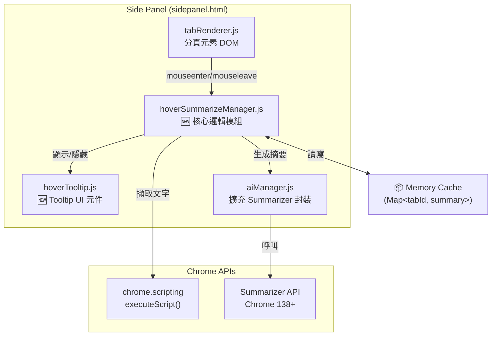
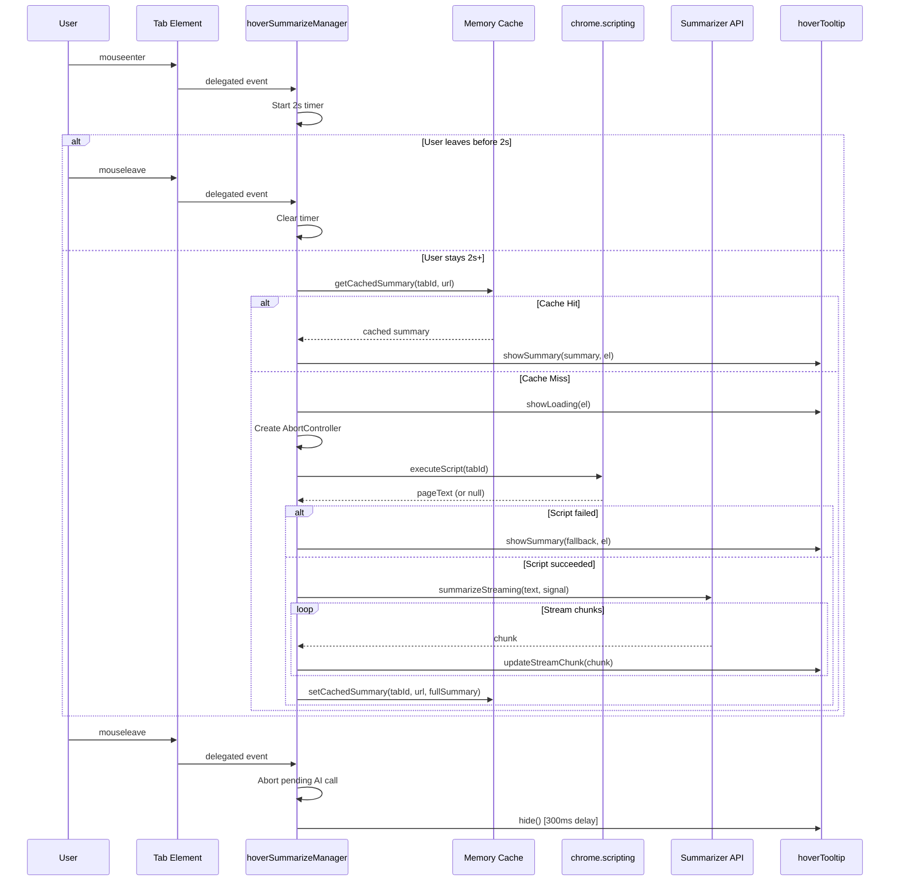

# SA: Hover Summarize — 懸浮智慧摘要系統設計

| Attribute | Details |
| :--- | :--- |
| **Version** | v1.0 |
| **Status** | Draft |
| **Author** | Antigravity Agent |
| **Related PRD** | [PRD_spec.md](./PRD_spec.md) |
| **PRD Version** | v1.0 |
| **Created** | 2026-02-27 |
| **Last Updated** | 2026-02-27 |

## 1. Overview

### 1.1 Scope

本文件涵蓋 PRD BASE-012 定義的 Hover Summarize 功能的完整技術方案：

1. **Hover 觸發機制** — Debounce timer + AbortController
2. **內容擷取** — `chrome.scripting.executeScript()` → 頁面文字
3. **AI 摘要生成** — **Chrome 內建 Summarizer API** (非 Prompt API)
4. **快取機制** — 記憶體 `Map` 快取
5. **Tooltip UI** — 自訂 Glassmorphism 浮層

### 1.2 技術決策：Summarizer API vs Prompt API

> [!IMPORTANT]
> **重大技術選擇**: 經過研讀 Chrome AI 官方文件後，本功能改為使用 **Summarizer API** 而非原本 PRD 中提到的 Prompt API (Gemini Nano)。

| 比較維度 | Summarizer API | Prompt API |
|---------|---------------|------------|
| 用途適配性 | ✅ 專為摘要設計 | ⚠️ 通用型，需自行設計 Prompt |
| 回應速度 | ✅ 較快 (專用模型路徑) | ⚠️ 較慢 (通用推理) |
| 輸出控制 | ✅ `type/length/format` 原生參數 | ❌ 需靠 Prompt 指示，不穩定 |
| 語言支援 | ✅ `outputLanguage` 原生支援 | ⚠️ 需在 Prompt 中要求 |
| Chrome 版本 | Chrome 138+ (Stable) | Chrome 131+ (Stable) |
| 串流支援 | ✅ `summarizeStreaming()` | ✅ `promptStreaming()` |

**結論**: Summarizer API 在速度、輸出品質控制和語言支援上都優於 Prompt API，且明確對應「摘要」這個使用場景。

### 1.3 回應時間預估與使用者體驗策略

> [!WARNING]
> **Local AI 延遲問題**: 本機 AI 模型推理速度取決於使用者硬體 (GPU/CPU)。根據官方文件，首次使用的 session 建立可能需要數秒。

| 階段 | 預估時間 | UX 策略 |
|------|---------|---------|
| Hover 等待 | 2s (設計固定) | 不顯示任何 UI |
| Session 建立 | 0.5~3s (首次較慢) | 顯示 shimmer 動畫 |
| 摘要生成 | 1~5s (依文字量) | 串流漸顯 + shimmer |
| 快取命中 | < 50ms | 直接顯示 |
| **總計 (首次)** | **3.5~10s** | shimmer → 串流文字 |
| **總計 (快取)** | **2~2.05s** | 直接顯示 |

**最佳化策略**:
1. **Session 預建立**: 側邊欄載入時，在背景預先呼叫 `Summarizer.create()` 建立 session，避免 Hover 時才建立的延遲。
2. **串流顯示**: 使用 `summarizeStreaming()` 而非 `summarize()`，讓使用者在 AI 生成過程中就能逐步看到結果。
3. **積極快取**: 一旦摘要生成完畢，透過 `Map` 快取，後續 Hover 即時顯示。

### 1.4 Architecture Diagram



## 2. Requirement Traceability

| Req ID | PRD Section | SA Section | Implementation File | Test File |
|--------|-------------|------------|---------------------|-----------|
| FR-1.01 | PRD 3.1 | SA 3.1 | `modules/ui/hoverSummarizeManager.js` | Manual |
| FR-1.02 | PRD 3.1 | SA 3.1 | `modules/ui/hoverSummarizeManager.js` | Manual |
| FR-1.03 | PRD 3.1 | SA 3.1 | `modules/ui/hoverSummarizeManager.js` | Manual |
| FR-1.04 | PRD 3.1 | SA 3.9 | `modules/ui/settingManager.js` | Manual |
| FR-2.01 | PRD 3.2 | SA 3.2 | `modules/ui/hoverSummarizeManager.js` | Manual |
| FR-2.02 | PRD 3.2 | SA 3.2 | `modules/ui/hoverSummarizeManager.js` | Manual |
| FR-2.03 | PRD 3.2 | SA 3.2 | `modules/ui/hoverSummarizeManager.js` | Manual |
| FR-2.04 | PRD 3.2 | SA 3.2 | `modules/ui/hoverSummarizeManager.js` | Manual |
| FR-3.01 | PRD 3.3 | SA 3.3 | `modules/aiManager.js` | Manual |
| FR-3.02 | PRD 3.3 | SA 3.3 | `modules/aiManager.js` | Manual |
| FR-3.03 | PRD 3.3 | SA 3.3 | `modules/aiManager.js` | Manual |
| FR-3.04 | PRD 3.3 | SA 3.6 | `modules/aiManager.js` | Manual |
| FR-4.01 | PRD 3.4 | SA 3.4 | `modules/ui/hoverSummarizeManager.js` | Manual |
| FR-4.02 | PRD 3.4 | SA 3.4 | `modules/ui/hoverSummarizeManager.js` | Manual |
| FR-4.03 | PRD 3.4 | SA 3.4 | `modules/ui/hoverSummarizeManager.js` | Manual |
| FR-4.04 | PRD 3.4 | SA 3.4 | `modules/ui/hoverSummarizeManager.js` | Manual |
| FR-4.05 | PRD 3.4 | SA 3.4 | `modules/ui/hoverSummarizeManager.js` | Manual |
| FR-5.01 | PRD 3.5 | SA 3.5 | `modules/ui/hoverTooltip.js`, `sidepanel.css` | Manual |
| FR-5.02 | PRD 3.5 | SA 3.5 | `sidepanel.css` | Manual |
| FR-5.03 | PRD 3.5 | SA 3.5 | `sidepanel.css` | Manual |
| FR-5.04 | PRD 3.5 | SA 3.5 | `modules/ui/hoverTooltip.js` | Manual |
| FR-5.05 | PRD 3.5 | SA 3.5 | `modules/ui/hoverTooltip.js` | Manual |

## 3. Component Design

### 3.1 Hover 觸發控制器 (`hoverSummarizeManager.js` 🆕)

**新增模組**: `modules/ui/hoverSummarizeManager.js`

```javascript
/**
 * @module hoverSummarizeManager
 * 
 * 職責:
 * - 監聽分頁元素的 mouseenter/mouseleave 事件
 * - 管理 2 秒 debounce timer
 * - 協調內容擷取 → AI 摘要 → Tooltip 顯示
 * - 管理 AbortController 用於取消進行中的 AI 呼叫
 * - 管理記憶體快取
 */

// === State ===
/** @type {Map<number, string>} tabId → summary */
const summaryCache = new Map();

/** @type {number|null} */
let hoverTimerId = null;

/** @type {AbortController|null} */
let currentAbortController = null;

/** @type {Summarizer|null} 預建立的 session */
let summarizerSession = null;

// === Public API ===

/**
 * 初始化 Hover Summarize 功能
 * - 綁定事件委派到分頁列表容器
 * - 預建立 Summarizer session
 */
export async function init() { /* ... */ }

/**
 * 當分頁 URL 變化時清除快取
 * @param {number} tabId
 */
export function invalidateCache(tabId) { /* ... */ }

/**
 * 當分頁關閉時移除快取
 * @param {number} tabId
 */
export function removeFromCache(tabId) { /* ... */ }
```

**事件委派策略**: 使用事件委派綁定在 `tabListContainer` 上，而非每個分頁元素，以避免大量分頁時的記憶體開銷。

### 3.2 內容擷取策略

**技術方案**: `chrome.scripting.executeScript()`

```javascript
/**
 * 擷取分頁的頁面文字內容
 * @param {number} tabId 
 * @returns {Promise<string>} 截斷至 1500 字元的純文字
 */
async function extractPageContent(tabId) {
    try {
        const results = await chrome.scripting.executeScript({
            target: { tabId },
            func: () => {
                // 移除 script/style/nav 等干擾元素
                const clone = document.body.cloneNode(true);
                clone.querySelectorAll('script, style, nav, footer, header, aside')
                    .forEach(el => el.remove());
                return clone.innerText.replace(/\s+/g, ' ').trim();
            }
        });
        
        const text = results?.[0]?.result || '';
        return text.substring(0, 1500); // Token limit guard
    } catch (err) {
        // chrome:// 或受限頁面 → 降級
        return null; 
    }
}
```

> [!WARNING]
> **權限注意**: `chrome.scripting.executeScript()` 需要 `"scripting"` permission。目前 `manifest.json` 中**未包含** `"scripting"` permission，需要新增。`host_permissions: ["*://*/*"]` 已存在，滿足 host 的需求。

**降級規則** (FR-2.03, FR-2.04):
- `chrome://`, `chrome-extension://`, `about:` 頁面 → 使用 tab.title + tab.url
- 凍結/suspended 分頁 → 使用 tab.title + tab.url
- `executeScript` 失敗 → 使用 tab.title + tab.url

### 3.3 AI 摘要生成 (`aiManager.js` 擴充)

在現有 `aiManager.js` 中新增 Summarizer 相關函式：

```javascript
/**
 * 檢查 Summarizer API 是否可用
 * @returns {Promise<boolean>}
 */
export async function checkSummarizerReadiness() {
    if (!('Summarizer' in self)) return false;
    try {
        const status = await Summarizer.availability();
        return status !== 'unavailable';
    } catch (e) {
        return false;
    }
}

/**
 * 建立並快取 Summarizer Session
 * @returns {Promise<Summarizer|null>}
 */
export async function createSummarizerSession() {
    if (!('Summarizer' in self)) return null;
    
    const availability = await Summarizer.availability();
    if (availability === 'unavailable') return null;
    
    const currentLang = getResolvedUILanguage();
    
    return await Summarizer.create({
        type: 'tldr',
        format: 'plain-text',
        length: 'short',
        // 語言設定
        expectedInputLanguages: ['en', 'ja', 'es'],
        outputLanguage: currentLang === 'zh-TW' ? 'en' : currentLang,
        sharedContext: 'Summarize web page content for browser tab tooltip. Keep it very concise, one sentence.',
    });
}

/**
 * 生成頁面摘要 (串流)
 * @param {Summarizer} session
 * @param {string} text 
 * @param {AbortSignal} signal
 * @returns {ReadableStream<string>}
 */
export function summarizeStreaming(session, text, signal) {
    return session.summarizeStreaming(text, {
        context: 'This is content from a browser tab. Provide a one-sentence summary.',
        signal,
    });
}
```

> [!IMPORTANT]
> **語言限制**: Summarizer API 從 Chrome 140 起支援 en/es/ja 輸出。中文 (zh-TW) 目前**不在官方支援清單**中，需測試實際效果。若不支援，`outputLanguage` 回退至 `'en'`。

> [!WARNING]
> **Summarizer Session 生命週期**: Session 建立一次後可重複呼叫 `summarize()` / `summarizeStreaming()`。但 Session 有 Token 上限 (`inputUsage/inputQuota`)，超出後需重建。建議在每次摘要完成後檢查 quota 使用率。

### 3.4 記憶體快取

```javascript
/** @type {Map<number, {summary: string, url: string}>} */
const summaryCache = new Map();

/**
 * 快取讀取 — 需比對 URL 是否變化
 */
function getCachedSummary(tabId, currentUrl) {
    const cached = summaryCache.get(tabId);
    if (cached && cached.url === currentUrl) {
        return cached.summary;
    }
    // URL 變了 → 清除舊快取
    if (cached) summaryCache.delete(tabId);
    return null;
}

/**
 * 快取寫入
 */
function setCachedSummary(tabId, url, summary) {
    summaryCache.set(tabId, { summary, url });
}

/**
 * 快取清理 — 在 tab removed 事件中呼叫
 */
function removeCachedSummary(tabId) {
    summaryCache.delete(tabId);
}
```

**記憶體估算**: 每個快取項目約 200 bytes (URL + Summary 文字)。500 個分頁 ≈ 100KB，遠在 5MB 上限之內。

### 3.5 Tooltip UI 元件 (`hoverTooltip.js` 🆕)

**新增模組**: `modules/ui/hoverTooltip.js`

```javascript
/**
 * @module hoverTooltip
 * 
 * 職責:
 * - 管理 Tooltip DOM 元素的建立與定位
 * - 提供 show(summary, anchorElement) / hide() API
 * - Shimmer 載入狀態管理
 * - 滑鼠移入 Tooltip 時保持顯示 (FR-5.05)
 */

// === DOM 結構 ===
// <div class="hover-tooltip" role="tooltip">
//   <div class="hover-tooltip__shimmer"></div>
//   <div class="hover-tooltip__content">
//     <span class="hover-tooltip__emoji">📰</span>
//     <span class="hover-tooltip__text">摘要文字...</span>
//   </div>
//   <div class="hover-tooltip__meta">
//     <span class="hover-tooltip__domain">react.dev</span>
//   </div>
// </div>

export function showLoading(anchorElement) { /* 顯示 shimmer */ }
export function showSummary(summary, anchorElement) { /* 顯示摘要 */ }
export function updateStreamChunk(chunk) { /* 串流更新 */ }
export function hide() { /* 300ms 延遲後隱藏 */ }
```

**定位邏輯**: 使用 `anchorElement.getBoundingClientRect()` 計算位置，Tooltip 顯示在分頁項目的右側。若空間不足，fallback 到下方。

**CSS 樣式** (新增至 `sidepanel.css`):

```css
.hover-tooltip {
  position: fixed;
  z-index: 1000;
  max-width: 280px;
  padding: var(--arc-space-sm) var(--arc-space-md);
  border-radius: var(--arc-radius-md);
  
  /* Glassmorphism */
  background: var(--arc-glass-bg);
  backdrop-filter: blur(12px);
  -webkit-backdrop-filter: blur(12px);
  border: 1px solid var(--arc-glass-border);
  box-shadow: var(--arc-shadow-hover);
  
  /* Animation */
  opacity: 0;
  transform: translateY(4px);
  transition: opacity var(--arc-anim-duration-fast) var(--arc-anim-easing-out),
              transform var(--arc-anim-duration-fast) var(--arc-anim-easing-out);
  pointer-events: none;
}

.hover-tooltip.visible {
  opacity: 1;
  transform: translateY(0);
  pointer-events: auto; /* 允許滑鼠移入 */
}

/* Shimmer 載入動畫 */
.hover-tooltip__shimmer {
  height: 14px;
  border-radius: 4px;
  background: linear-gradient(
    90deg,
    var(--arc-color-surface-1) 25%,
    var(--arc-color-surface-2) 50%,
    var(--arc-color-surface-1) 75%
  );
  background-size: 200% 100%;
  animation: arc-shimmer 1.5s ease-in-out infinite;
}

@keyframes arc-shimmer {
  0% { background-position: 200% 0; }
  100% { background-position: -200% 0; }
}
```

### 3.6 降級策略 (Fallback)

```mermaid
graph TD
    A{Summarizer API<br/>存在?} -->|No| FALLBACK
    A -->|Yes| B{availability()}
    B -->|unavailable| FALLBACK
    B -->|available/downloadable| C[使用 Summarizer API]
    C --> D{executeScript<br/>成功?}
    D -->|Yes| E[用頁面文字摘要]
    D -->|No| FALLBACK
    
    FALLBACK["降級: 顯示<br/>🌐 domain.com<br/>Tab Title"]
```

### 3.7 完整流程 Sequence Diagram



### 3.8 Manifest 變更

`manifest.json` 需新增 `"scripting"` permission：

```diff
  "permissions": [
    "tabs",
    "sidePanel",
    "bookmarks",
    "tabGroups",
    "storage",
    "readingList",
    "alarms",
-   "offscreen"
+   "offscreen",
+   "scripting"
  ],
```

### 3.9 設定開關

在 `stateManager.js` 中新增：
```javascript
// 預設啟用
const HOVER_SUMMARIZE_KEY = 'hoverSummarizeEnabled';

export function isHoverSummarizeEnabled() { /* chrome.storage.local */ }
export function setHoverSummarizeEnabled(enabled) { /* ... */ }
```

在 `settingManager.js` 的設定面板 UI 中新增一個 toggle 開關。

### 3.10 uiManager.js 更新

在 `modules/uiManager.js` 中重新匯出新模組：
```javascript
export * from './ui/hoverSummarizeManager.js';
export * from './ui/hoverTooltip.js';
```

### 3.11 sidepanel.js 整合

在 `sidepanel.js` 初始化流程中加入：
```javascript
import { init as initHoverSummarize } from './modules/ui/hoverSummarizeManager.js';

// 在 DOMContentLoaded 中
await initHoverSummarize();
```

同時在分頁的 `onRemoved` 事件中呼叫 `removeFromCache(tabId)`。

### 3.12 i18n 新增字串

在 `_locales/*/messages.json` 中新增：
- `hoverSummarizeLoading`: "正在分析頁面..."
- `hoverSummarizeFailed`: "無法生成摘要"
- `hoverSummarizeToggle`: "Hover 智慧摘要"
- `summarizerNotAvailable`: "摘要功能不可用"

## 4. Data Design

### 4.1 Data Models

```json
// summaryCache entry
{
  "tabId": 12345,
  "value": {
    "summary": "📰 This article discusses React 19's new concurrent rendering...",
    "url": "https://react.dev/blog/react-19"
  }
}
```

### 4.2 Storage Strategy

- **Session Only**: 快取僅存在於 `Map` 物件中，不持久化。
- **Settings**: `hoverSummarizeEnabled` 存於 `chrome.storage.local`。

## 5. Testing Strategy

### 5.1 Test Impact Analysis

| Test File | Impact | Action Required |
|-----------|--------|-----------------| 
| `benchmark/modal_perf.test.js` | 無影響 | 無需修改 |
| 新增 | — | 見下方 |

### 5.2 Verification Plan

#### Manual Verification

1. **Hover 2s 觸發**: Hover 分頁，確認剛好在 ~2 秒後出現 Tooltip (shimmer → 摘要)。
2. **快速滑過不觸發**: 快速滑過 5 個分頁，確認 DevTools Console 無 AI 呼叫日誌。
3. **快取命中**: 同一分頁再次 Hover，確認 < 100ms 顯示（無 shimmer）。
4. **URL 變化清快取**: Navigate 到另一頁面後 Hover，確認重新生成摘要。
5. **chrome:// 降級**: Hover `chrome://settings` 分頁，確認顯示 URL + Title。
6. **AI 不可用**: 在 `chrome://flags` 停用 AI → Hover，確認顯示 URL + Title。
7. **Abort 機制**: Hover 分頁觸發後快速移走，確認 AI 呼叫被 abort（Console 無錯誤）。
8. **設定開關**: 停用 Hover Summarize → Hover 分頁 → 確認無 Tooltip。
9. **Glassmorphism**: 確認 Tooltip 有毛玻璃背景效果。
10. **串流顯示**: Hover 觸發後，確認文字是逐步出現而非整段跳出。

## 6. Security & Performance

- **Privacy**: 頁面文字僅本地擷取，傳給本機 Summarizer API，不上傳任何伺服器。
- **Performance**: 
  - Hover timer 使用 `setTimeout` (不佔主線程)。
  - AI 呼叫在 Promise 中非同步進行。
  - 預建立 Session 避免 Hover 時的建立延遲。
- **Memory**: 快取最大約 100KB (500 分頁)，不設硬上限（依隨分頁關閉自然清理）。
- **Error Handling**: 所有 AI 呼叫包裹在 `try/catch` 中，失敗一律 fallback 到 URL+Title 顯示。

---

## Revision History

| Version | Date | Author | Changes |
|---------|------|--------|---------|
| v1.0 | 2026-02-27 | Antigravity Agent | Initial draft |
