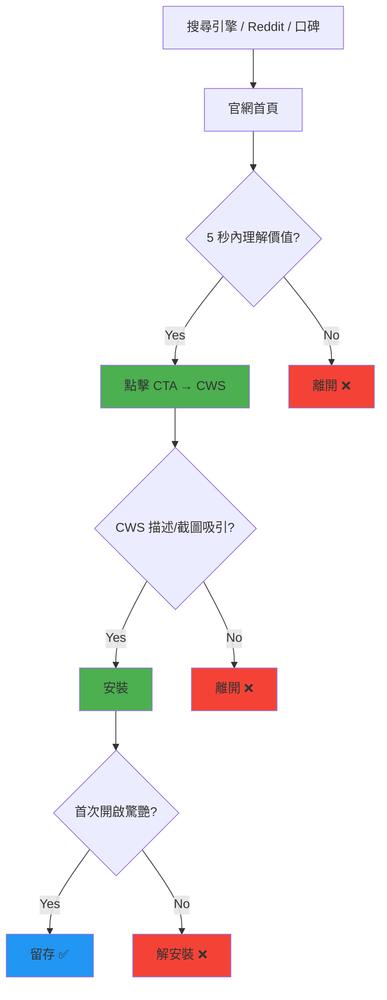

# PRD: Market Positioning — 重新定位與品牌差異化

| Attribute | Details |
| :--- | :--- |
| **Version** | v1.0 |
| **Status** | Draft |
| **Author** | Antigravity Agent |
| **Reviewers** | Tai |
| **Created** | 2026-02-27 |
| **Last Updated** | 2026-02-27 |
| **Strategic Context** | 產品戰略四：明確品牌與市場定位 (Positioning) |

## 1. Introduction

### 1.1 Problem Statement

目前我們的套件名稱為「Sidebar for Tabs & Bookmarks」，定位較為通用且描述性。為了提升產品能見度，我們需要確立獨特且清晰的**市場定位**。

許多工具將自己定位為「The best all-in-one tabs manager」——這其實容易失焦，因為「All-in-One」通常意味著目標使用者是少數的 Power User。我們認為真正的大眾市場（設計師、PM、行銷、學生）需要的是「一個開箱即用、具有良好美學設計的側邊欄」。

我們需要透過品牌語言、視覺素材、SEO 優化和社群策略的全面升級，搶佔「Arc for Chrome」這個心智定位。

### 1.2 Goals & Objectives

- **目標 1**: 制定清晰的品牌定位語言 (Positioning Statement)，建立獨特市場區隔。
- **目標 2**: 重新設計官網首頁的核心敘事與 Hero Section。
- **目標 3**: 優化 Chrome Web Store 的 Listing (標題、描述、截圖) 以提升轉化率。
- **目標 4**: 制定 SEO 策略，搶佔「Arc Chrome extension」、「vertical tabs AI」等高價值關鍵字。
- **目標 5**: 制定功能亮點頁面 (Feature Highlight Page) 策略，清晰呈現產品優勢。

### 1.3 Success Metrics (KPIs)

- Chrome Web Store 頁面點擊→安裝轉化率提升 20%。
- 官網自然搜尋流量提升 50%（透過 SEO 優化）。
- 「arc chrome extension」關鍵字排名進入 Google 前 3 頁。
- 社群 (Reddit/X) 有機提及率提升 30%。

## 2. User Stories

| ID | As a (Role) | I want to (Action) | So that (Benefit) | Priority |
| :--- | :--- | :--- | :--- | :--- |
| US-01 | 在 CWS 搜尋的潛在用戶 | 在搜尋結果中一眼看出這個套件「像 Arc」且「有 AI」 | 我會優先點進去看 | High |
| US-02 | 正在尋找管理工具的用戶 | 在官網看到清楚的功能亮點對比表 | 我能快速了解產品核心優勢 | High |
| US-03 | 從搜尋引擎來的訪客 | 在官網第一屏就理解這個產品的核心價值 | 我 5 秒內決定是否安裝 | High |
| US-04 | Reddit/社群用戶 | 看到有人分享使用心得和美觀的截圖 | 我被種草，想馬上試用 | Medium |

## 3. Functional Requirements

### 3.1 品牌定位語言 (Positioning)

| 需求編號 | 需求描述 | 優先級 |
| :--- | :--- | :--- |
| FR-1.01 | **應**確立核心定位語：「不是更多功能，而是更好的瀏覽體驗。」 | High |
| FR-1.02 | **應**定義三大差異化支柱 (Differentiation Pillars)：① Arc 極簡美學 ② Zero-Config Local AI ③ 書籤-分頁無縫整合。 | High |
| FR-1.03 | **應**制定一句話 Elevator Pitch：「你的 Chrome，一秒變 Arc。免設定本地 AI 幫你一鍵整理分頁，100% 隱私保護。」 | High |
| FR-1.04 | **應**定義 Anti-Positioning（我們不是什麼）：不是 Power User 工具、不是 100 個設定的工具箱、不是需要 API Key 的 AI 包裝。 | Medium |

### 3.2 官網 Hero Section 改版

| 需求編號 | 需求描述 | 優先級 |
| :--- | :--- | :--- |
| FR-2.01 | 首頁 Hero Section **應**包含一句主標語 (Headline)、一段副標語 (Subheadline)、和動態展示圖/影片。 | High |
| FR-2.02 | 主標語**應**突出情感價值而非功能列表（如：「你的瀏覽器，理當井然有序。」已經很好，可保留或微調）。 | High |
| FR-2.03 | 副標語**應**明確提及三大差異化支柱的核心關鍵字。 | High |
| FR-2.04 | Hero Section **應**包含 Trust Signals（安裝數、GitHub Stars、「100% 開源」Badge）。 | Medium |
| FR-2.05 | **應**新增或強化動態展示：一段 15~30 秒的 GIF/WebM 展示核心互動（拖曳、AI 整理、主題切換）。 | High |

### 3.3 Chrome Web Store 優化

| 需求編號 | 需求描述 | 優先級 |
| :--- | :--- | :--- |
| FR-3.01 | CWS 短描述（132 字以內）**應**包含關鍵字：「Arc-like」、「vertical tabs」、「local AI」、「bookmarks」。 | High |
| FR-3.02 | CWS 詳細描述**應**在前三行提及「免 API Key」、「本機 AI」、「隱私保護」。 | High |
| FR-3.03 | CWS 截圖**應**至少包含 5 張高品質截圖：① 側邊欄全景 ② AI 整理過程 ③ 拖曳書籤互動 ④ 主題變換 ⑤ 閱讀清單。 | High |
| FR-3.04 | 每張 CWS 截圖**應**加上清晰的功能標註文字 (Overlay text)。 | Medium |
| FR-3.05 | CWS **應**新增行銷用的宣傳圖塊 (Promotional Tile) 440x280。 | Medium |

### 3.4 功能亮點比較頁

| 需求編號 | 需求描述 | 優先級 |
| :--- | :--- | :--- |
| FR-4.01 | 官網**應**新增 `/features` 頁面，提供不同工具設計理念的比較表格。 | Medium |
| FR-4.02 | 比較表**應**包含 3~4 個核心維度（e.g., 設計美學、設定複雜度、AI 整合）。 | Medium |
| FR-4.03 | 比較措辭**應**保持專業客觀。 | High |
| FR-4.04 | 比較頁**應**在結尾提供明確的 CTA (Call-to-Action)：「立即安裝，親自體驗差異」。 | Medium |

### 3.5 SEO 策略

| 需求編號 | 需求描述 | 優先級 |
| :--- | :--- | :--- |
| FR-5.01 | 官網**應**針對以下高價值關鍵字進行 SEO 優化：`arc browser chrome extension`, `vertical tabs chrome`, `AI tab manager`, `chrome sidebar bookmarks`。 | High |
| FR-5.02 | 每個官網頁面**應**具備完整的 Meta Tags（title, description, og:image）。 | High |
| FR-5.03 | 官網**應**實作結構化資料 (Schema.org - SoftwareApplication) 以增強搜尋結果呈現。 | Medium |
| FR-5.04 | 官網**應**建立部落格/指南區 (`/guide`) 或 FAQ 頁面，針對長尾關鍵字佈局內容。 | Low |

## 4. Acceptance Criteria

### AC for FR-1.01 ~ FR-1.04: 品牌定位

```gherkin
Given 品牌定位文件已撰寫完成
When 使用者想了解「這個套件跟其他工具有什麼不同？」
Then 可以在 10 秒內用一句話作出差異化回答
  And 回答中不包含「功能更多」或「設定更多」等字眼
```

### AC for FR-3.01 ~ FR-3.02: CWS 描述

```gherkin
Given Chrome Web Store 的 Listing 已更新
When 使用者搜尋 "Arc vertical tabs chrome extension"
Then 搜尋結果中的短描述包含 "Arc-like" 和 "local AI"
  And 詳細描述的前三行明確提及 "No API Key required"
```

### AC for FR-4.01 ~ FR-4.03: 功能亮點比較頁

```gherkin
Given 使用者訪問 /compare 頁面
When 頁面載入完成
Then 顯示一個依據設計理念劃分的比較表格
  And 比較維度優先呈現我方優勢（AI 免設定、極簡美學、書籤整合）
  And 措辭客觀專業，未使用任何貶抑性字詞
```

## 5. User Experience (UI/UX)

### 5.1 使用者獲取漏斗



### 5.2 比較表格設計概念

| 比較維度 | 我們的產品 🏆 | 強調全能的工具 | 傳統側邊欄 |
|---------|---------------------|-----------|---------|
| AI 設定門檻 | ✅ 零設定 (本機 AI) | ❌ 需申請 API Key | ❌ 無 AI |
| 設計美學 | ✅ Arc 極簡風格 | ⚠️ 功能導向 | ⚠️ 不一 |
| 書籤整合 | ✅ 拖曳即書籤 | ❌ 不支援 | ❌ 不支援 |
| 閱讀清單 | ✅ 內建 | ❌ 不支援 | ❌ 不支援 |
| 隱私保護 | ✅ 100% 離線 | ⚠️ 需傳 API Key | ⚠️ 不一 |
| 開箱即用 | ✅ 最少設定 | ❌ 100+ 設定 | ⚠️ 不一 |

> **注意**: 以上表格為設計概念，實際內容需經過客觀事實查證後方可發布。

## 6. Non-Functional Requirements

- **SEO**: 官網 Lighthouse SEO 分數應 ≥ 95。
- **Performance**: 官網 Largest Contentful Paint (LCP) < 2.5 秒。
- **Ethics**: 功能比較必須基於事實，禁止虛假宣稱或誤導性說法。
- **Localization**: 核心行銷文案應至少支援繁體中文與英文兩個語系。

## 7. Out of Scope

- 付費推廣 / Google Ads（本階段只做 Organic 策略）。
- 品牌 Logo / 名稱的全面更換（僅優化 tagline 與描述）。
- 影片製作（本階段以 GIF/WebM 截圖為主）。
- 社群帳號營運的具體排程（本 PRD 僅提供策略方向）。

---

## Revision History

| Version | Date | Author | Changes |
|---------|------|--------|---------|
| v1.0 | 2026-02-27 | Antigravity Agent | Initial draft |
