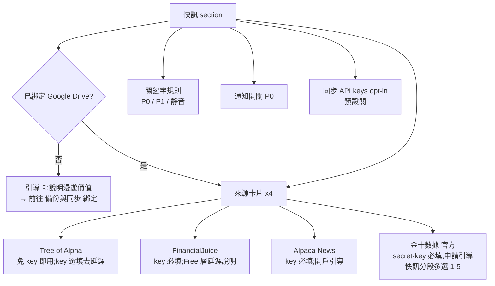

# PRD — newswire：財經快訊訂閱（WSS News Feed）

| 欄位 | 值 |
|---|---|
| ID | BASE-016 |
| 分級 | **T2**（Phase 1：PRD） |
| 狀態 | Draft v1.0 — 待 User Review（Gate 1） |
| 日期 | 2026-07-20 |
| 上游文件 | 外部規格書 `wss_news_feed_spec.md`（server-side daemon 版，codename: newswire） |
| 下游文件 | 同目錄 `SA_spec.md`（Phase 2，本 PRD 核准後才定稿） |
| 相依 | BASE-015 側邊欄區塊排序（快訊區塊以 `data-section-id="newswire"` 參與排序） |

---

## 1. Introduction

### 1.1 Problem Statement

使用者（台指期／美股看盤情境）需要即時財經快訊（宏觀頭條、經濟數據、個股新聞、中文快訊），目前只能另開金十、FinancialJuice 等網站或依賴手機通知——脫離瀏覽器側邊欄的工作流。既有的外部規格書定義了一套 server-side daemon（Ubuntu + Python + Telegram），但需要一台常駐主機；本功能把其中「多源訂閱 → 正規化 → 去重 → 分級 → 呈現/通知」的核心價值搬進 Chrome extension，讓**只要瀏覽器開著**就能在 sidepanel 看到即時快訊流、重大事件跳系統通知，零額外基礎設施。

### 1.2 Goals

1. 使用者可在 options 以 opt-in 方式啟用最多 4 個官方資訊源，並依引導文案自行申請/填入 API key。
2. 瀏覽器開啟期間，extension 於背景維持 WSS 連線；sidepanel 的「快訊」區塊即時顯示聚合流。
3. P0 級事件（重大數據/央行決議）觸發 Chrome 系統通知。
4. 來源設定與關鍵字規則跨裝置漫遊（Google Drive appdata）；未綁定 Google 帳號時引導綁定。
5. 全程符合 MV3 與 Chrome Web Store 政策：僅官方 API、零遠端程式碼、金十非官方端點排除。

### 1.3 Success Metrics（KPIs）

| 指標 | 目標 |
|---|---|
| 快訊延遲（來源發布 → sidepanel 顯示，即時層來源、連線中） | ≤ 3 秒 |
| P0 通知延遲（來源發布 → chrome.notifications） | ≤ 5 秒 |
| 斷線自癒（網路恢復 → 重新連上） | ≤ 90 秒（含指數退避） |
| 跨源重複告警（同 source+source_id） | 0（L1 去重保證） |
| 對既有功能的效能影響（sidepanel 首屏） | 無可感知差異（快訊初始化不進關鍵路徑） |

---

## 2. User Stories

- **US-1**：作為看盤使用者，我想在側邊欄直接看到即時財經快訊流，這樣我不用另開網站或切換視窗。
- **US-2**：作為使用者，我想自行決定啟用哪些來源、並依引導申請對應的 API key，這樣沒有 key 的來源不會干擾我（Tree of Alpha 免 key，裝完即用）。
- **US-3**：作為使用者，我想在 CPI／FOMC 等重大事件發布時收到系統通知，即使 sidepanel 沒開著。
- **US-4**：作為使用者，我想自訂 P0／P1／靜音關鍵字，這樣快訊分級符合我的交易標的（台積電、半導體、關稅…）。
- **US-5**：作為多裝置使用者，我想讓來源開關與關鍵字規則跟著 Google 帳號漫遊；沒綁定時希望被清楚引導去綁定。
- **US-6**：作為注重安全的使用者，我希望 API key 預設只留在本機；作為多裝置使用者，我希望**可以自行選擇**讓 key 隨 Drive appdata 同步（US-6 兩個立場以 opt-in 開關並存）。
- **US-7**：作為使用者，我想暫停/繼續快訊流與調整快訊區塊在側邊欄的位置（沿用 BASE-015 排序）。

---

## 3. Functional Requirements（EARS）

### 3.1 來源管理（options）

- **FR-01**：The system shall 在 options 新增「快訊」section，列出 4 個來源卡片：Tree of Alpha、FinancialJuice、Alpaca News、金十數據（官方）。每張卡片含：啟用 toggle（預設全關）、來源說明與**申請 key 引導文案**、官方申請頁外部連結、API key 輸入欄（Tree of Alpha 的 key 為選填「去延遲」欄位）。金十卡片另含**快訊分段多選**（M0 查證：官方 `category` 為市場分段——1 市場快訊(主站)／2 期貨／3 美港／4 A股／5 商品外匯，可複選，預設僅「1 市場快訊」）。
- **FR-02**：WHEN 使用者啟用需要 key 的來源但未填 key，the system shall 顯示行內提示並不建立連線（不視為錯誤態）。
- **FR-03**：The system shall 僅使用各來源之**官方公開端點**；金十一律走官方開放平台（WSS 為主、REST 輪詢備援），**不得**內建任何非官方端點。

### 3.2 連線生命週期（background service worker）

- **FR-04**：WHILE 瀏覽器執行中 AND 至少一個來源已啟用且憑證齊備，the system shall 由 service worker 以**單例**持有各來源連線（每源最多 1 條，符合 FJ/Alpaca 連線數限制），並維持 keepalive。
- **FR-05**：IF 連線中斷，THEN the system shall 以指數退避＋抖動重連（上限 60s），並於連續失敗達 10 次時將該來源標記為 DEGRADED（UI 呈現狀態，不影響其他來源）。
- **FR-06**：WHEN service worker 因故被回收後重新喚醒（alarms watchdog／瀏覽器事件），the system shall 自動重建所有已啟用來源的連線。
- **FR-07**：The system shall 在 options 快訊 section 顯示各來源連線狀態（連線中／已連線／重試中／DEGRADED／未啟用）。

### 3.3 事件管線

- **FR-08**：The system shall 將各源訊息正規化為統一 `NewsEvent`（欄位裁剪自上游規格書 §3：id、source、source_id、ts_source、ts_ingest、title、url、symbols、categories、importance）。
- **FR-09**：The system shall 以 `(source, source_id)` 做 L1 精確去重；重複事件不得二次呈現或通知（含 Tree of Alpha 連線初始的 history replay 與重連補收）。
- **FR-10**：The system shall 將事件寫入本機 ring buffer（容量上限 300 則，FIFO 淘汰），供 sidepanel 開啟/重載時回填；事件資料**不**進入 Drive appdata 與 chrome.storage.sync。

### 3.4 sidepanel 快訊區塊

- **FR-11**：The system shall 在 sidepanel 新增「快訊」區塊（wrapper `data-section-id="newswire"`，參與 BASE-015 區塊排序），列表每則顯示：時間（Asia/Taipei）、來源徽章、標題；P0 以 danger 色、P1 以 info 色高亮（沿用既有 theme tokens）；點擊開啟原文連結（新分頁）。
- **FR-12**：WHEN 新事件抵達且 sidepanel 開啟，the system shall 即時將其插入列表頂部並更新未讀計數；WHEN 使用者捲動至列表頂部或點擊未讀徽章，未讀水位重置。
- **FR-13**：The system shall 提供暫停/繼續控制（header 按鈕，比照既有 `header-action-btn` 版型）：暫停時停止列表插入（連線與落地不中斷），繼續時一次補齊。
- **FR-14**：IF 所有來源皆未啟用，THEN 快訊區塊 shall 顯示空狀態與「前往設定」入口；使用者亦可在 options 整體隱藏快訊區塊（比照 `readingListVisible` 模式）。

### 3.5 規則引擎與通知

- **FR-15**：The system shall 依關鍵字規則將事件分級 P0／P1／P2：P0＝命中 P0 關鍵字或來源標記高重要度；P1＝命中 P1 關鍵字；P2＝其餘；命中靜音關鍵字者直接丟棄（不落地、不通知）。預設關鍵字集沿用上游規格書 §6（含台股語境：台積電、半導體、關稅、非農…）。
- **FR-16**：The system shall 在 options 提供 P0／P1／靜音三組關鍵字的編輯 UI，變更即時生效並隨設定漫遊。
- **FR-17**：WHEN P0 事件產生 AND 通知開關開啟，the system shall 發送 `chrome.notifications`（標題含來源與 ⚡ 前綴規則、內文為快訊標題）；WHEN 使用者點擊通知，the system shall 開啟原文連結。通知開關預設開啟、可於 options 關閉；P1/P2 不發系統通知。

### 3.6 持久層與 Google Drive appdata

- **FR-18**：The system shall 將「來源啟用狀態、來源參數（不含 key，除非 FR-20 opt-in）、關鍵字規則、通知/顯示偏好」存為 newswire 設定；本機工作副本存 `chrome.storage.local`，並經既有 Drive appdata 管線（RSS union-merge 模式，單檔）跨裝置合併同步。
- **FR-19**：IF 使用者未綁定 Google 帳號，THEN newswire 功能 shall 正常運作（僅不漫遊），且 the system shall 於「使用者已啟用任一來源但未綁定」時，以一次性 toast＋options 快訊 section 頂部引導卡，引導使用者前往「備份與同步」完成綁定（沿用既有 `driveConnect` 流程與隱私揭露 modal）。
- **FR-20**：The system shall 提供「同步 API keys 到 Google Drive」opt-in 開關（**預設關閉**）：開啟時 keys 隨 appdata payload 同步（僅使用者本人 Drive appdata 可存取）；關閉時 payload 不含 keys，且 the system shall 於下次同步時將遠端已存在的 keys 清除（scrub）。keys 的本機工作副本一律存 `chrome.storage.local`（比照 `aiProviderSettings` 安全慣例，輸入欄遮罩）。

### 3.7 i18n 與相容

- **FR-21**：The system shall 為所有引擎 UI 文案提供 14 語系 `_locales` 字串（en 為 fallback）；快訊內容本身依來源原文呈現、不翻譯。（收尾連動：`update-multilingual-docs`。）
- **FR-22**：The system shall 新增 manifest 權限 `notifications`；不得新增其他權限（`host_permissions` 已為 `*://*/*`，足以涵蓋各源 WSS/REST）。

---

## 4. Acceptance Criteria（Given-When-Then）

**AC-01（對應 FR-01/02）**
- Given 使用者開啟 options「快訊」section
- When 檢視 FinancialJuice 卡片並啟用 toggle 但未填 key
- Then 卡片顯示「需填入 API key 才會連線」行內提示、顯示申請引導文案與官方連結，且 background 不嘗試連線。

**AC-02（對應 FR-04/08/11/12）**
- Given Tree of Alpha 已啟用（免 key）且 sidepanel 開啟
- When 來源推送一則新快訊
- Then 3 秒內快訊出現在「快訊」區塊頂部，含來源徽章與 Asia/Taipei 時間，未讀計數 +1；點擊該則於新分頁開啟原文。

**AC-03（對應 FR-09）**
- Given Tree of Alpha 重連並回放 history 訊息
- When 回放內容包含已呈現過的 `(source, source_id)`
- Then 列表不出現重複項、不重複通知、未讀計數不變。

**AC-04（對應 FR-15/17/22）**
- Given 使用者於 P0 關鍵字保留預設 `CPI`、通知開關開啟
- When 任一來源推送標題含「US CPI YoY」的快訊
- Then 該則以 danger 色高亮置於列表，且 chrome.notifications 跳出系統通知；點擊通知開啟原文分頁。

**AC-05（對應 FR-15/16）**
- Given 使用者在靜音關鍵字加入 `crypto airdrop`
- When 來源推送標題含「crypto airdrop」的快訊
- Then 該則不出現在列表、不落地、不通知；規則變更於下一則事件即生效（無需重載）。

**AC-06（對應 FR-05/06/07）**
- Given FinancialJuice 連線因網路中斷
- When 網路於 90 秒內恢復
- Then 來源自動重連（options 狀態依序顯示 重試中 → 已連線），期間其他來源持續運作。

**AC-07（對應 FR-18/19）**
- Given 裝置 A（已綁定 Drive）啟用金十並新增 P1 關鍵字 `CoWoS`
- When 裝置 B（已綁定同帳號）完成一次同步
- Then 裝置 B 的金十啟用狀態與 `CoWoS` 關鍵字一致；若裝置 B 未填金十 key，來源顯示「需填入 API key」而非錯誤。

**AC-08（對應 FR-19）**
- Given 使用者未綁定 Google 帳號
- When 使用者首次啟用任一來源
- Then sidepanel 顯示一次性 toast 引導綁定，options 快訊 section 頂部顯示引導卡（含前往綁定入口）；不綁定亦可正常使用（僅不漫遊）。

**AC-09（對應 FR-20）**
- Given 「同步 API keys」開關為預設關閉且裝置 A 已填 FJ key
- When 裝置 A 完成同步、裝置 B 拉取
- Then 裝置 B 收到 FJ 啟用狀態但 key 欄為空；When 裝置 A 開啟 opt-in 後再次同步，Then 裝置 B 拉取後 key 欄自動填入；When 裝置 A 關閉 opt-in，Then 下次同步後遠端 payload 不含 keys。

**AC-10（對應 FR-10/13）**
- Given 快訊區塊處於暫停狀態且期間累積 5 則新事件
- When 使用者點擊繼續
- Then 5 則一次補入列表（維持時間序），ring buffer 總量不超過 300 則。

**AC-11（對應 FR-14 + BASE-015）**
- Given 使用者於外觀設定將快訊區塊拖至第一位
- When 重新開啟 sidepanel
- Then 快訊區塊顯示於最上方；隱藏快訊區塊後，其於排序清單仍可見但 sidepanel 不顯示。

---

## 5. User Experience（UI/UX）

### 5.1 sidepanel「快訊」區塊

- 版型完全沿用既有 section 慣例：`.panel-section` wrapper ＋ `.section-header-row`（`section-toggle-btn` 收合＋`header-controls-right` 按鈕群）。
- header 按鈕（比照 AI 按鈕）：`暫停/繼續`（info 藍）、`全部標為已讀`；未讀計數以小徽章呈現於標題旁（沿用 `pulse-badge` 動畫慣例）。
- 列表項：`[HH:MM:SS] [來源徽章] 標題`；P0 左緣 `--danger-color` 高亮、P1 `--info-color`；主題自動呼應（僅用既有 tokens）。

### 5.2 options「快訊」section

- 每張來源卡片：啟用 toggle → 展開 key 欄（`type=password`＋`autocomplete=new-password`）＋連線狀態＋引導文案（含官方申請頁 `target=_blank` 連結與費用/延遲注意事項，例：FJ Free 層延遲 10 分鐘；金十 secret-key 於金十開放平台**購買或申請試用**取得——M0 查證：官方文件無免費層延遲聲明，舊規格書「1–3 分鐘延遲」臆測已移除）。金十卡片含 traditional 語言參數行為說明（UI 語言為繁體時快訊自動轉繁體，官方 `language=traditional` 參數）。
- 危險操作（清除全部快訊資料）用 `.modal-button.danger-outline`。

### 5.3 通知

- P0 系統通知：標題 `⚡ [來源] 快訊`（台北 20:20–22:35 夜盤數據帶前綴 `⚡夜盤`，沿上游規格 §6）、內文為快訊標題、點擊開原文。

---

## 6. Non-Functional Requirements

| 類別 | 需求 |
|---|---|
| 延遲 | 即時層來源：發布 → sidepanel ≤ 3s；→ 系統通知 ≤ 5s |
| 資源 | 事件僅存 ring buffer（≤300 則、單則裁剪 raw payload）；storage.local 佔用 < 500KB；不佔用 chrome.storage.sync 配額 |
| 可靠性 | 單源失效不影響其他源（adapter 隔離）；SW 回收後可自癒重連；at-least-once + L1 去重 ⇒ 呈現層 effectively-once |
| 安全 | API key 僅存 local（除非 opt-in 同步至使用者本人 Drive appdata）；key 欄位遮罩；全程 HTTPS/WSS |
| 合規 | 零遠端程式碼（僅資料）；僅官方端點（金十非官方端點明文排除）；CWS 隱私揭露需更新（新增網路連線用途與 notifications 權限說明） |
| 相容 | Chrome 116+（SW WebSocket keepalive 行為）；與既有 RSS／Drive sync／workspace 功能無互相干擾 |

---

## 7. Out of Scope（v1 明確不做）

1. 金十**非官方** Web 推送端點（socket.io / z3c 輪詢）——ToS 風險，永久排除（非僅 v1）。
2. X（Twitter）官方 API 直連——無可行串流方案；以 Tree of Alpha 聚合替代（上游規格 §4.6 結論）。
3. Benzinga 直連（付費 token）——Alpaca 已涵蓋 Benzinga 內容；留待未來需求。
4. 跨源標題 simhash 去重（L2）——v1 僅 L1；多源同事件僅靠精確鍵去重。
5. NLP 情緒分析、自動下單、Telegram／twdash／parquet 匯出——上游規格書的 server-side sinks 不搬進 extension。
6. 快訊「事件資料」的雲端同步／歷史回放——事件僅本機 ring buffer。
7. 免費層延遲的付費升級引導以外的任何 in-app 購買／代理申請 key。

---

## 8. Analytics & Tracking

本專案無遙測基礎設施，不新增任何使用者行為追蹤（連線狀態等診斷資訊僅存本機供 UI 呈現）。

---

## Revision History

| 版本 | 日期 | 變更 | 作者 |
|---|---|---|---|
| v1.0 | 2026-07-20 | 初稿：自 server-side 規格書改造為 MV3 extension 版；納入使用者拍板決策（背景常駐＋通知、四源 opt-in、key 同步 opt-in、Drive appdata 持久層） | Tai / Claude 協作 |
| v1.1 | 2026-07-21 | M0 金十官方文件查證（使用者授權瀏覽器逐頁檢視）後修訂：category 語意更正為市場分段多選（FR-01）、金十引導文案改為購買/試用取得 key（移除延遲臆測）、繁體 language 參數說明 | Tai / Claude 協作 |
