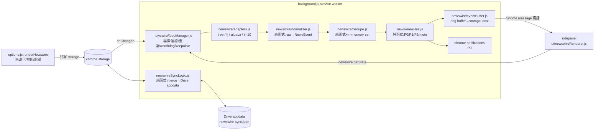
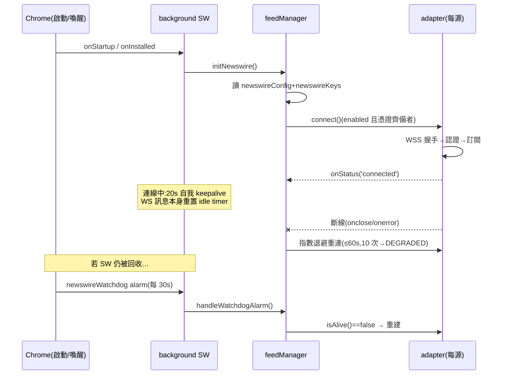

# SA — newswire：財經快訊訂閱（WSS News Feed）

| 欄位 | 值 |
|---|---|
| ID | BASE-016 |
| 分級 | **T2**（Phase 2：SA） |
| 狀態 | Draft v1.0 — 待 User Review（Gate 2，PRD 核准後定稿） |
| 日期 | 2026-07-20 |
| 上游 | 同目錄 `PRD_spec.md` v1.0；外部規格書 `wss_news_feed_spec.md` |
| 相依 | BASE-015（區塊排序，已實作）；既有 Drive sync 基建（`modules/sync/*`）；RSS union-merge 先例（`modules/rss/rssSyncLogic.js`） |

---

## 1. Overview

### 1.1 Scope

把 server-side newswire 規格書的核心管線（多源訂閱 → 正規化 → 去重 → 分級 → 呈現/通知）改造為 MV3 extension 原生實作：

- **連線層**：background service worker 單例持有各源 WSS 連線（Chrome 116+ 官方 WebSocket-in-SW 模式），alarms watchdog 自癒。
- **呈現層**：sidepanel 新「快訊」區塊（參與 BASE-015 排序）＋ options「快訊」設定 section。
- **持久層**：設定/規則走 Google Drive appdata（照抄 RSS union-merge 模式）；API keys 預設 local、opt-in 同步；事件走本機 ring buffer。
- **通知**：P0 → `chrome.notifications`（新權限）。

不在範圍（PRD §7）：金十非官方端點、L2 simhash、Telegram/twdash sinks、事件雲端同步。

### 1.2 Architecture Diagram



---

## 2. Requirement Traceability

| PRD FR | SA 落點（§） |
|---|---|
| FR-01~03 來源管理/官方端點 | §3 `renderNewswire`、§4.2 config schema、§5.2 adapter 介面、§9 合規 |
| FR-04~07 連線生命週期 | §3 feedManager、§7.1 連線/keepalive/watchdog 流程 |
| FR-08~10 事件管線/去重/ring buffer | §4.1 NewsEvent、§5.2 純函式介面、§7.2 管線流程 |
| FR-11~14 sidepanel 區塊 | §3 newswireRenderer、§4.2 `newswireVisible`、§6 i18n |
| FR-15~17 規則/通知 | §3 rules、§7.2、§4.2 rules schema、§10 manifest diff |
| FR-18~19 Drive appdata/引導綁定 | §4.3 payload、§7.3 同步流程、§3 background 接點 |
| FR-20 key opt-in 同步 | §4.3 keys 段、§7.3 scrub 流程 |
| FR-21 i18n | §6 |
| FR-22 manifest | §10 |

---

## 3. Component Design（Module Impact Map）

### 新增（NEW）

| 檔案 | 職責 | 層 |
|---|---|---|
| `modules/newswire/normalizer.js` | 純函式：各源 raw payload → `NewsEvent`（`parseTree/parseFj/parseAlpaca/parseJin10`＋共用 `sanitizeEvent`：欄位裁剪、長度上限、URL scheme 驗證）。`parseJin10` 特有規則（M0 查證）：`data.content` 可能含 HTML 富文本→regex strip tags（SW 無 DOMParser；渲染端 textContent 為第二道防線）；title 取 `data.title`（常為空）否則 content 摘要；`time` 為北京時間字串→以 UTC+8 解析轉 epoch；`important===1` 直接標 P0 依據；`action !== 1`（修改/刪除）v1 忽略不入列 | utils 級純邏輯 |
| `modules/newswire/dedupe.js` | 純函式 `makeDedupeKey(ev)`＋`createDedupeSet(seedIds, cap)`（in-memory，種子來自 ring buffer） | utils 級純邏輯 |
| `modules/newswire/rules.js` | 純函式 `classify(ev, rules)` → `{importance, muted}`；`DEFAULT_RULES`（沿上游 §6 關鍵字集）；正規化比對（NFKC、大小寫不敏感） | utils 級純邏輯 |
| `modules/newswire/eventBuffer.js` | ring buffer：append/trim(cap 300)/load；storage.local 寫入 2s debounce 批次 | 根層（經 apiManager） |
| `modules/newswire/adapters.js` | 四源 adapter 工廠（見 §5.2）：連線/認證/訂閱/心跳/解析委派 normalizer；每源獨立重連狀態機（指數退避＋抖動，上限 60s；連續失敗 10 次 → DEGRADED）；jin10 以官方 WSS 為主路徑（協定已於 M0 定稿，見 §5.4）、官方 REST 輪詢為備援模式 | 根層（SW 專用） |
| `modules/newswire/feedManager.js` | SW 編排核心：讀 config → 建/拆 adapter、keepalive interval、watchdog alarm handler、事件管線串接、狀態表維護與廣播、`newswire:*` message handler | 根層（SW 專用） |
| `modules/newswire/newswireSyncLogic.js` | 純函式：`mergeNewswireState(local, remote)`（per-source/per-group LWW by `updatedAt`）、`canonicalize`、`stateEqual`、`stripKeys`（opt-in 關閉時移除 keys） | utils 級純邏輯 |
| `modules/ui/newswireRenderer.js` | sidepanel 區塊 renderer：初始 `newswire:getState` 回填、runtime message 訂閱、列表插入（`textContent`-only）、未讀/暫停/標記已讀、`newswireVisible` 顯隱 | UI（經 uiManager re-export） |

### 修改（MODIFY）

| 檔案 | 變更 |
|---|---|
| `background.js` | RSS 模式六接點：import merge/橋接、`NEWSWIRE_SYNC_FILE` 常數、`newswireSyncOnce()`（single-flight）、掛入 `runSyncOnce()`、onChanged → debounce flush alarm、onAlarm 明確 branch（`newswireSyncFlush`／`newswireWatchdog`／`newswire_jin10_poll`）；＋feedManager 初始化（onInstalled/onStartup）與 notifications click handler |
| `sidepanel.html` | 新增 `<section id="newswire-section" class="panel-section" data-section-id="newswire">`（含 header row＋`#newswire-list`＋divider），預設由 `newswireVisible` 控制顯隱 |
| `sidepanel.js` | `initialize()` 加 `ui.initNewswireSection()`（不進關鍵路徑，仿 rssManager 的 `.then()` 掛尾） |
| `modules/ui/settingsBridge.js` | sync `newswireVisible` → dispatch＋refreshState（照 `readingListVisible` 模式）；local `newswireEvents` 不經 bridge（renderer 直接收 runtime message，跨視窗一致） |
| `modules/stateManager.js` | `newswireVisible` 的 init/is/set 三件組（照既有 visibility pattern） |
| `options.js` | `SECTIONS` 加 `{id:'newswire', labelKey:'settingsNavNewswire', render: renderNewswire}`（置於 `rss` 之後）；`renderNewswire` 骨架＋async hydrate（照 renderSync 模式） |
| `modules/uiManager.js` | +1 行 re-export |
| `manifest.json` | permissions +`notifications`（§10） |
| `_locales/*/messages.json` ×14 | §6 keys |
| `modules/utils/sectionOrder.js` | `DEFAULT_SECTION_ORDER` 加 `'newswire'`（附尾） |
| `GEMINI.md` | key_files 補 8 個新檔 |

Makefile：**不需動**（全部新檔在 `modules/` 下且被進入點 import；無新進入點頁面）。

---

## 4. Data Design

### 4.1 `NewsEvent`（統一訊息模型，裁剪自上游 §3）

```js
/**
 * @typedef {Object} NewsEvent
 * @property {string} id          // `${source}:${sourceId}` — 兼作 L1 去重鍵
 * @property {'tree'|'fj'|'alpaca'|'jin10'} source
 * @property {string} sourceId    // 來源端唯一 ID
 * @property {number} tsSource    // epoch ms(UTC);缺值時 fallback tsIngest
 * @property {number} tsIngest    // epoch ms
 * @property {string} title      // 必填;NFKC 正規化;上限 500 字元
 * @property {string} [url]       // http/https;new URL() 驗證;上限 2048
 * @property {string[]} [symbols] // 統一大寫;上限 20 項
 * @property {0|1|2} importance   // 0=P0
 */
```

裁掉的上游欄位與理由：`body`（列表不顯示全文，省 buffer 容量）、`raw`（除錯用，僅 M0 dump 階段保留於 console）、`dup_of`（L2 不做）、`categories`（v1 分級只靠關鍵字＋來源旗標，欄位待有消費者再加）、`is_update`（v1 以新事件呈現）。

### 4.2 Storage Schema Diff

**Before**：無任何 `newswire*` key；`sectionOrder`（BASE-015）已存在。

**After（新增）**：

| Key | Area | Shape | 說明 |
|---|---|---|---|
| `newswireConfig` | **local** | `{ schemaVersion:1, sources:{ tree:{enabled,updatedAt}, fj:{enabled,updatedAt}, alpaca:{enabled,updatedAt}, jin10:{enabled, mode:'wss'\|'rest', categories:string[]（'1'~'5'，預設['1']）, updatedAt} }, rules:{ p0:string[], p1:string[], mute:string[], updatedAt }, prefs:{ notificationsEnabled:true, syncKeys:false, updatedAt } }` | 可同步部分的本機工作副本（**不含 keys**）。字串陣列每項 ≤64 字元、每組 ≤50 項。jin10.categories 為市場分段多選（M0 查證：1 市場主站/2 期貨/3 美港/4 A股/5 商品外匯） |
| `newswireKeys` | **local** | `{ tree:{apiKey}, fj:{apiKey}, alpaca:{keyId,secret}, jin10:{secretKey}, updatedAt }` | **敏感**：永遠 local（比照 `aiProviderSettings` SECURITY 慣例）；opt-in 時由 push 端合入 Drive payload |
| `newswireEvents` | **local** | `{ events: NewsEvent[] }`（新→舊，cap 300） | ring buffer;2s debounce 批次寫入;不進 sync/appdata |
| `newswireLastSeenTs` | **local** | `number` | 未讀水位（per-device，未讀本質上是裝置狀態） |
| `newswireVisible` | **sync** | `boolean`（default `true`） | 區塊顯隱，照 `readingListVisible` 模式走 settingsBridge |

**sync 配額影響**：僅 `newswireVisible` 一個 boolean — 幾十 bytes，無配額疑慮。設定本體刻意走 local＋Drive appdata（RSS 前例：大體積/常變動資料不進 storage.sync）。

**Migration**：全新 feature，無舊資料;`newswireConfig.schemaVersion` 供未來演進，沿用「flag-guarded 一次性 seed」慣例（首次讀取無值時寫入 defaults）。

### 4.3 Drive appdata payload — `newswire-sync.json`

```jsonc
{
  "schemaVersion": 1,
  "config": { /* 同 newswireConfig(sources/rules/prefs 三組,各帶 updatedAt) */ },
  "keys":   { /* 僅 prefs.syncKeys=true 時存在;shape 同 newswireKeys */ },
  "updatedAt": 1753000000000
}
```

- **合併模型**：比 RSS 更簡單——無動態集合（來源固定 4 個、規則是整組清單）→ **per-group LWW**：`sources.{id}`、`rules`、`prefs` 各以自己的 `updatedAt` 取新者；無 tombstone 需求。merge 為可交換冪等純函式（`newswireSyncLogic.js`），沿用 RSS 的 no-op guard（`stateEqual` 相等即不寫）避免 ping-pong。
- **keys opt-in 語義（FR-20）**：push 端依 `prefs.syncKeys` 決定 payload 是否含 `keys`；**關閉時 push 明確寫入「無 keys 的 payload」以 scrub 遠端**。pull 端：payload 有 keys 且本機 syncKeys=true → 合入 `newswireKeys`（LWW）；本機 syncKeys=false 時忽略遠端 keys（不落地）。
- **未綁定 Drive**：`syncProvider.isConnected()` false → 整條同步 inert（既有機制，零新碼）；引導 UI 見 §7.3。

---

## 5. Interface Design

### 5.1 跨 context 訊息協定（NEW — T2 觸發器）

沿用 background.js 單一 `onMessage` dispatcher 的 `action` 慣例，namespace `newswire:`：

| 方向 | 訊息 | payload / 回應 |
|---|---|---|
| sidepanel → SW | `{action:'newswire:getState'}` | 回 `{events: NewsEvent[], statuses: {[source]: SourceStatus}, lastSeenTs}` — 開panel/重載時一次回填 |
| sidepanel → SW | `{action:'newswire:markSeen', ts}` | 更新 `newswireLastSeenTs`;回 `{ok}` |
| options → SW | *(無專屬訊息)* | options 只寫 storage;feedManager 監聽 `newswireConfig`/`newswireKeys` onChanged 重建 adapter（沿「options 不直接對 SW 下指令」的既有紀律） |
| SW → 全部 extension pages | `{type:'newswire:events', events: NewsEvent[]}` | 新事件批次廣播（`chrome.runtime.sendMessage`,無 listener 時吞 lastError） |
| SW → 全部 extension pages | `{type:'newswire:status', statuses}` | 來源狀態變更廣播（options 卡片與 sidepanel 空狀態共用） |

`SourceStatus = 'disabled'|'needs-key'|'connecting'|'connected'|'retrying'|'degraded'`。
暫停/繼續為 sidepanel 本地 UI 狀態（不停連線、不涉 SW）——不進協定。

### 5.2 模組介面（JSDoc 摘要）

```js
// adapters.js — 每源一個工廠,回傳統一 Adapter 介面
/**
 * @typedef {Object} Adapter
 * @property {() => void} connect
 * @property {() => void} disconnect
 * @property {() => boolean} isAlive   // watchdog 用:readyState 檢查
 */
// createTreeAdapter({key?}, {onRaw, onStatus}) → Adapter
// createFjAdapter({apiKey}, hooks) / createAlpacaAdapter({keyId,secret}, hooks)
// createJin10Adapter({secretKey, mode, categories, language}, hooks)
//   mode:'wss'(主路徑,協定見 §5.4)|'rest'(alarms 輪詢備援,同參數走 query/header)

// normalizer.js
// parseTree(raw) → NewsEvent[] ; parseFj / parseAlpaca / parseJin10 同型
// (單 raw 訊息可能含多事件,一律回陣列;解析失敗回 [] 並 console.warn)

// rules.js
// classify(event, rules) → { importance: 0|1|2, muted: boolean }

// feedManager.js (SW 唯一 stateful 編排點)
// initNewswire()            — onInstalled/onStartup 進入點;讀 config+keys、建 adapter、排 watchdog alarm
// handleWatchdogAlarm()     — 每 30s:isAlive 檢查、重建死連線、無啟用來源時自我清除 alarm
// handleConfigChange()      — storage.onChanged(newswireConfig/newswireKeys) → diff 重建
// handleMessage(msg) → bool — newswire:* dispatcher
```

### 5.3 Keepalive 策略（FR-04/06 的實作依據）

| 機制 | 內容 | 依據/侷限 |
|---|---|---|
| WS 訊息重置 idle timer | Chrome 116+ 官方行為：30s 窗內有訊息往來 SW 不回收 | 官方文件；靜流時段無訊息則失效 |
| 自我 keepalive | 任一 adapter 連線中時 `setInterval(20s)` 呼叫廉價 extension API（官方範例模式） | SW 存活期間有效；SW 被強制回收即消失 |
| **alarms watchdog（backstop）** | `newswireWatchdog` periodic alarm 0.5 分鐘：喚醒 SW → `isAlive` 全檢 → 重建死連線 | alarms 最短週期 30s;SW 死亡至下次 alarm 間（≤30s）可能漏訊 |
| 補漏 | Tree：重連自帶 history replay（過 L1 去重）;Benzinga 型 `replay` 不適用（不接）;FJ/Alpaca/金十：v1 接受 ≤30s 缺口（REST 回補列 v1.5；金十可用 `last_id` 翻頁與 `/flash/modify/log` 精確回補，素材已備） | 誠實揭露於 PRD NFR |

**協定紀律**：金十 WSS 文件未定義任何 app-level 心跳訊息（僅 connect/auth/subscribe 三步）——adapter **不得**向連線送出未定義訊息（防被判協定違規斷線）；WS 協定層 ping/pong 由瀏覽器自動處理。

### 5.4 金十官方 WSS 協定（M0 已查證定稿，2026-07-21 使用者授權瀏覽器逐頁檢視官方文件）

- **端點**：`wss://open-api-ws.jin10.com/flash`
- **三步協定**（依序，認證必須先於其他請求）：
  1. 連線成功 ← `{"type":"connected_result","data":{"connected_result":200,"message":"connected success"}}`
  2. 認證 → `{"action":"auth","params":{"secret-key":"<KEY>"}}`；成功 ← `{"type":"auth_result","data":{"auth_result":200}}`
  3. 訂閱 → `{"action":"subscribe","params":{"category":["1",...],"contain":[...],"filter":[...],"classify":[...],"language":"traditional"}}`；成功 ← `{"type":"subscribe_result","data":{"subscribe_result":200}}`
- **資料訊息**：`{"type":"data","data":{ id, type:0, time:"YYYY-MM-DD HH:mm:ss"(北京時間), important:0|1, data:{content(可含 HTML), pic, title}, qh_tags[], classify[], category[], action:1新增|2修改|3刪除 }}`
- **引擎參數決策**：`category`＝使用者的 jin10.categories；`language`＝uiLanguage 為 `zh_TW` 時送 `traditional`，其餘省略；`contain`/`filter`（伺服器端關鍵字過濾）v1 不使用——mute/分級統一走 client 端 rules.js 單一路徑（跨源一致），server-side filter 列為日後頻寬優化選項；`classify` v1 不使用
- **REST 備援**：`GET https://open-data-api.jin10.com/data-api/flash?category=1,2&language=traditional`（header `secret-key`），`last_id` 供翻頁增量；修改/刪除追蹤 `GET /data-api/flash/modify/log?category=N`
- **auth/subscribe 失敗碼**：非 200 即視為 needs-key/degraded（依階段），不重試 auth 迴圈（防 key 錯誤打爆重連）

---

## 6. I18n Keys（NEW，14 語系）

收斂為 **26 keys**（品牌名 Tree of Alpha/FinancialJuice/Alpaca/金十不進 i18n；快訊內容不翻譯）：

`settingsNavNewswire`、`newswireSectionHeader`、`newswireEmptyState`、`newswireEmptyStateCta`、`newswirePauseBtn`、`newswireResumeBtn`、`newswireMarkReadBtn`、`newswireUnreadBadgeTitle`、
`newswireSourcesHeader`、`newswireEnableSource`、`newswireApiKeyLabel`、`newswireApiKeyOptionalLabel`、`newswireNeedsKeyNote`、`newswireGetKeyLink`、`newswireStatusConnecting`、`newswireStatusConnected`、`newswireStatusRetrying`、`newswireStatusDegraded`、
`newswireRulesHeader`、`newswireRulesP0Label`、`newswireRulesP1Label`、`newswireRulesMuteLabel`、`newswireRulesDesc`、
`newswireNotifToggleLabel`、`newswireKeySyncToggleLabel`、`newswireKeySyncToggleDesc`（含安全提示）。

每源的「申請引導文案」（費用/延遲注意事項）為較長段落 ×4 源，亦進 i18n（+8 keys：`newswireGuideTree/Fj/Alpaca/Jin10` 標題與內文可合併為單 key 段落）→ 總計 **~30–34 keys**，於 N2 phase 一次進 14 語系（觸發 `update-multilingual-docs`）。

---

## 7. Sequence Flows

### 7.1 連線生命週期（含 watchdog 自癒）



### 7.2 事件管線（單則快訊）

```mermaid
sequenceDiagram
    participant AD as adapter
    participant P as normalizer→dedupe→rules(純函式鏈)
    participant BUF as eventBuffer
    participant NT as chrome.notifications
    participant SP as sidepanel(可能多個)
    AD->>P: raw message
    P->>P: parse→NewsEvent[];L1 去重(id);classify
    alt muted
        P-->>P: 丟棄(不落地不通知)
    else 正常
        P->>BUF: append(2s debounce 批次寫 local)
        P-->>SP: runtime msg {type:'newswire:events'}
        SP->>SP: 未暫停→插入列表頂部;未讀+1
        opt importance==0 且通知開啟
            P->>NT: notifications.create(標題含⚡規則)
            NT-->>SW: onClicked → chrome.tabs.create(url)
        end
    end
```

### 7.3 設定同步與 key opt-in（Drive appdata）

```mermaid
sequenceDiagram
    participant OPT as options(renderNewswire)
    participant ST as storage.local
    participant BG as background(newswireSyncOnce)
    participant DR as Drive appdata
    OPT->>ST: 寫 newswireConfig / newswireKeys
    ST-->>BG: onChanged → debounce flush alarm(~8.4s)
    BG->>DR: read newswire-sync.json
    BG->>BG: mergeNewswireState(local, remote)
    alt prefs.syncKeys == true
        BG->>DR: write(config + keys)
    else false
        BG->>DR: write(config only) — 遠端 keys 被 scrub
    end
    BG->>ST: 合併結果落地(僅有差異時;no-op guard)
    Note over OPT: 未綁定 Drive:isConnected()=false→全程 inert;<br/>「已啟用來源但未綁定」→ 一次性 toast(仿 initRssSyncOnboarding)<br/>＋ options 引導卡 → driveConnect 既有流程
```

---

## 8. Testing Strategy

### 8.1 Test Impact Analysis

**既有測試影響**：

| 測試 | 影響 |
|---|---|
| `settingsBridge.test.mjs` | 擴充：`newswireVisible` 映射 case |
| `happy_path_section_order.test.js` | `DEFAULT_SECTION_ORDER` 增為 5 段後需更新期望值（含 `newswire`） |
| `happy_path_options_page.test.js` / `happy_path_settings_panel.test.js` | nav 多一項「快訊」；若斷言項數需更新 |
| 其餘 E2E | 無（newswire 區塊預設有 wrapper 但空狀態；不動既有 id/selector） |

**新增 unit（全純函式，jsdom-free 優先）**：

1. `newswireNormalizer.test.mjs` — 各源真實 payload fixture（M0 dump 取樣）→ NewsEvent；畸形輸入回 `[]`；URL scheme/長度裁剪。
2. `newswireRules.test.mjs` — P0/P1/mute 命中矩陣（含中文關鍵字、NFKC、大小寫）；預設規則集健全性。
3. `newswireDedupe.test.mjs` — 重複 id、history replay 批次、cap 淘汰。
4. `newswireSyncLogic.test.mjs` — per-group LWW、可交換性/冪等性、`stripKeys`、no-op guard（仿 `rssSyncLogic.test.mjs` 的測法）。
5. `eventBuffer.test.mjs` — cap 300 FIFO、debounce 批次（mock apiManager）。

**新增 E2E（storage/message-driven，不連真源）**：

- `happy_path_newswire.test.js`：
  (a) 預埋 `newswireEvents` buffer → 開 sidepanel → 區塊回填、P0 高亮 class、點擊開新分頁；
  (b) options 快訊 section：來源卡片存在、啟用未填 key 顯示 `needs-key` 行內提示、規則 textarea 寫入 storage；
  (c) `newswireVisible` toggle → sidepanel 區塊顯隱（bridge 路徑）。
- **真連線驗證不進 CI**：列入 §8.2 M0/手動矩陣（живой WSS 依賴外部服務，CI 必 flaky）。

**建置流程**：Makefile 零變更（驗證：`make` 後 zip 內含 `modules/newswire/`——modules 整目錄複製涵蓋）。

### 8.2 Verification Plan

| 階段 | 內容 | 驗收 |
|---|---|---|
| **M0 查證（部分完成）** | ✅ **金十官方文件已逐頁查證（2026-07-21，使用者授權瀏覽器檢視全側欄：快訊×5/日曆×5/行情×4/參考/文章）**：WSS 端點/三步協定/訊息格式定稿於 §5.4，`mode:'wss'` 為主路徑拍板；殘留實測項（N1 期間以試用 key 完成）：真實 payload dump 校正 fixtures、連線數上限（文件未載明）、深夜靜流行為。Tree（免 key）/FJ Free/Alpaca paper 的 raw dump 照原計畫於 N1 前置完成 | schema 校正 normalizer fixtures |
| N1~N4 各 phase | `npm run test:unit`＋`npm run test:ci`＋`make` | 全綠 |
| 手動矩陣（N4 收尾） | 真源連線 24h 觀察（斷網重連、SW 回收自癒、深夜靜流）、雙裝置同步（config 漫遊、key opt-in/scrub）、通知點擊、14 語系抽查 3 語系 | 對照 PRD AC-01~11 逐條回報 |

### 8.3 實作 Phase（SA 核准後，每 phase 一個 PR）

| Phase | 內容 | 對應 AC |
|---|---|---|
| **N1 管線＋Tree＋sidepanel MVP** | normalizer/dedupe/rules/eventBuffer/feedManager＋Tree adapter＋sidepanel 區塊（回填+即時+未讀+暫停）＋`sectionOrder` 納入 `newswire` | AC-02/03/10/11 |
| **N2 options section＋其餘 adapters** | renderNewswire（來源卡×4、規則編輯、狀態顯示）＋FJ/Alpaca/jin10 adapters＋i18n ~34 keys ×14 | AC-01/05/06 |
| **N3 Drive 同步＋key opt-in** | newswireSyncLogic＋background 六接點＋引導綁定（toast＋引導卡）＋key opt-in/scrub | AC-07/08/09 |
| **N4 notifications＋收尾** | manifest +notifications＋P0 通知＋onClicked＋手動矩陣＋GEMINI/wiki/隱私文件更新 | AC-04 |

---

## 9. Security & Performance

| 面向 | 設計 |
|---|---|
| 不可信內容渲染 | 快訊 title/symbols 為**外部不可信資料**：一律 `textContent`/`createElement`，禁 innerHTML 插值；title NFKC＋長度裁剪於 normalizer 完成 |
| URL 安全 | `new URL()` 解析、僅 `http:/https:`（normalizer 驗證＋`createTab` 前二次檢查）；通知 onClicked 同規則 |
| Key 保護 | `newswireKeys` 僅 local；輸入欄 `type=password`＋`autocomplete=new-password`；FJ key 走 query string 為該源官方設計（僅於 SW 內組 URL，不落 log）；opt-in 同步僅至使用者本人 appdata，UI 附安全說明 |
| 合規 | 零 eval/遠端碼；僅官方端點（金十非官方端點在程式與文件層面雙重排除）；CWS 隱私揭露更新：新增「使用者啟用之新聞來源連線」用途說明＋notifications 權限理由 |
| 效能 | 事件處理全在 SW；sidepanel 只收批次訊息做 DOM 插入（上限 300 列，超出移除尾端節點）；`initNewswireSection` 掛在 init 尾端不進首屏關鍵路徑（CI 對 init 延遲敏感的既有註解）；storage 寫入全 debounce |
| 資源 | 4 條 WSS＋20s interval 的 SW 常駐成本為使用者顯性 opt-in 的結果（預設全關＝零成本） |

**風險登記**：

| 風險 | 對策 |
|---|---|
| 金十 WSS 連線數上限未文件化；ToS 聲明「未經授權不得將資訊用於 AI 訓練或其他商業用途」 | 連線數於 N1 試用 key 實測；本功能僅作使用者個人瀏覽器內顯示（非再分發/商用），引導文案提醒使用者遵守金十授權條款；`data.pic` 官方要求不得直接分發 URL——v1 不顯示快訊配圖，無涉 |
| FJ Free/Alpaca 單連線限制：多 profile/裝置同帳號 key 併發互踢（Alpaca 406） | SW 單例保證單 browser 內唯一連線；跨裝置互踢寫入來源引導文案（使用者自行取捨）；406/限制錯誤映射為 `degraded` 狀態＋說明 |
| SW 回收 ≤30s 缺口漏訊 | watchdog 30s＋Tree history replay；FJ/Alpaca/金十 REST 回補列 v1.5；NFR 誠實揭露 |
| 免費層延遲（FJ 10 分、金十 1–3 分）造成「不即時」觀感 | 來源卡片文案明示延遲；列表顯示 `ts_source` 時間 |
| CWS 審查對常駐連線的疑慮 | 預設全關、使用者逐源 opt-in、隱私政策明列端點清單與用途 |

---

## 10. Manifest Diff

```diff
   "permissions": [
     "tabs", "sidePanel", "bookmarks", "tabGroups", "storage", "readingList",
-    "alarms", "offscreen", "scripting", "identity"
+    "alarms", "offscreen", "scripting", "identity", "notifications"
   ],
```

`host_permissions` 不變（既有 `*://*/*` 已涵蓋各源）；CSP 不變；無新進入點。

---

## 11. File Changes Summary

- **New**：`modules/newswire/{normalizer,dedupe,rules,eventBuffer,adapters,feedManager,newswireSyncLogic}.js`、`modules/ui/newswireRenderer.js`、unit ×5、`happy_path_newswire.test.js`
- **Modified**：`background.js`、`sidepanel.html`、`sidepanel.js`、`options.js`、`manifest.json`、`modules/{stateManager,uiManager}.js`、`modules/ui/settingsBridge.js`、`modules/utils/sectionOrder.js`、`_locales/*` ×14、`GEMINI.md`、`docs/wiki`（同步機制文件，N4）

---

## Revision History

| 版本 | 日期 | 變更 | 作者 |
|---|---|---|---|
| v1.0 | 2026-07-20 | 初稿：SW 單例連線架構、keepalive 三層策略、RSS 模式 Drive 同步、key opt-in scrub 語義、phase N1–N4 | Tai / Claude 協作 |
| v1.1 | 2026-07-21 | M0 金十查證完成：新增 §5.4 官方 WSS 協定定稿（端點/三步/訊息格式）、jin10 mode:'wss' 拍板、config 加 categories、normalizer parseJin10 規則（strip HTML/北京時間/action/important）、協定紀律（無 app-level 心跳）、風險表更新（連線數/ToS/pic） | Tai / Claude 協作 |
