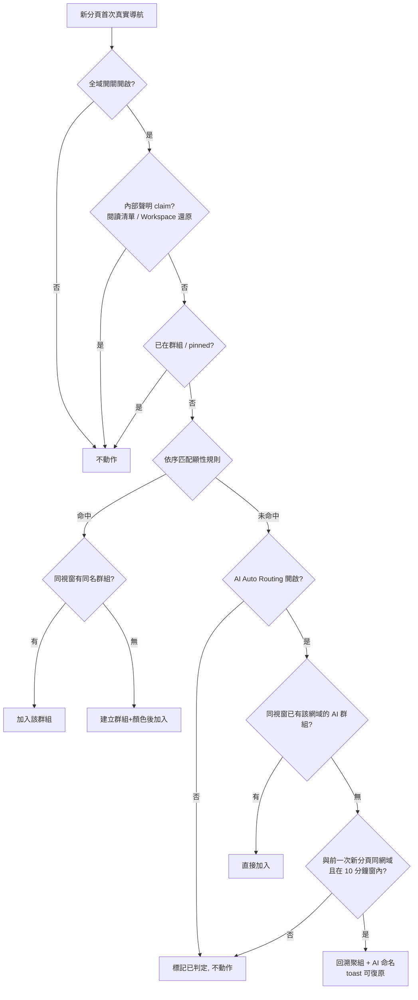

# PRD: Tab Routing Rules — 規則式自動路由（迷你 Air Traffic Control）

| Attribute | Details |
| :--- | :--- |
| **Version** | v1.1 |
| **Status** | Draft |
| **Author** | Claude Code |
| **Reviewers** | Tai |
| **Created** | 2026-07-27 |
| **Last Updated** | 2026-07-27 |
| **Origin** | 2026-07 瀏覽器市場調查 Tier 1 建議（`.agent/notes/NOTE_20260727.md`） |

## 1. Introduction

### 1.1 Problem Statement

使用者反覆手動把同類分頁拖進同一個群組（所有 YouTube 進「Media」、所有 Jira 進「Work」），這個整理動作每天重複發生、且永遠做不完——不整理的結果就是側欄回到雜亂狀態。

市場調查顯示這是被三個獨立產品驗證過的強需求：Arc 的 **Air Traffic Control**（URL 規則 → Space）、Zen Browser 2026/6 新增的 **Space Routing**、Vivaldi 的 **Workspace Rules**。Arc 凍結後，前 Arc 使用者在 Chrome 上復刻清單中也明確包含連結路由。Chrome 原生與現有主流 extension 均未提供此能力，屬差異化空窗。

另一個規則覆蓋不到的高頻場景：**一批同站連結的臨時性開啟**——review 一整批 PR、從 email 逐一點開同一份文件系統的多個連結。這類場景不值得為它建立持久規則（明天就不需要了），但當下若有自動分組會顯著減壓（市調對應：Opera Tab Islands 的「依開啟脈絡自動圈組」）。

本產品現有的「AI 一鍵分組」是**事後補救**（雜亂後手動觸發整理）；顯性規則是**事前預防**；AI Auto Routing 補中間的**即時反應**——三者互補。

### 1.2 Goals & Objectives

- **目標 1**：使用者設定一次規則後，符合規則的新分頁自動進入指定 tab group，側欄長期保持整齊，零重複勞動。
- **目標 2**：建立規則的成本趨近於零——從側欄既有分頁右鍵兩步完成，不強迫使用者進設定頁學習（呼應 BASE-013 anti-positioning：不做 power user 工具箱）。
- **目標 3**：行為完全可預期、可關閉：只在分頁「首次導航」路由一次、尊重使用者手動安排、全域開關一鍵暫停、與既有內部分組功能（閱讀清單、Workspace 還原）零衝突。
- **目標 4**：無規則命中時，提供 opt-in 的 **AI Auto Routing**：連續開啟同網域分頁時自動成組並以 AI 命名，涵蓋臨時性批次場景。
- **目標 5**：規則可跨裝置同步（沿用既有 Google Drive 同步管道），多裝置使用者設定一次即可。

### 1.3 Success Metrics (KPIs)

本專案無遙測（隱私定位），不新增埋點。以質性訊號衡量：

- 發布後 Chrome Web Store 評論與 GitHub issue 對此功能的正向提及／功能請求收斂。
- 驗收層面：第 4 節 Acceptance Criteria 全數通過 + 對應 E2E 測試進 CI。

## 2. User Stories

| ID | As a (Role) | I want to (Action) | So that (Benefit) | Priority |
| :--- | :--- | :--- | :--- | :--- |
| US-01 | 分頁常態 20+ 的使用者 | 設定「某網域的新分頁自動進指定群組」 | 側欄自動保持整齊，不用每天手動拖 | High |
| US-02 | 不想學設定頁的使用者 | 在側欄分頁上右鍵「一律將此網站分到群組…」快速建立規則 | 兩步完成設定，零學習成本 | High |
| US-03 | 已建立多條規則的使用者 | 在設定頁檢視、編輯、排序、啟停、刪除規則 | 完整掌控路由行為 | High |
| US-04 | 被路由後改變主意的使用者 | 手動把分頁拖出群組後，該分頁不再被搬回 | 手動操作永遠優先於規則，不跟系統打架 | High |
| US-05 | 暫時不想被打擾的使用者 | 一鍵暫停全部規則 | 特殊工作情境（如 demo、除錯）不被自動行為干擾 | Medium |
| US-06 | 辦公中 review 一批 PR 的工程師 | 逐一點開多個 PR 連結時，這些分頁自動聚成一組並有合理命名 | 不用中斷 review 節奏手動整理 | High |
| US-07 | 從 email 逐一點開同站文件連結的使用者 | 連續開啟的同網域文件分頁自動成組 | 信件處理完，側欄不是一排散落的分頁 | High |
| US-08 | 多裝置使用者 | 在 A 裝置設定的規則自動出現在 B 裝置 | 規則設定一次，到處生效 | Medium |

## 3. Functional Requirements

> 使用 EARS syntax。「群組」一律指 Chrome 原生 tab group（`chrome.tabGroups`），與現有側欄群組渲染、AI 命名功能共用同一實體。

### 3.1 規則模型與儲存

- **FR-1.01 (State)**: 系統必須支援一份有序規則清單，每條規則包含：啟用狀態、匹配類型（`網域等於` / `網址包含`）、匹配值、目標群組名稱、目標群組顏色（可選，未指定則沿用 Chrome 預設配色行為）。
- **FR-1.02**: 規則必須持久化於 `chrome.storage.local`（單一事實來源）；規則上限 50 條，達上限時 UI 必須阻止新增並提示。
- **FR-1.03**: 當多條規則同時命中，系統必須採用清單順序中的第一條（清單順序即優先序）。
- **FR-1.04 (Optional)**: 當使用者已啟用既有的 Google Drive 同步（opt-in）時，規則清單必須納入同步範圍——沿用現行 `modules/sync/` 管道（`drive.appdata` / appDataFolder，與 RSS 訂閱、Workspace metadata 同一機制與授權範圍，不新增 OAuth scope）。跨裝置衝突合併語意由 SA 定義（傾向與現有 syncLogic 決策核心一致）。

### 3.2 路由引擎（background service worker）

- **FR-2.01 (Event)**: 當新分頁完成**首次真實導航**（URL 為 http/https；排除 `chrome://` 等內部頁與空白新分頁）時，若命中任一啟用中規則，系統必須將該分頁加入**同視窗**中名稱等於目標的 tab group；同名群組不存在時必須建立之（套用規則指定顏色）。
- **FR-2.02 (Unwanted)**: 已屬於任何 tab group 的分頁，不得被路由（例：從群組內分頁以「在群組中開啟」產生的子分頁繼承原群組，不得被搬走）。
- **FR-2.03 (Unwanted)**: pinned 分頁不得被路由。
- **FR-2.04**: 每個分頁最多被自動路由**一次**。路由後（或首次導航判定未命中後），該分頁後續的任何導航不得再觸發顯性規則路由；使用者手動將分頁拖出群組後，系統不得將其搬回。
- **FR-2.05 (State)**: 路由引擎必須位於 background service worker：sidepanel 未開啟時路由仍須生效；service worker 因閒置被終止後，由事件喚醒時規則仍須正確生效。
- **FR-2.06 (State)**: 全域開關為關閉狀態時，引擎不得執行任何路由（含 AI Auto Routing）。全域開關預設為開啟（無規則即無行為，安全）。
- **FR-2.07 (Unwanted)**: 凡本擴充功能**自身開啟且會指定群組歸屬**的分頁，不得被顯性規則或 AI Auto Routing 處理。已知案例：閱讀清單開啟（歸入「來自 閱讀清單」群組，`readingListManager.js`）、Workspace 還原。**競速背景**：現行閱讀清單流程是 sidepanel 先 `createTab` 再非同步補分組，而路由引擎在 background 監聽首次導航——導航事件必然早於或交錯於補分組完成，FR-2.02 的「已在群組豁免」檢查在該時刻會誤判為可路由，造成分頁被搶進規則群組後又被搬回（或留下空群組）。因此系統必須提供「**內部開啟聲明（claim）**」機制：聲明必須在路由引擎可能觀察到該分頁**之前**完成登記（不得存在時序窗），機制設計（訊息協定 vs session storage、以 URL 或 tabId 聲明、逾時回收）由 SA 定義；SA 並須盤點所有內部開啟且指定群組的流程，逐一納入聲明。

### 3.3 建立規則入口（sidepanel）

- **FR-3.01 (Event)**: 側欄分頁項目的 context menu 必須新增「一律將此網站分到群組…」：開啟後預填該分頁網域（匹配類型預設 `網域等於`），使用者選擇既有群組或輸入新群組名稱後即建立規則。
- **FR-3.02 (Optional)**: 若該分頁當下已在某群組內，目標群組預選該群組。
- **FR-3.03**: 規則建立成功必須以 toast 回饋並提供「復原」（沿用現有 toast + undo 模式）；建立當下該分頁若符合規則且可路由（不違反 FR-2.02/2.03/2.07），必須立即套用一次。

### 3.4 AI Auto Routing（無規則命中時的智慧自動分組）

> 定位：顯性規則的補集。臨時性批次場景（US-06/07）不值得建立持久規則，由 AI 即時成組。優先序固定為：**內部聲明豁免 > 顯性規則 > AI Auto Routing**。

- **FR-3.04 (Event)**: 當 AI Auto Routing 開啟、且新分頁的首次真實導航**未命中任何顯性規則**時：若該分頁與**前一次**新分頁首次導航為**相同網域**（hostname 比對，`www.` 前綴正規化；中間不得插入其他網域的新分頁首次導航）、且兩者間隔在時間窗內（預設 10 分鐘），系統必須將這些同網域、可成組的分頁聚入**同視窗的新群組**，並以 AI 依分頁標題（必要時輔以既有 `pageContentExtractor` 之內容摘要）產生 emoji + 簡短名稱；AI 命名完成前群組以網域名稱為暫名，AI 不可用（無 Nano 亦無 BYO key）時保留網域暫名。
- **FR-3.05**: 成組範圍與後續行為：
  - (a) 觸發時納入的分頁限於：同視窗、時間窗內首次導航、目前未分組、未 pinned、未被使用者手動移出過群組、非內部聲明（FR-2.07）的同網域分頁——即使其中較早的分頁已消耗過 FR-2.04 的顯性規則判定，仍可被本機制回溯納入。
  - (b) AI 建立的群組在**存續期間**（同視窗、群組未被解散）記住其來源網域：其後開啟的同網域新分頁（未命中顯性規則且可成組者）直接加入該群組，不需重新滿足連續條件。
  - (c) 本機制**不得**產生任何持久規則（規則清單不因此新增條目）；群組解散或視窗關閉後，關聯即消失。
  - (d) AI 命名僅於群組建立後套用一次；使用者手動改名後，系統不得再覆寫該群組名稱。
- **FR-3.06 (State)**: AI Auto Routing 必須有**獨立開關**（位於 options「自動分組規則」區塊，與全域開關並列但各自獨立；全域開關關閉時本功能一併停用）。**預設關閉（opt-in）**——自動移動分頁屬驚訝型行為，遵循市調教訓（Firefox 建議制 vs 強推自動制的反彈）與本產品「AI 可關」原則。
- **FR-3.07**: 每次 AI 自動成組必須以 toast 回饋並提供「復原」：復原後群組解散、分頁回到未分組狀態，且**同視窗同網域**在冷卻期內（預設 30 分鐘）不得再自動觸發成組。

### 3.5 規則管理 UI（options 頁）

- **FR-4.01**: options 頁必須新增「自動分組規則」accordion 區塊：規則清單（顯示匹配條件與目標）、新增、編輯、刪除、單條啟停、拖曳排序。
- **FR-4.02**: 全域開關與 AI Auto Routing 開關必須位於同區塊頂部（兩者關係見 FR-2.06 / FR-3.06）。
- **FR-4.03 (State)**: 清單為空時必須顯示一句話說明與一個範例（例：`youtube.com → 🎵 Media`）。

### 3.6 i18n

- **FR-5.01**: 所有新增 UI 文案必須進 `_locales` 並同步 14 種語言（觸發 `update-multilingual-docs` 流程）。

## 4. Acceptance Criteria

### AC for FR-2.01（命中 → 入群／建群）
```gherkin
Given 存在啟用規則「網域等於 youtube.com → 群組 Media（紅色）」
  And 當前視窗不存在名為 Media 的群組
When 使用者開啟新分頁並導航至 https://www.youtube.com/watch?v=x
Then 該分頁被加入當前視窗中新建立的群組 Media
  And 該群組顏色為紅色

Given 當前視窗已存在名為 Media 的群組
When 使用者開啟新分頁並導航至 https://www.youtube.com/
Then 該分頁被加入既有的 Media 群組（不重複建立）
```

### AC for FR-1.03（順序優先）
```gherkin
Given 規則清單依序為「網址包含 google.com → Work」「網域等於 docs.google.com → Docs」
When 使用者開啟新分頁並導航至 https://docs.google.com/
Then 該分頁被加入群組 Work（第一條命中者生效）
```

### AC for FR-1.04（Drive 同步）
```gherkin
Given 使用者已於裝置 A 啟用 Google Drive 同步並建立規則「github.com → Dev」
When 使用者於裝置 B（同帳號、已啟用同步）觸發同步完成
Then 裝置 B 的規則清單包含「github.com → Dev」
  And 於裝置 B 開啟 https://github.com/ 的新分頁被路由至群組 Dev
```

### AC for FR-2.02 / FR-2.03（豁免）
```gherkin
Given 存在啟用規則「網域等於 github.com → Dev」
When 使用者從群組 Work 內的分頁以「在群組中開啟連結」開啟 https://github.com/
Then 該分頁保持在群組 Work，不被搬移至 Dev

Given 同上規則
When 使用者將某 github.com 分頁 pin 後重新整理該分頁
Then 該 pinned 分頁不進入任何群組
```

### AC for FR-2.04（一次性；手動優先）
```gherkin
Given 分頁 A 已被規則路由進群組 Media
When 使用者將分頁 A 拖出群組 Media
  And 分頁 A 於同分頁再次導航至 youtube.com 的其他頁面
Then 分頁 A 不被搬回 Media

Given 分頁 B 首次導航至未命中任何規則的網址
When 使用者其後在分頁 B 導航至 youtube.com
Then 分頁 B 不被顯性規則路由（首次導航已消耗判定機會）
```

### AC for FR-2.05（背景生效）
```gherkin
Given 存在啟用規則「網域等於 youtube.com → Media」
  And 側欄（sidepanel）未開啟
When 使用者開啟新分頁並導航至 https://www.youtube.com/
Then 路由仍然生效，分頁進入群組 Media
```

### AC for FR-2.06（全域開關）
```gherkin
Given 全域開關為關閉
  And 存在啟用規則「網域等於 youtube.com → Media」
  And AI Auto Routing 為開啟
When 使用者開啟新分頁並導航至 https://www.youtube.com/
  And 連續開啟第二個 youtube.com 分頁
Then 任何分頁皆不進入任何群組（顯性規則與 AI Auto Routing 均停用）
```

### AC for FR-2.07（內部開啟豁免——閱讀清單競速案例）
```gherkin
Given 存在啟用規則「網域等於 example.com → News」
When 使用者從側欄閱讀清單開啟網址為 https://example.com/article 的項目
Then 該分頁最終且穩定地位於群組「來自 閱讀清單」
  And 過程中不曾被加入群組 News
  And 視窗中不存在因此產生的空群組 News

Given AI Auto Routing 為開啟
When 使用者連續從閱讀清單開啟兩個 example.com 的項目
Then 兩個分頁皆位於「來自 閱讀清單」群組
  And 不觸發 AI 自動成組
```

### AC for FR-3.01 / FR-3.03（context menu 建規則）
```gherkin
Given 側欄中存在網域為 youtube.com 的未分組分頁
When 使用者於該分頁右鍵選擇「一律將此網站分到群組…」
  And 輸入新群組名稱 Media 並確認
Then 規則「網域等於 youtube.com → Media」被建立並持久化
  And 該分頁立即被加入群組 Media
  And 顯示含「復原」的 toast；點擊復原後規則被刪除且分頁退出群組
```

### AC for FR-3.04 / FR-3.05（AI 自動成組）
```gherkin
Given AI Auto Routing 為開啟
  And 不存在命中 github.com 的顯性規則
When 使用者於 10 分鐘內連續開啟兩個 github.com 的新分頁（PR-1、PR-2，中間無其他網域的新分頁）
Then 兩個分頁被聚入同視窗的新群組
  And 群組先以「github.com」為暫名，AI 完成後更名為 emoji + 簡短名稱
  And 顯示含「復原」的 toast
  And 規則清單不因此新增任何條目

Given 上述 AI 群組仍存在
When 使用者（於任意時點、即使中間開過其他網站）再開啟一個 github.com 新分頁
Then 該分頁直接加入該 AI 群組（不需重新滿足連續條件）

Given 使用者已手動將該 AI 群組改名為「PR 大掃除」
When 後續分頁加入該群組
Then 群組名稱保持「PR 大掃除」，AI 不再改名
```

### AC for FR-3.06（獨立開關與預設值）
```gherkin
Given 全新安裝（未動過任何設定）
When 使用者於 10 分鐘內連續開啟兩個 github.com 的新分頁
Then 不發生任何自動成組（AI Auto Routing 預設關閉）

Given AI Auto Routing 於 options 被開啟
  And 全域開關為開啟
When 重複上述操作
Then 觸發 AI 自動成組
```

### AC for FR-3.07（復原與冷卻）
```gherkin
Given AI 剛將兩個 github.com 分頁自動成組
When 使用者點擊 toast 上的「復原」
Then 群組解散、兩個分頁回到未分組狀態
When 使用者於冷卻期（預設 30 分鐘）內再連續開啟兩個 github.com 新分頁
Then 不再自動成組
```

### AC for FR-4.01（管理 UI）
```gherkin
Given options 頁的「自動分組規則」區塊已有兩條規則
When 使用者拖曳第二條至第一位
Then 清單順序持久化，後續路由以新順序判定

When 使用者關閉某條規則的啟用開關
Then 該規則不再參與匹配，且狀態持久化
```

## 5. User Experience (UI/UX)



- **建立入口**（主要動線）：側欄分頁 context menu →「一律將此網站分到群組…」→ 群組選擇器（既有群組清單 + 新建輸入）→ toast + undo。
- **管理介面**（次要動線）：options 頁 accordion，沿用現有 settings UI 樣式；區塊頂部依序為全域開關、AI Auto Routing 開關；純圖示按鈕附 `aria-label`/`title`，符合專案 a11y 慣例。
- **AI 命名的漸進呈現**：成組當下即以網域為暫名（使用者立即看得懂），AI 完成後原地更名——不阻塞、不閃爍。
- 視覺上分頁會先短暫出現在未分組區、隨即移入群組（Chrome API 時序的固有限制）；以動線流暢為目標，不做額外動畫掩飾。

## 6. Non-Functional Requirements

- **Performance**: 規則匹配為純記憶體同步運算（規則快取，`storage.onChanged` 失效重載）；不得於每次導航事件讀取 storage。路由動作應於導航完成後即刻發生（目標 < 300ms 感知）。AI 命名為非同步後置作業，不得阻塞成組。
- **Privacy**: URL 比對與連續開啟偵測 100% 本地執行，不外送、不記錄；AI 命名依使用者既有 AI provider 設定執行（預設 Gemini Nano 本機；BYO key 時僅送出群組內分頁之標題／摘要，與現有 AI 功能同一資料邊界）；不新增任何遙測。
- **Reliability**:
  - 引擎為事件驅動，不依賴 service worker 常駐；「已判定」「AI 群組網域關聯」「冷卻」等暫態在 SW 終止/喚醒循環下必須維持一致（存放策略由 SA 設計，`storage.session` 為候選）。
  - **FR-2.07 的聲明機制不得存在時序窗**：聲明完成先於分頁可被引擎觀察；聲明需有逾時回收，避免洩漏導致分頁永久豁免。
- **Permissions**: 不新增 manifest 權限與 OAuth scope（`tabs` / `tabGroups` / `storage` 皆已具備；Drive 同步沿用既有 `drive.appdata` 授權）。
- **Compatibility**: 與既有功能的邊界——閱讀清單開啟與 Workspace 還原走 FR-2.07 聲明豁免；「AI 一鍵分組」（手動觸發的存量整理）與本功能（增量自動）並存不互斥，一鍵分組產生的群組視為一般群組；Linked Tabs（書籤開啟）的分頁**照常參與路由**（書籤開啟後被規則歸位是期望行為）。

## 7. Analytics & Tracking

本專案無遙測基礎設施且隱私定位明確：**不新增任何埋點**。

## 8. Out of Scope

- **跨視窗路由／指定視窗**：只在分頁所在視窗內分組；不將分頁搬到其他視窗（focus 搶奪與 UX 複雜度高）。
- **路由到 Workspace**：本產品 Workspace 為 hibernate/restore 快照語意，非常駐容器，路由目標不符（Arc Space 在本產品的對應物是 tab group）。
- **Regex / glob 匹配**：只提供「網域等於」與「網址包含」兩種（Arc ATC 同級）；進階匹配待真實需求出現再議。
- **AI 歸納持久規則**：AI Auto Routing 僅做臨時成組（FR-3.05c）；「觀察慣性後建議建立持久規則」「把 AI 群組一鍵升級為規則」列為未來方向，本期不做。
- **規則 import/export**：檔案匯入匯出本期不做（跨裝置需求由 FR-1.04 Drive 同步涵蓋）。

---

## Revision History

| Version | Date | Author | Changes |
|---------|------|--------|---------|
| v1.0 | 2026-07-27 | Claude Code | Initial draft（源自 2026-07 市場調查 Tier 1 建議） |
| v1.1 | 2026-07-27 | Claude Code | Review 修訂：新增 FR-2.07 內部開啟聲明豁免（閱讀清單競速，經 code 查證 `readingListManager.js` 確認為真實風險）；FR-1.04 規則納入 Drive `drive.appdata` 同步；新增 §3.4 AI Auto Routing（FR-3.04~3.07，US-06/07/08）；對應 AC 與 UX 流程圖更新 |
