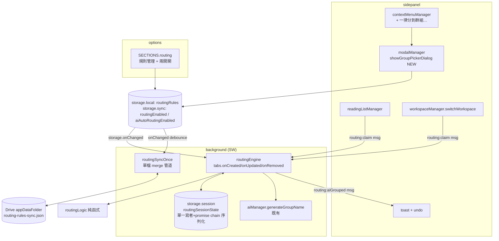
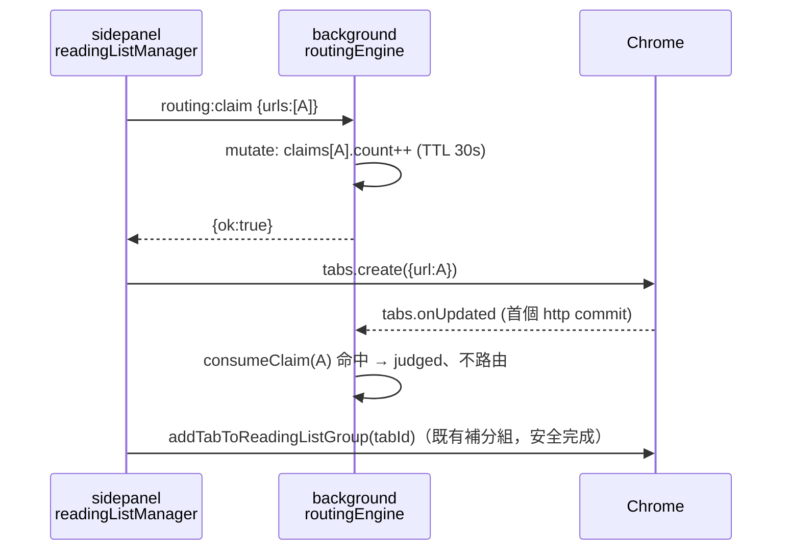
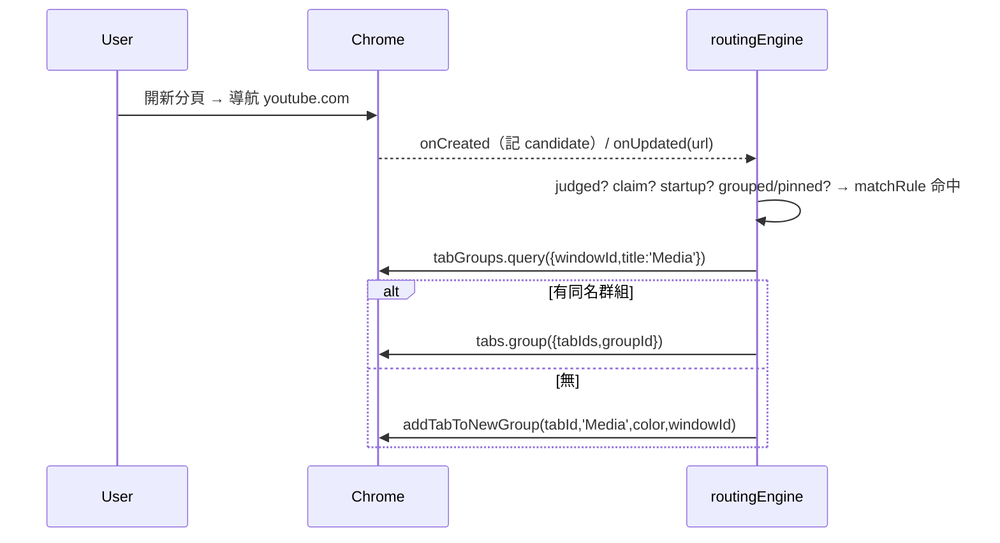
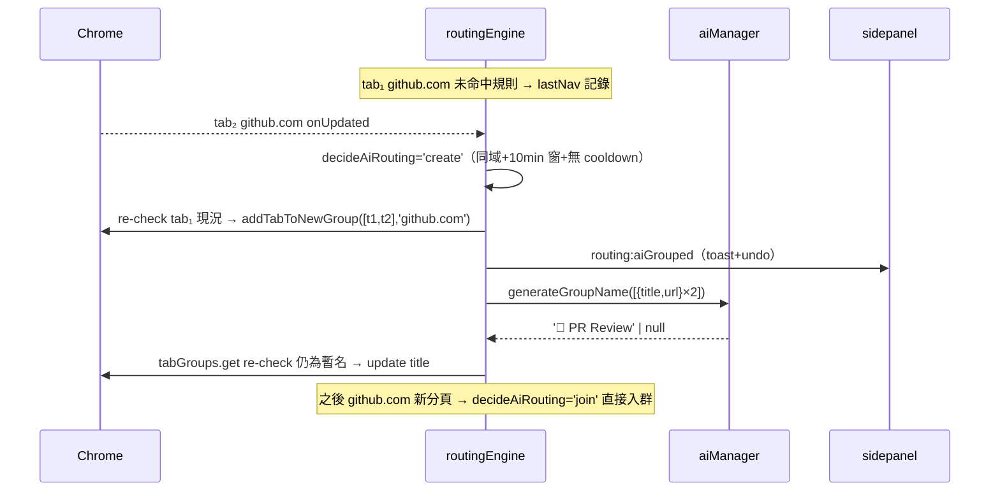

# SA — Tab Routing Rules：規則式自動路由（迷你 Air Traffic Control）

| Attribute | Details |
| :--- | :--- |
| **Version** | v1.0 |
| **Status** | Draft |
| **Author** | Claude Code |
| **Reviewers** | Tai |
| **Created** | 2026-07-27 |
| **PRD** | `PRD_spec.md` v1.1（已核准） |

## 1. Overview

### 1.1 Scope

- **新增 `modules/routing/`**：純函式決策核心（routingLogic）、規則 CRUD（rulesStore）、background 路由引擎（routingEngine）、Drive 同步 merge（routingRulesSyncLogic）。
- **修改**：`background.js`（引擎初始化＋sync 五件組接線）、`modules/ui/contextMenuManager.js`（第三個選單項）、`modules/modalManager.js`（群組選擇器 dialog）、`options.js`（新 `routing` section）、`modules/readingListManager.js` 與 `modules/workspace/workspaceManager.js`（開分頁前送 claim）、`_locales/*`（14 語）。
- **不動**：manifest.json（權限與 OAuth scope 皆已足夠）、Makefile（無新頂層檔）、既有 tabGroups.onCreated AI 命名（相容性靠其既有 re-check，見 §5.6）。

### 1.2 Architecture Diagram



## 2. Requirement Traceability

| PRD 需求 | 落點元件 | 驗證（§8） |
|---|---|---|
| FR-1.01 規則模型 | `rulesStore.js` typedef（§4.1） | UT: rulesStore |
| FR-1.02 local 持久化＋上限 50 | `rulesStore.addRule` cap guard；options UI 提示 | UT: rulesStore；E2E: options |
| FR-1.03 順序優先 | `routingLogic.matchRule`（先命中先贏） | UT: routingLogic |
| FR-1.04 Drive 同步 | `routingRulesSyncLogic.js` + background 五件組接線（§5.5） | UT: syncLogic 型測試 |
| FR-2.01 首次導航路由/建群 | `routingEngine`（§5.2 判定管線） | E2E: engine |
| FR-2.02/2.03 已分組/pinned 豁免 | `routingLogic.shouldExclude` | UT + E2E |
| FR-2.04 一次性＋手動優先 | session `judged` 標記（§4.3） | UT + E2E |
| FR-2.05 SW 生效/喚醒一致 | 事件驅動＋session state（§5.3） | E2E: engine（sidepanel 不開） |
| FR-2.06 全域開關 | sync `routingEnabled`，引擎快取（§4.2） | E2E: options+engine |
| FR-2.07 claim 豁免 | `routing:claim` 訊息協定（§5.4）；readingListManager / workspaceManager 改造 | E2E: claim regression ⭐ |
| FR-3.01~3.03 右鍵建規則 | contextMenuManager + showGroupPickerDialog | E2E: context menu |
| FR-3.04/3.05 AI 自動成組 | `routingLogic.decideAiRouting` + engine AI 分支（§5.6） | UT + E2E |
| FR-3.06 獨立開關預設關 | sync `aiAutoRoutingEnabled`（default false） | UT: 預設值；E2E: options |
| FR-3.07 toast/undo/冷卻 | `routing:aiGrouped` 廣播 → sidepanel toast；冷卻入 session（§5.6；偏差見 §5.7-D3） | E2E: undo |
| FR-4.01~4.03 管理 UI | options.js `SECTIONS` 新 `routing` 區（§5.7-D1） | E2E: options |
| FR-5.01 i18n | §6 key 清單，14 語 | E2E: fallback 慣例 |

## 3. Component Design（Module Impact Map）

### 新增（NEW）

| 檔案 | 職責 | Context |
|---|---|---|
| `modules/routing/routingLogic.js` | **純函式**：URL 正規化（hostname、`www.` 去前綴）、`matchRule(url, rules)`、`shouldExclude(flags)`、`decideAiRouting(state, nav, now)`、startup 排除判定。零 chrome、零 Date.now（時間由參數傳入）——比照 `syncLogic.js` 可測性慣例 | 共用 |
| `modules/routing/rulesStore.js` | `routingRules` key 的 CRUD：get/add/update/delete/reorder/setEnabled；50 上限 guard；寫入時 bump 規則 `updatedAt` 與 tombstone 維護（供 merge） | sidepanel / options / background |
| `modules/routing/routingEngine.js` | **SW 專屬**：`initRoutingEngine()` 註冊 tabs.onCreated/onUpdated/onRemoved、tabGroups.onRemoved、windows.onRemoved；session state 序列化存取；`routing:claim` handler；規則與開關快取（storage.onChanged 失效重載）；執行分組與 AI 命名 | background |
| `modules/routing/routingRulesSyncLogic.js` | **純函式** merge：per-rule LWW（updatedAt）＋ set-union ＋ tombstone `{ruleId: deletedAtMs}` ＋ `order` 排序鍵；`mergeRoutingRules`／`buildRoutingRulesPayload`／`canonicalizeRoutingRules`（no-op write guard）；`ROUTING_SYNC_SCHEMA = 1` ＋ `isSchemaTooNew` — 完全比照 `rssSyncLogic.js` 模板 | background |

### 修改（MODIFY）

| 檔案 | 變更 |
|---|---|
| `background.js` | import + `initRoutingEngine()`；sync 五件組：常數（`ROUTING_SYNC_FILE='routing-rules-sync.json'`、`ALARM_ROUTING_FLUSH`）、`routingSyncOnce()`（single-flight）、`runSyncOnce` 尾端 piggyback、**onAlarm 明確分支**（已知坑：不加會 fall-through 到 handleRssAlarm）、`handleRoutingStorageChange` 註冊 |
| `modules/ui/contextMenuManager.js` | `showContextMenu` 新增第三項「一律將此網站分到群組…」（僅 http/https 分頁顯示；比照 Add to Reading List 的過濾模式） |
| `modules/modalManager.js` | 新 `showGroupPickerDialog({domain, preselectGroupId})`：既有群組清單（`api.getTabGroupsInCurrentWindow`）＋「建立新群組」（名稱輸入＋ `GROUP_COLORS` 色票，內部複用 `showCreateGroupDialog` 的表單元件） |
| `sidepanel.js`（或 tabListeners 對應處） | context menu 建規則流程：寫 rulesStore → 立即套用（FR-3.03，sidepanel 端直接 `api.groupTabs`/`addTabToNewGroup`）→ toast + undo（undo＝刪規則＋ungroup） |
| `modules/readingListManager.js` | `openReadingListItem` 在 `api.createTab` **之前** `await claimUrls([url])`（§5.4） |
| `modules/workspace/workspaceManager.js` | `switchWorkspace` 在 `windows.create` **之前** `await claimUrls(全部還原 URL)` |
| `options.js` | `SECTIONS` 新增 `{id:'routing', labelKey:'optRoutingSection', render: renderRouting}`：頂部兩開關（sync 存 `routingEnabled`/`aiAutoRoutingEnabled`）＋規則清單（新增/編輯/刪除/啟停/拖曳排序，沿用 `makeRow` 與現有 section 樣式）＋空狀態文案 |
| `_locales/*/messages.json` | §6 keys × 14 語 |
| `GEMINI.md` | `key_files` 新增 `modules/routing/` 四檔職責（收尾時） |

## 4. Data Design

### 4.1 RoutingRule（`routingRules` @ `chrome.storage.local`）

```js
/**
 * @typedef {Object} RoutingRule
 * @property {string} id            // crypto.randomUUID()
 * @property {boolean} enabled
 * @property {'domain'|'contains'} matchType  // 網域等於 / 網址包含
 * @property {string} pattern       // domain: 正規化 hostname；contains: 原字串
 * @property {string} groupTitle
 * @property {string|null} groupColor  // GROUP_COLORS 之一或 null
 * @property {number} order         // 排序鍵；reorder 時重寫並 bump updatedAt
 * @property {number} createdAt
 * @property {number} updatedAt     // per-rule LWW merge 依據
 */
// storage.local.routingRules =
// { schemaVersion: 1, updatedAt: number,
//   rules: RoutingRule[],            // ≤ 50，UI 與 rulesStore 雙重 guard
//   tombstones: { [ruleId]: deletedAtMs } }  // 60 天 GC，比照 syncEngine 慣例
```

尺寸估算：50 條 × ~180B ≈ 9KB —— **超過 sync 8KB/key 配額，佐證 local 選型正確**（跨裝置靠 Drive）。

### 4.2 設定開關（`chrome.storage.sync`，比照 stateManager 慣例）

| Key | Default | 讀取方 |
|---|---|---|
| `routingEnabled` | `true`（`!== false` 慣例） | 引擎快取；options |
| `aiAutoRoutingEnabled` | `false`（**opt-in，明確 `=== true` 才啟用**） | 引擎快取；options |

引擎不走 settingsBridge（那是 sidepanel 的）：init 時讀一次 + 在既有 `storage.onChanged`（background.js:699 區）加分支失效重載——與 `aiAutoNamingEnabled` 的事件時讀取相比多了快取，因 onUpdated 頻率高（NFR Performance）。

### 4.3 Session 暫態（`chrome.storage.session` key `routingSessionState`）

```js
// 單一寫者 = background 引擎；所有變更走模組內 promise chain（mutate(fn)）序列化，
// 讀取方重入安全；SW 終止/喚醒後 lazy 重讀。瀏覽器重啟自動清空（正是要的語意）。
{
  judged:   { [tabId]: true },                 // FR-2.04；tabs.onRemoved 清除
  claims:   { [normalizedUrl]: { count, expiresAt } },  // FR-2.07；TTL 30s，命中即扣 count，過期 lazy 清
  lastNav:  { domain, windowId, tabId, ts } | null,     // AI 連續判定（FR-3.04）
  aiGroups: { [windowId]: { [domain]: { groupId, aiNamed } } }, // FR-3.05b/d；group/window onRemoved 清除
  cooldown: { [`${windowId}:${domain}`]: expiresAt },   // FR-3.07；30 min，lazy 清
  startupUntil: number                          // 啟動突發窗（§5.3）；runtime.onStartup 時設 now+10s
}
```

### 4.4 Drive appdata payload — `routing-rules-sync.json`

```js
{ schemaVersion: 1, updatedAt, deviceId,
  rules: RoutingRule[], tombstones: { [ruleId]: deletedAtMs } }
```

Merge 語意（`routingRulesSyncLogic`）：逐 id union；同 id 取 `updatedAt` 大者（平手 deviceId 字典序，比照 `resolveConflict`）；tombstone 勝過較舊的活規則；合併後依 `order, createdAt` 重排；`canonicalize` 比對無差異即不回寫（no-op guard，收斂 ≤2 cycle）；`isSchemaTooNew` → `needs-update`、拒絕降級回寫。**已知天花板**：A 裝置 reorder 與 B 裝置同時 reorder 時順序取 per-rule LWW 近似解，不保證全序一致——規則編輯頻率極低，接受（`// ponytail:` 註記於 merge 模組）。

## 5. Interface Design

### 5.1 跨 context 訊息協定（NEW；沿用字面值 action + `{ok,error}` 慣例）

| action | 方向 | payload | 回應 | 用途 |
|---|---|---|---|---|
| `routing:claim` | sidepanel/spotlight → SW | `{urls: string[]}` | `{ok:true}` | FR-2.07：**呼叫方必須 `await` ack 後才 `tabs.create`**（順序保證：claim 寫入完成 → ack → create → 導航事件 → 引擎讀到 claim，無時序窗）。urls 正規化後以 count 累計，TTL 30s |
| `routing:aiGrouped` | SW → sidepanel（廣播） | `{windowId, groupId, domain, tabIds}` | — | FR-3.07：sidepanel 過濾 windowId 後顯 toast + undo |
| `routing:aiUndo` | sidepanel → SW | `{windowId, domain, groupId, tabIds}` | `{ok}` | undo：SW ungroup + 註記 cooldown |

呼叫端封裝為 `claimUrls(urls)` export 於 rulesStore（薄 wrapper：`api.sendRuntimeMessage`；失敗時 warn 後放行——claim 是防護網，不得因它讓閱讀清單開不了分頁）。

### 5.2 引擎判定管線（同 PRD §5 流程圖的實作對映）

```
tabs.onCreated(tab):
  candidates[tab.id] = { hadUrl: isRealUrl(tab.url ?? tab.pendingUrl), hasOpener: !!tab.openerTabId, at: now }
tabs.onUpdated(tabId, changeInfo, tab):
  if (!changeInfo.url || !isHttp(changeInfo.url)) return        // 首個 http(s) commit 才判
  mutate(state => {
    if (state.judged[tabId]) return                              // FR-2.04
    state.judged[tabId] = true                                   // 先標記（含未命中）
    if (!routingEnabled) return                                  // FR-2.06
    if (consumeClaim(state, tab.url)) return                     // FR-2.07
    if (isStartupRestored(candidates[tabId], state.startupUntil)) return  // §5.3
    if (tab.groupId !== -1 || tab.pinned) return                 // FR-2.02/2.03
    const rule = matchRule(tab.url, rulesCache)                  // FR-1.03 首中即用
    if (rule) return applyRule(tab, rule)                        // 入群或 addTabToNewGroup
    if (aiAutoRoutingEnabled) return maybeAiRoute(state, tab)    // §5.6
    updateLastNav(state, tab)                                    // 未命中也要記，供下一分頁連續判定
  })
```

- **不需要 `webNavigation` 權限**：`tabs.onUpdated` 的 `changeInfo.url` 足以偵測首次真實導航（manifest 維持零新增）。
- `applyRule`：同視窗 `tabGroups.query({windowId, title})` 精確比對 → 有則 `chrome.tabs.group`，無則 `addTabToNewGroup(tabId, title, color, windowId)`（apiManager 既有簽名）。SW 專屬模組直接用 `chrome.*` 符合 RULE_002 invariant 1 的 SW 例外，與 workspaceLifecycle 同級。

### 5.3 已還原分頁的排除啟發式（FR 未明列，屬 NFR Reliability 的必要補充）

問題：瀏覽器啟動還原與 Ctrl+Shift+T 復原的分頁會觸發 onCreated/onUpdated，形似「新分頁首次導航」。判定矩陣：

| 情境 | onCreated 特徵 | 處置 |
|---|---|---|
| 空白新分頁 → 使用者導航 | 無 URL | ✅ 參與路由 |
| 連結開啟（target=_blank / window.open） | 有 openerTabId | ✅ 參與路由 |
| 桌面 App 外開連結（Slack/信件客戶端） | 有 URL、無 opener、**非啟動窗內** | ✅ 參與路由（期望行為） |
| 瀏覽器啟動還原 | 有 URL、無 opener、**啟動窗內**（onStartup + 10s） | ❌ 直接標記 judged |
| Ctrl+Shift+T 復原 | 有 URL、無 opener、非啟動窗 | ⚠️ 參與路由（原在群組者 Chrome 會還原歸屬 → FR-2.02 擋掉；原未分組者被規則歸位，視為符合規則語意，文件化為已知行為） |

`// ponytail: 10s 啟動窗是啟發式；若使用者回報大型 session 還原超窗，再改為「onStartup 後首個 idle」偵測`。

### 5.4 Claim 協定設計依據（FR-2.07）

- **單一寫者原則**：claims 只由 background 寫（sidepanel 經 message），避免多 context 對同 key read-modify-write 掉更新；panelBridge 的 session 旗標＋TTL 模式先例（ISSUE-162）。
- Workspace 還原 claim 整批 URL 一次（`windows.create` 前送齊），count 語意天然支援快照內同 URL 多分頁。
- 逾時回收：TTL 30s、命中即扣減、mutate 時 lazy 清過期——claim 洩漏最多讓單一 URL 豁免 30 秒，不會永久豁免（NFR）。
- **SA 盤點結論（內部開分頁全清單）**：需 claim＝閱讀清單開啟、Workspace 還原（唯二「開啟＋指定群組」流程）。不需 claim＝書籤點擊、Spotlight/NL 搜尋結果、Newswire 卡片與 P0 通知（皆不分組，照常參與路由=期望行為）；「新分頁開在右側」（background 指令與 palette 兩處）分組先於導航完成，FR-2.02 自然豁免。

### 5.5 Drive 同步接線（比照 rss/newswire 五件組模板）

1. 純 merge 模組 `routingRulesSyncLogic.js`（§4.4）＋單元測試。
2. rulesStore 的 `exportRoutingState()` / `importMergedRoutingState()`。
3. background 常數區：`ROUTING_SYNC_FILE`、`ALARM_ROUTING_FLUSH`（one-shot debounce 0.14 min，與 rss/newswire 同值）。
4. `routingSyncOnce()`：promise chain single-flight；read 遠端 → merge → 兩側僅有差異時寫回。
5. 接線三處：`runSyncOnce` 尾端 piggyback；`onAlarm` **明確分支**；`handleRoutingStorageChange`（watch local `routingRules`）＋ onChanged 註冊。
- 引擎寫入迴圈抑制：import 落地時經 rulesStore 統一寫入，`engineWriteEcho` 既有模式抑制自觸發。

### 5.6 AI Auto Routing 實作細節（FR-3.04~3.07）

- `decideAiRouting(state, {domain, windowId, tabId}, now)` 純函式回 `'join'|'create'|'none'`＋目標：join＝`aiGroups[windowId][domain]` 存在；create＝`lastNav` 同 domain 同 window、間隔 ≤ 10 min、無 cooldown；其餘 none（並更新 lastNav）。
- create 路徑：回溯納入 lastNav.tabId（需 re-check 其當下仍未分組/未 pinned/未被手動動過——`judged` 已 true 不阻擋回溯，以 `chrome.tabs.get` 現況為準）→ `addTabToNewGroup([prev, cur], domain, 隨機 GROUP_COLORS)` → 記入 `aiGroups` → 廣播 `routing:aiGrouped`。
- AI 命名：`aiManager.generateGroupName(tabsInfo)` 既有函式（title+url、嚴格 availability gate、失敗回 null）。null → 保留 domain 暫名（FR-3.04 fallback）。寫入前 `tabGroups.get` re-check 標題仍為 domain 暫名才 update（防覆寫手動改名，FR-3.05d；模式同 background.js 既有 800ms re-check）。成功後 `aiNamed=true`，之後永不再命名。
- **與既有空群組自動命名（tabGroups.onCreated）相容性**：本功能建的群組經 `addTabToNewGroup`——建立瞬間 title 為空、毫秒內補上；既有命名器延遲 800ms 後 re-check「title 仍為空」才動作 → 必然 skip，無衝突、零修改。
- PRD「必要時輔以 pageContentExtractor 摘要」→ v1 **只用 title+url**（generateGroupName 現有輸入；免 scripting 注入成本），列為偏差 D2。

### 5.7 與 PRD 的偏差（請於 review 一併裁決）

| # | PRD | SA 落地 | 理由 |
|---|---|---|---|
| D1 | FR-4.01「accordion 區塊」 | options 實為 nav+section SPA → 落地為 `SECTIONS` 新 `routing` 區 | 現況如此；「獨立區塊」精神不變 |
| D2 | FR-3.04 AI 命名「必要時輔以內容摘要」 | v1 僅 title+url | 複用既有 generateGroupName；避免對批次分頁做 scripting 注入 |
| D3 | FR-3.07 每次自動成組必 toast | **sidepanel 開啟時**才有 toast+undo；未開啟時靜默成組（群組本身在原生 tab strip 可見，可手動解散） | toast 宿主是 sidepanel；為此發系統通知（notifications）過度打擾。若不接受，替代案＝改用 chrome.notifications |

## 6. I18n Keys（NEW，14 語系）

`optRoutingSection`、`routingGlobalToggle(+Desc)`、`routingAiToggle(+Desc)`、`routingAddRule`、`routingEditRule`、`routingDeleteRule`、`routingMatchDomain`、`routingMatchContains`、`routingTargetGroup`、`routingEmptyState`（含範例文案）、`routingLimitReached`、`routingRuleCreatedToast`、`routingAiGroupedToast`、`routingUndo`、`ctxAlwaysGroupSite`、`groupPickerTitle`、`groupPickerNewGroup`（重用既有 `save`/`cancel` 類 key 者不新增）。→ 觸發 `update-multilingual-docs` 流程。

## 7. Sequence Flows

### 7.1 閱讀清單 claim（FR-2.07 核心迴歸場景）



### 7.2 顯性規則路由（FR-2.01）



### 7.3 AI 自動成組＋命名（FR-3.04/3.05）



### 7.4 Drive 同步（FR-1.04）

```mermaid
sequenceDiagram
    participant OPT as options/rulesStore
    participant SW as background
    participant DR as Drive appdata

    OPT->>OPT: 寫 storage.local.routingRules
    OPT-->>SW: storage.onChanged → ALARM_ROUTING_FLUSH (8.4s debounce)
    SW->>DR: read routing-rules-sync.json
    SW->>SW: mergeRoutingRules(local, remote)（LWW+tombstone+order）
    alt canonicalize 有差異
        SW->>DR: write merged
        SW->>OPT: importMergedRoutingState（echo 抑制）
    end
```

## 8. Testing Strategy

### 8.1 Test Impact Analysis

**新增單元測試**（`usecase_tests/unit_tests/`，esbuild transform、node env）：
| 檔案 | 覆蓋 |
|---|---|
| `routingLogic.test.mjs` | matchRule 順序/大小寫/`www.` 正規化/contains vs domain；shouldExclude 全矩陣；decideAiRouting 決策表（join/create/none/窗界/cooldown）；startup 排除矩陣（§5.3 五情境） |
| `routingRulesSyncLogic.test.mjs` | 比照 `syncLogic.test.mjs` 型：union、LWW 平手 tiebreak、tombstone 勝老活規則、order 重排、no-op guard、schema-too-new |
| `rulesStore.test.mjs` | CRUD、50 上限、reorder bump updatedAt、tombstone 產生（chrome stub 比照 `driveSyncBadge.test.mjs` 慣例：getMessage 回空走英文 fallback） |

**新增 E2E**（`usecase_tests/puppeteer_tests/`）：
| 檔案 | 場景 | CI |
|---|---|---|
| `happy_path_routing_engine.test.js` | page.evaluate 種規則入 storage.local → `chrome.tabs.create({url:'https://example.com/'})` → waitFor 分頁入群、群組 title/color 斷言（sidepanel DOM `.tab-group-header`）；含「sidepanel 關閉仍生效」變體（先 close page 再開） | ✅ happy_path |
| `happy_path_routing_claim_readinglist.test.js` ⭐ | 種規則命中某 URL → page.evaluate `chrome.readingList.addEntry` → 點擊側欄閱讀清單項 → 斷言最終在「來自 閱讀清單」群組、規則群組不存在（**FR-2.07 迴歸測試，未修前會 fail**） | ✅ happy_path |
| `happy_path_routing_options.test.js` | 比照 `happy_path_drive_sync_section.test.js` 結構：goto options.html → `data-section="routing"` → 建規則/開關/排序 → storage round-trip 斷言 | ✅ happy_path |
| `routing_ai_grouping.test.js` | 開 AI 開關（AI 不可用環境下走 domain 暫名路徑）→ 連開兩個同域分頁 → 斷言自動成組、暫名=domain、undo 後 30min cooldown（page.evaluate 檢 session state） | 本地（AI 可用性在 CI 不穩，不掛 happy_path） |

**既有測試須 review（DOM/行為連動）**：
| 檔案 | 風險 |
|---|---|
| `happy_path_context_menu.test.js` | context menu 從 2 項變 3 項——檢查是否有 item 數量/nth 選擇器斷言；afterEach dismiss 慣例沿用 |
| `happy_path_options_page.test.js` | SECTIONS 多一區——檢查 nav 數量斷言 |
| `happy_path_workspace_group_restore.test.js` | 還原流程前多一個 claim message await——外部行為不變，跑一次確認無 timing 影響 |
| `reading_list_edge_cases.test.js` | 其 mock DOM 注入不經 openReadingListItem，不受影響（確認即可） |

**必須保留的 DOM 契約**：`.custom-context-menu` / `.context-menu-item` 結構、`.opt-nav__item[data-section]`、`.tab-group-header[data-group-id]`。

**建置**：無新頂層檔 → Makefile 不動；`modules/routing/*` 必須被 `background.js`（engine/sync）與 `options.js`/`sidepanel.js`（rulesStore）transitively import，否則 prod bundle 漏包無報錯——列入 PR checklist。

### 8.2 Verification Plan

```bash
npm run test:unit                       # 三個新 UT 檔 + 既有全綠
npm run test:ci                         # happy_path（含三個新 E2E）
make release && unzip -l *.zip | grep routing   # prod bundle 含 routing（間接驗 import 圖）
```

手動：真機載入 → 建規則 → 開分頁驗路由；閱讀清單連開兩項驗無搶群；Drive 連線雙裝置驗規則同步。

### 8.3 實作 Phase（SA 核准後，每 phase 一個 PR）

| Phase | 內容 | 對應 FR |
|---|---|---|
| P1 | routingLogic + rulesStore + routingEngine（顯性規則＋claim）＋ readingList/workspace claim 改造＋ UT ＋ engine/claim E2E | FR-1.01~1.03、2.01~2.07 |
| P2 | context menu 項＋ showGroupPickerDialog ＋ options `routing` 區＋ i18n×14 ＋ options E2E | FR-3.01~3.03、4.01~4.03、5.01 |
| P3 | AI Auto Routing（決策＋成組＋命名＋toast/undo/cooldown）＋ UT/E2E | FR-3.04~3.07 |
| P4 | Drive 同步（merge 模組＋五件組接線）＋ UT | FR-1.04 |

依賴：P2/P3/P4 皆只依賴 P1；P2 與 P3/P4 可並行。

## 9. Security & Performance

- **輸入面**：pattern 為純字串比對（無 regex → 無 ReDoS）；`contains` 對 `url.href` 做 `includes`，domain 對正規化 hostname 全等；規則建立時 trim + 長度上限（pattern ≤ 256、title ≤ 64，UI guard）。
- **隱私**：比對/連續偵測全本地；AI 命名僅送 title+url 給使用者已設定的 provider（與既有 AI 功能同資料邊界）；無遙測。
- **效能**：規則快取常駐引擎記憶體（SW 存活期），onUpdated 熱路徑零 storage 讀；未命中 http URL 的事件在第一個 if 早退；session mutate 串行化只在真正需要判定時進入。
- **穩健**：所有引擎動作 best-effort try/catch silent-skip（比照既有 tabGroups.onCreated 命名器）——路由失敗絕不影響分頁開啟；claim message 失敗時放行（fail-open，寧可漏豁免不可擋開啟）。

## 10. Manifest Diff

**無**。`tabs`/`tabGroups`/`storage` 既有；不需 `webNavigation`（§5.2）；OAuth `drive.appdata` 既有（manifest.json:21-24）。

## 11. File Changes Summary

| 類型 | 檔案 |
|---|---|
| NEW | `modules/routing/{routingLogic,rulesStore,routingEngine,routingRulesSyncLogic}.js` |
| NEW (test) | `unit_tests/{routingLogic,routingRulesSyncLogic,rulesStore}.test.mjs`；`puppeteer_tests/{happy_path_routing_engine,happy_path_routing_claim_readinglist,happy_path_routing_options,routing_ai_grouping}.test.js` |
| MODIFY | `background.js`、`modules/ui/contextMenuManager.js`、`modules/modalManager.js`、`sidepanel.js`（建規則流程）、`modules/readingListManager.js`、`modules/workspace/workspaceManager.js`、`options.js`、`_locales/*`（14）、`GEMINI.md`（key_files，收尾） |

---

## Revision History

| Version | Date | Author | Changes |
|---------|------|--------|---------|
| v1.0 | 2026-07-27 | Claude Code | Initial draft（基於 codebase 實地盤點：background 監聽現況、sync 五件組模板、session 單寫者模式、E2E 慣例） |
| v1.1 | 2026-07-27 | Claude Code | P2 落地備註：(1) 建規則流程獨立為 `modules/ui/routingRuleUI.js`（原文「sidepanel.js 或 tabListeners 對應處」的具體化）；(2) 共用 toast undo 按鈕發現既存干擾（aiGrouperUI 的 undo 狀態在 toast 消失後殘留、會誤觸他功能復原）→ toast.js 新增 `claimUndo` 單一擁有者模式，aiGrouperUI 同步遷移；(3) FR-3.06 AI Auto Routing 開關依 phase 對齊改隨 P3 出貨（避免無行為的死開關），FR-4.02 於 P2 先落地全域開關 |
| v1.2 | 2026-07-27 | Claude Code | P3 落地備註：(1) §5.6 join 路徑補「更新 lastNav」——否則舊網域的 lastNav 會跨過中間插入的導航配對成組，違反 FR-3.04 連續性；(2) FR-3.07 undo 改以 groupId 查詢現任成員整組解散（建組後 join 的分頁也涵蓋，貼合 PRD「群組解散」語意），非建組當下的 tabIds 快照；(3) §8.1 的 AI E2E 由「本地跑」升級為 `happy_path_routing_ai_grouping`——斷言全部 AI-agnostic（Nano 不可用時網域暫名即為可斷言的決定性行為），CI 穩定性無虞 |
| v1.3 | 2026-07-28 | Claude Code | P4 落地備註：(1) schema-too-new 的處置比照 rss/newswire 前例採「跳過該輪＋console.warn、拒絕降級回寫」，未動用 workspace 引擎的 needs-update status（該 status 屬 rev/baseRev 模型語意，單檔 merge 管道無獨立 status）；(2) merge **刻意不裁切 MAX_RULES**——規則是使用者資料非可拋簿記，union 裁切＝靜默刪除某裝置的規則且無 tombstone 可收斂；50 上限維持「新增時護欄」語意（rulesStore/options 皆擋），超上限集合只會縮不會長；(3) tombstone GC 60d 照 §4.1。全功能（P1–P4）至此交付完畢 |
