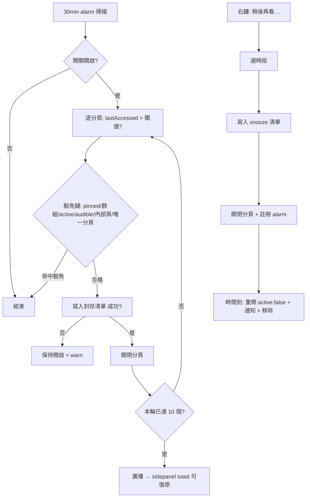

# PRD: Tab Lifecycle — 分頁生命週期（Auto-Archive + Snooze）

| Attribute | Details |
| :--- | :--- |
| **Version** | v1.0 |
| **Status** | Draft |
| **Author** | Claude Code |
| **Reviewers** | Tai |
| **Created** | 2026-07-28 |
| **Last Updated** | 2026-07-28 |
| **Origin** | 2026-07 瀏覽器市場調查 Tier 1 建議第 2 案（`.agent/notes/NOTE_20260727.md`）；前案 BASE-022 已交付 |

## 1. Introduction

### 1.1 Problem Statement

分頁囤積是側欄雜亂的根源：使用者開了不敢關（怕找不回來）、關了又後悔。現有的 AI Tab Cleanup 是**建議制**（使用者手動觸發、逐一確認關閉），解決不了「每天自動堆積」的常態。

市場調查的證據：Arc 的 **Auto-Archive**（未釘選閒置分頁依週期自動歸檔進 Library，預設 12 小時）被公認是「側欄永遠乾淨」口碑的核心；SigmaOS 的 **tabs-as-todo / snooze**（分頁可延後、時間到回來）被社群評為「符合人腦瀏覽模型」的分頁囤積解方。兩者合起來就是完整的分頁生命週期：**閒置的自動收走（找得回來）、暫時不看的定時回來**。

關鍵約束：這是**資料遺失風險**功能——自動關閉使用者的分頁。所有設計都以「永不真正丟失」為前提：先持久化、後關閉；預設關閉（opt-in）；保守的豁免鏈。

### 1.2 Goals & Objectives

- **目標 1**：開啟 Auto-Archive 後，閒置分頁自動移入「封存區」，側欄長期保持乾淨——且**任何被收走的分頁都能一鍵找回**。
- **目標 2**：Snooze 讓「現在沒空看」的分頁在指定時間自動回來，取代「先留著佔位」的囤積行為。
- **目標 3**：行為保守可控：預設關閉、豁免鏈寬鬆（pinned／群組內／播放中／作用中分頁一律不動）、閾值可調、隨時可全關。
- **目標 4**：與既有功能語意互補不重疊：AI Cleanup 維持「手動建議」定位，Auto-Archive 是「自動收納」；封存區獨立於 Reading List（不污染「要讀的文章」語意）。

### 1.3 Success Metrics (KPIs)

本專案無遙測，以質性訊號＋驗收衡量：CWS 評論/GitHub issue 對「側欄自動保持乾淨」的正向提及；第 4 節 AC 全數通過＋對應 E2E 進 CI。

## 2. User Stories

| ID | As a (Role) | I want to (Action) | So that (Benefit) | Priority |
| :--- | :--- | :--- | :--- | :--- |
| US-01 | 分頁常態 30+ 的囤積者 | 閒置超過一段時間的分頁自動被收進封存區 | 側欄自動保持乾淨，不用每天手動清 | High |
| US-02 | 怕丟東西的使用者 | 隨時瀏覽封存區、一鍵還原任何被收走的分頁 | 敢放心開啟自動歸檔 | High |
| US-03 | 現在沒空看的使用者 | 右鍵把分頁「稍後再看」，時間到自動回來 | 不用讓分頁佔位當提醒 | High |
| US-04 | 誤收走東西的使用者 | 在封存區看到剛被歸檔的分頁並立即還原 | 錯誤可逆，不焦慮 | High |
| US-05 | 想控制節奏的使用者 | 調整閒置閾值（或完全關閉）、單獨管理 snooze 項目 | 行為完全可預期 | Medium |

## 3. Functional Requirements

> 使用 EARS syntax。「封存區」= sidebar 新增的 collapsible section（同 Reading List 的區塊形態，納入既有 sectionOrder 排序機制）。

### 3.1 Auto-Archive 引擎（background service worker）

- **FR-1.01 (State)**: Auto-Archive 必須為 **opt-in**（`autoArchiveEnabled` 預設 `false`）；閒置閾值 `autoArchiveIdleHours` 預設 **12 小時**，可選 1／6／12／24／72／168 小時。
- **FR-1.02 (Event)**: 開關開啟時，系統必須以週期性掃描（`chrome.alarms`，週期 30 分鐘）檢查所有一般視窗的分頁：`lastAccessed` 距今超過閾值者視為閒置候選。
- **FR-1.03 (Unwanted)**: 以下分頁**不得**被歸檔（豁免鏈）：
  - (a) pinned 分頁
  - (b) 已在任何 tab group 內的分頁（對應 Arc「資料夾內不受影響」語意）
  - (c) 各視窗當下的 active 分頁
  - (d) 正在播放聲音的分頁（`audible`）
  - (e) 非 http/https 的內部頁（`chrome://` 等）
  - (f) 視窗中最後一個分頁（歸檔會導致關窗）
- **FR-1.04**: 歸檔動作必須**先將分頁資訊成功寫入封存清單（storage 持久化完成）、才關閉分頁**；寫入失敗時不得關閉。這是資料遺失防線，順序不可逆。
- **FR-1.05**: 單輪掃描最多歸檔 **10 個**分頁（防止使用者剛開啟功能時整個側欄瞬間清空的驚嚇；下輪繼續收）。
- **FR-1.06 (State)**: 引擎必須在 SW 終止/喚醒循環下正確運作（alarms 驅動、無 in-memory 依賴）。

### 3.2 封存清單（storage）

- **FR-2.01**: 封存項目包含：`url`、`title`、`favIconUrl`、`archivedAt`、來源（`auto` / `snooze`）。存於 `chrome.storage.local`，上限 **500 條**，超出時淘汰最舊者（FIFO）。
- **FR-2.02**: 還原＝以新分頁開啟（`active:true`）並自清單移除。
- **FR-2.03**: 支援單項刪除與「清空全部」（清空需確認對話框——這是唯一真正丟資料的操作）。

### 3.3 封存區 UI（sidepanel）

- **FR-3.01**: sidebar 新增「封存」collapsible section：列表顯示 favicon＋標題＋相對時間（「3 小時前」），點擊項目即還原（FR-2.02）；hover 顯示刪除鈕。
- **FR-3.02**: 新 section 必須納入既有 `sectionOrder` 拖曳排序機制（`DEFAULT_SECTION_ORDER` 加入 `archive`）。
- **FR-3.03 (State)**: 空清單時顯示一句話說明；section 標題顯示項目數 badge。
- **FR-3.04**: snooze 中的項目顯示於同一區塊頂部（帶喚醒時間 badge，例「明天 09:00」），可提前喚醒（點擊）或取消（刪除鈕＝直接還原為封存項）。
- **FR-3.05**: 每次自動歸檔完成後，若 sidepanel 開啟，必須以 toast 告知（「已封存 N 個閒置分頁」＋「復原」）；復原＝該輪歸檔的分頁全部重開並自清單移除。

### 3.4 Snooze（sidepanel 入口 + background 喚醒）

- **FR-4.01 (Event)**: 分頁 context menu 新增「稍後再看…」（僅 http/https 分頁）：提供四個固定時段——**1 小時後／今晚 20:00／明天 09:00／下週一 09:00**（已過的時段自動跳到次日對應時間）。
- **FR-4.02**: 選定後：分頁資訊寫入 snooze 清單（含 `wakeAt`）→ 寫入成功才關閉分頁（同 FR-1.04 順序）→ 註冊 `chrome.alarms` 喚醒。
- **FR-4.03 (Event)**: 喚醒時：以新分頁開啟（`active:false`）、發系統通知（點擊通知聚焦該分頁）、自 snooze 清單移除。喚醒開啟的分頁照常參與 BASE-022 路由（使用者回來看＝一般新分頁語意）。
- **FR-4.04 (Unwanted)**: 瀏覽器在 `wakeAt` 時間點未執行（關機）時，下次啟動必須補喚醒所有已過期的 snooze 項目。
- **FR-4.05**: snooze 無獨立開關（使用者主動觸發即意圖明確）；但清單管理同封存區（FR-3.04）。

### 3.5 設定（options）

- **FR-5.01**: options「功能」區或獨立區塊提供：Auto-Archive 開關（預設關）＋閒置閾值下拉（FR-1.01 六檔）。
- **FR-5.02**: 開關關閉時引擎停止掃描；既有封存清單與 snooze 排程**不受影響**（snooze 獨立於開關）。

### 3.6 i18n

- **FR-6.01**: 所有新 UI 文案進 `_locales` 14 語（觸發 `update-multilingual-docs`）。

## 4. Acceptance Criteria

### AC for FR-1.02 / FR-1.03（閒置判定與豁免鏈）
```gherkin
Given Auto-Archive 開啟、閾值 12 小時
  And 分頁 A 的 lastAccessed 為 13 小時前、未 pinned、未在群組、非 active、無聲音
When 掃描執行
Then 分頁 A 被寫入封存清單後關閉

Given 同上設定
  And 分頁 B pinned、分頁 C 在群組內、分頁 D 為 active、分頁 E 播放聲音中、分頁 F 是視窗唯一分頁（皆閒置超過閾值）
When 掃描執行
Then B/C/D/E/F 全部保持開啟
```

### AC for FR-1.04（先寫後關——資料遺失防線）
```gherkin
Given 封存清單寫入會失敗（storage 錯誤注入）
When 掃描嘗試歸檔分頁 A
Then 分頁 A 保持開啟
  And 封存清單不含分頁 A
```

### AC for FR-1.05（單輪上限）
```gherkin
Given Auto-Archive 開啟且有 15 個合格的閒置分頁
When 單輪掃描執行
Then 恰好 10 個被歸檔，其餘 5 個保持開啟（待下輪）
```

### AC for FR-2.02 / FR-3.01（還原）
```gherkin
Given 封存區含分頁 A 的項目
When 使用者點擊該項目
Then 分頁 A 以作用中分頁重新開啟
  And 該項目自封存清單移除
```

### AC for FR-2.01（FIFO 上限）
```gherkin
Given 封存清單已有 500 條
When 第 501 條寫入
Then 清單仍為 500 條且最舊一條被移除
```

### AC for FR-3.05（歸檔 toast 復原）
```gherkin
Given sidepanel 開啟且該輪自動歸檔了 3 個分頁
When 使用者點擊 toast 上的「復原」
Then 3 個分頁全部重新開啟且自封存清單移除
```

### AC for FR-4.01 ~ 4.03（snooze 完整流程）
```gherkin
Given 使用者於分頁 A 右鍵選「稍後再看…」→「1 小時後」
Then 分頁 A 關閉
  And snooze 清單含分頁 A（wakeAt ≈ now + 1h）
  And 封存區頂部顯示分頁 A 與喚醒時間

When 喚醒時間到
Then 分頁 A 以背景分頁重新開啟
  And 發出系統通知
  And snooze 清單不再包含分頁 A
```

### AC for FR-4.04（過期補喚醒）
```gherkin
Given snooze 清單含 wakeAt 已過期的分頁 A（瀏覽器當時未執行）
When 瀏覽器啟動、擴充功能初始化完成
Then 分頁 A 被補喚醒（重開＋通知＋移除）
```

### AC for FR-5.01 / FR-5.02（設定）
```gherkin
Given 全新安裝
Then Auto-Archive 為關閉、無任何自動歸檔行為

Given Auto-Archive 曾開啟並累積封存項目與 snooze 排程
When 使用者關閉 Auto-Archive
Then 掃描停止，但封存清單保留、snooze 仍照時喚醒
```

## 5. User Experience (UI/UX)



- **封存區**：位於 sidebar（sectionOrder 可拖曳排序），視覺同 Reading List 區塊語言；snooze 項目置頂帶時鐘 badge。
- **心智模型**：封存=「系統幫你收起來的，隨時找得回」；snooze=「你自己約好時間再見的」。兩者同區呈現、badge 區分。

## 6. Non-Functional Requirements

- **資料安全（最高優先）**: 「寫入成功先於關閉」順序不可逆（FR-1.04/4.02）；清空全部需確認；除「清空」外沒有任何操作會讓 URL 徹底消失。
- **Performance**: 掃描 O(tabs) 每 30 分鐘一次，無常駐監聽新增；封存清單渲染沿用既有列表模式（500 條上限內無虛擬捲動需求）。
- **Privacy**: 全本地，無遙測；封存清單不進任何同步管道（見 Out of Scope）。
- **Reliability**: alarms 驅動、狀態全在 `storage.local`，SW 終止/喚醒與瀏覽器重啟皆一致；瀏覽器重啟後補喚醒過期 snooze（FR-4.04）。
- **Permissions**: 不新增 manifest 權限（`tabs`／`alarms`／`notifications`／`storage` 皆已具備）。
- **已知限制（誠實列出）**: 無法偵測「分頁內有未送出的表單」（不注入 content script 的取捨，Arc 同樣如此）；`lastAccessed` 需 Chrome 121+（本擴充功能既有功能已要求更新版本）。
- **Compatibility**:
  - **AI Tab Cleanup**：定位互補——Cleanup 是手動觸發的「建議關閉」（真關閉、不留底），Auto-Archive 是自動的「收納可找回」。並存不互斥。
  - **Workspaces**：綁定視窗的分頁被歸檔時，快照隨生命週期自然更新（不豁免；歸檔項目在封存區可找回）。
  - **Linked Tabs**：歸檔＝一般分頁關閉，沿用既有連結清理。
  - **BASE-022 路由**：snooze 喚醒與封存還原開啟的分頁照常參與路由判定。

## 7. Analytics & Tracking

不新增任何埋點（無遙測基礎設施、隱私定位）。

## 8. Out of Scope

- **封存清單／snooze 的 Drive 同步**：封存與 snooze 是裝置本地語意（同 workspace tabSnapshot per-device 的理由）；跨裝置需求待真實回饋再議。
- **自訂 snooze 時間選擇器**：v1 固定四時段；datetime picker 待需求出現。
- **AI 建議歸檔／智慧閾值**：cleanup 已涵蓋 AI 建議；不重疊。
- **閒置預告（badge 倒數）**：Arc 亦無此設計，避免焦慮式 UI。
- **content script 表單偵測**：權限與複雜度不成比例，列為已知限制。
- **封存區搜尋**：既有全域搜尋（searchManager）是否納入封存項目由 SA 評估成本後決定；獨立搜尋框不做。

---

## Revision History

| Version | Date | Author | Changes |
|---------|------|--------|---------|
| v1.0 | 2026-07-28 | Claude Code | Initial draft（源自 2026-07 市場調查 Tier 1 第 2 案：Arc Auto-Archive + SigmaOS Snooze） |
