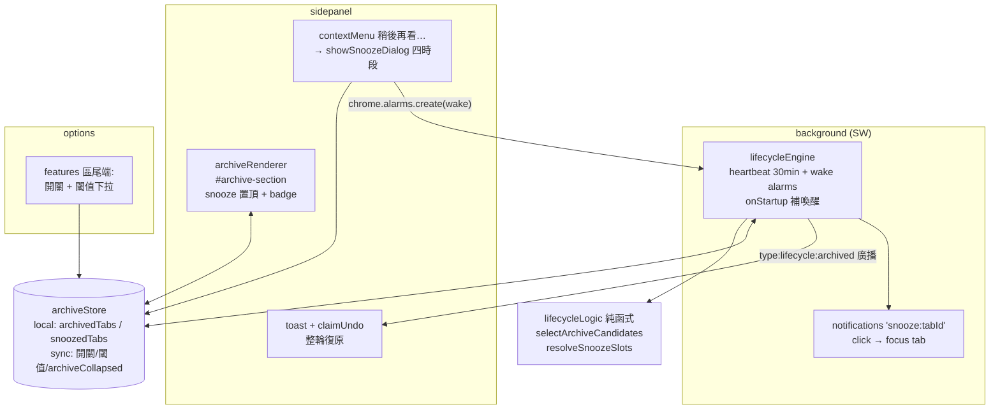
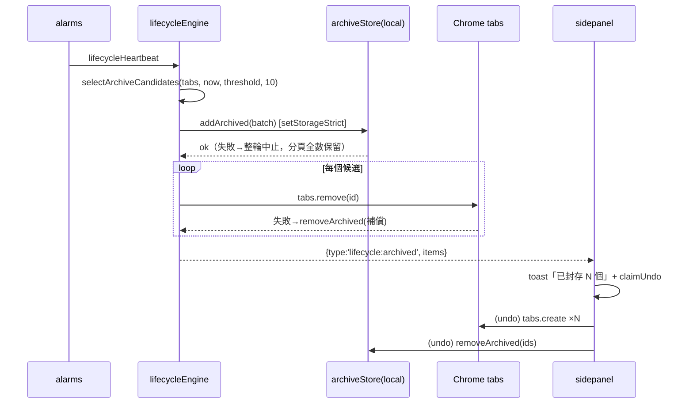
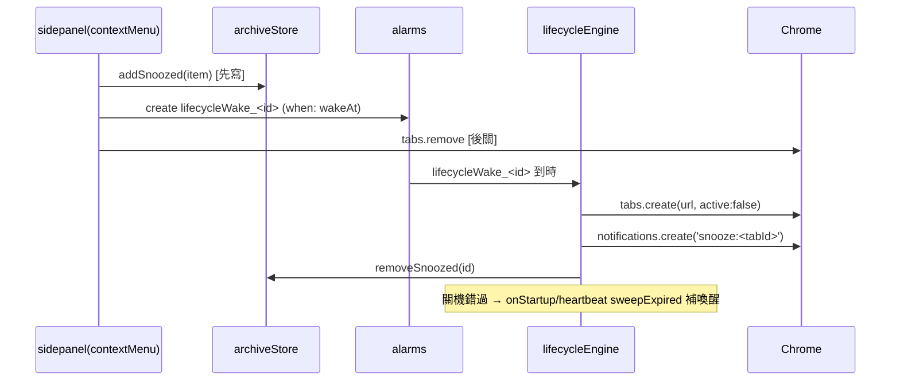

# SA — Tab Lifecycle：分頁生命週期（Auto-Archive + Snooze）

| Attribute | Details |
| :--- | :--- |
| **Version** | v1.0 |
| **Status** | Draft（使用者授權：SA 隨 P1 PR 一併審，不設事前 gate） |
| **Author** | Claude Code |
| **Reviewers** | Tai |
| **Created** | 2026-07-28 |
| **PRD** | `PRD_spec.md` v1.0（已核准） |

## 1. Overview

### 1.1 Scope

- **新增 `modules/lifecycle/`**：純函式決策（lifecycleLogic）、封存/snooze 儲存（archiveStore）、SW 引擎（lifecycleEngine）。
- **新增 UI**：sidebar「封存」section（`modules/ui/archiveRenderer.js`）＋ snooze 時段 dialog（modalManager）＋ context menu 第四項＋ options 功能區兩列設定。
- **新增 util**：`modules/utils/timeUtils.js`（相對時間＋喚醒時間格式，repo 現況無時間 util）。
- **修改**：`sidepanel.html`（新 section wrapper）、`sectionOrder.js`（DEFAULT +1）、`options.js`（SECTION_LABEL_KEYS ＋ features 區兩列）、`background.js`（引擎 init ＋ onAlarm 顯式分支 ＋ 通知分派鏈）、`contextMenuManager.js`、`sidepanel.js`（renderer 接線）、`_locales`×14、既有 E2E `happy_path_section_order`（DEFAULT_ORDER 硬編碼）。
- **不動**：manifest.json（權限全數已具備）、Makefile（無新頂層檔）。

### 1.2 Architecture Diagram



**跨 context 面最小化**（相對 PRD 的重要簡化）：snooze 建立**全在 sidepanel 完成**（寫 store → 建 alarm → 關分頁——`chrome.alarms` 任何 extension context 皆可用，onAlarm 一律在 SW 觸發），封存還原/undo 也全在 sidepanel（store 共用、tabs.create 可用）。唯一跨 context 協定是 SW→sidepanel 的 `lifecycle:archived` 單向廣播（toast 用），無 request/response 訊息。

## 2. Requirement Traceability

| PRD 需求 | 落點元件 | 驗證 |
|---|---|---|
| FR-1.01 opt-in + 閾值六檔 | sync keys + options 兩列 | E2E: options |
| FR-1.02 週期掃描 | `lifecycleHeartbeat` alarm（30min，常駐）+ engine.scan | E2E: archive（短閾值＋near-now alarm） |
| FR-1.03 豁免鏈 (a)-(f) | `lifecycleLogic.selectArchiveCandidates` 純函式 | UT: 決策表窮舉 ⭐ |
| FR-1.04 先寫後關 | engine.archiveBatch（批次寫入成功→逐一關閉→失敗補償） | UT + E2E storage 斷言 |
| FR-1.05 單輪 ≤10 | selectArchiveCandidates cap（最舊優先） | UT |
| FR-1.06 SW 安全 | alarms 驅動、零 in-memory 依賴 | 設計保證＋E2E |
| FR-2.01 項目模型/500 FIFO | `archiveStore` | UT |
| FR-2.02/2.03 還原/刪除/清空 | archiveStore + archiveRenderer | E2E: UI |
| FR-3.01~3.04 封存區 UI | `#archive-section` 六件組 + archiveRenderer + timeUtils | E2E: UI |
| FR-3.05 歸檔 toast 復原 | `lifecycle:archived` 廣播 → toast + claimUndo | E2E: archive |
| FR-4.01 右鍵四時段 | contextMenuManager 第四項 + `showSnoozeDialog` + `resolveSnoozeSlots` | UT: 時段計算 ⭐；E2E: snooze |
| FR-4.02 寫入→關閉→alarm | sidepanel 端 snoozeTab 流程 | E2E: snooze |
| FR-4.03 喚醒+通知+路由 | engine.wake（`lifecycleWake_<id>` alarm）+ `snooze:` 通知 | E2E: wake（近時 alarm） |
| FR-4.04 補喚醒 | engine.sweepExpired（onStartup + heartbeat 皆跑） | E2E: 過期 seed + heartbeat |
| FR-5.01/5.02 設定 | options features 區；引擎快取 onChanged 失效 | E2E: options |
| FR-6.01 i18n | ~22 keys × 14 語（P2/P3 分批） | 慣例 |

## 3. Component Design（Module Impact Map）

### 新增（NEW）

| 檔案 | 職責 | Context |
|---|---|---|
| `modules/lifecycle/lifecycleLogic.js` | **純函式**（零 chrome/Date.now，時間入參）：`selectArchiveCandidates(tabs, now, thresholdMs, cap)`——豁免鏈 (a)-(f) ＋ `lastAccessed` 缺值視為不合格（保守，沿 aiCleanupUI Chrome 122+ fallback 注意事項）＋最舊優先＋cap；`resolveSnoozeSlots(now)`——四時段計算（1h 後／今晚 20:00／明天 09:00／下週一 09:00，已過時段跳次日對應）；`isWakeExpired`、常數（預設 12h、cap 10、FIFO 500） | 共用 |
| `modules/lifecycle/archiveStore.js` | `archivedTabs`/`snoozedTabs`（storage.local）CRUD：addArchived（批次、FIFO 500）、removeArchived、clearArchived、addSnoozed、removeSnoozed、getAll；寫入走 `setStorageStrict`（FR-1.04 需要失敗可偵測） | sidepanel / SW |
| `modules/lifecycle/lifecycleEngine.js` | **SW 專屬**：`initLifecycleEngine()`——`ensureHeartbeat()`（30min 常駐 alarm，onInstalled/onStartup 重建）、onAlarm 處理（heartbeat→scan＋sweepExpired；`lifecycleWake_<id>`→wake）、onStartup sweep；`archiveBatch`（**批次寫入 store 成功 → 逐一 removeTab → 個別關閉失敗者自 store 補償移除**）、廣播 `{type:'lifecycle:archived', items}`；wake（tabs.create active:false → `snooze:` 通知 → store 移除）；設定快取（sync onChanged 失效） | background |
| `modules/ui/archiveRenderer.js` | 封存區 renderer（readingListRenderer 模板）：reconcileDOM、容器事件委派＋AbortController、snooze 項置頂（時鐘 badge）、還原/刪除/清空（清空走 modal confirm）、header 數字 badge（newswire `#newswire-unread-badge` 先例：aria-live、>99 顯示 99+、stopPropagation）、收合持久化 `archiveCollapsed`（sync，readingListCollapsed 先例）、**整區塊隱藏規則**：封存空 ∧ snooze 空 ∧ 開關關 → `display:none`（見 §5.5-D1）；監聽 storage.onChanged（local 兩 key）debounce refresh | sidepanel |
| `modules/utils/timeUtils.js` | `formatRelativeTime(ts, now, getMessage)`（分/時/天級，i18n 帶參 key，`viewedDaysAgo` 先例）；`formatWakeTime(wakeAt, now, locale)`（今天→HH:mm、明天→i18n 明天+HH:mm、其餘→Intl 短格式） | 共用 |

### 修改（MODIFY）

| 檔案 | 變更 |
|---|---|
| `sidepanel.html` | `#archive-section`（`data-section-id="archive"`）：`.section-header-row` > `.section-toggle-btn#archive-toggle`（h2 + chevron + `#archive-count-badge`）+ `#archive-list` + `hr.divider`——完全複製 readingList/newswire 區塊形態；置於 newswire 區之後 |
| `modules/utils/sectionOrder.js` | `DEFAULT_SECTION_ORDER` 尾端加 `'archive'`（mergeSectionOrder 對既有使用者自動補尾端，無 migration） |
| `options.js` | (1) `SECTION_LABEL_KEYS` 加 archive；(2) `renderFeatures` 尾端 append 兩列自訂 row：Auto-Archive 開關（checkbox，預設 false、`=== true` 判定）＋閾值 `modal-select`（1/6/12/24/72/168，renderLanguage select 先例） |
| `background.js` | `initLifecycleEngine()`（SW top-level）；onAlarm 加 `lifecycleHeartbeat` 與 `lifecycleWake_` prefix **顯式分支**（fall-through 事故防範）；notifications.onClicked 改鏈式：`if (handleNewswireNotificationClick(id)) return; handleSnoozeNotificationClick(id)`（newswire handler 已回傳 boolean 認領，探索確認此為原設計意圖） |
| `modules/ui/contextMenuManager.js` | 第四項「稍後再看…」（http/https 限定）→ `showSnoozeDialog` → sidepanel 端 snoozeTab 流程（寫 store → 建 `lifecycleWake_<id>` alarm → 關分頁；順序同 FR-4.02） |
| `modules/modalManager.js` | `showSnoozeDialog(slots)`：四選項按鈕清單（label + 解析後時刻），回傳選中 slot 或 null |
| `sidepanel.js` | archiveRenderer 初始化＋`lifecycle:archived` 廣播監聽 → toast（「已封存 N 個分頁」）+ claimUndo（重開整輪＋store 移除；toast.js `claimUndo` 既有單一擁有者機制） |
| `_locales/*` ×14 | §6 keys（P2 section/封存操作；P3 snooze/設定） |
| `usecase_tests/puppeteer_tests/happy_path_section_order.test.js` | `DEFAULT_ORDER` 硬編碼陣列（:15 與 :52-65 多處排列）加 `archive` |
| `GEMINI.md` | key_files 新增五檔（收尾） |

## 4. Data Design

### 4.1 Storage Schema Diff

```js
// NEW — chrome.storage.local
archivedTabs: {
  schemaVersion: 1,
  items: [{               // 上限 500，超出淘汰最舊（FIFO；items[0] 最新）
    id,                   // crypto.randomUUID()
    url, title,
    favIconUrl,           // 可空；渲染 fallback 同 readingList favicon 策略
    archivedAt,           // epoch ms
    source,               // 'auto' | 'snooze-cancel'
  }],
}
snoozedTabs: {
  schemaVersion: 1,
  items: [{ id, url, title, favIconUrl, snoozedAt, wakeAt }],
}

// NEW — chrome.storage.sync（皆小值，quota 無虞）
autoArchiveEnabled: false      // opt-in（FR-1.01）
autoArchiveIdleHours: 12       // 引擎寬容讀取任何正數（見 §8.1 測試縫隙）；UI 只給六檔
archiveCollapsed: boolean      // 區塊收合（readingListCollapsed 先例）
```

尺寸：500 × ~250B ≈ 125KB @ storage.local（~10MB 配額）無虞。**無 migration**（全新 keys）。

### 4.2 Alarms

| 名稱 | 型態 | 用途 |
|---|---|---|
| `lifecycleHeartbeat` | periodInMinutes: 30，**常駐**（onInstalled/onStartup ensure；不隨開關增刪——關閉時 scan 內部早退，換取 alarm 生命週期零管理＋snooze sweep 永遠有兜底） |掃描（開關開啟時）＋過期 snooze sweep |
| `lifecycleWake_<itemId>` | one-shot `when: wakeAt` | 單一 snooze 喚醒 |

### 4.3 通知

id = `snooze:<reopenedTabId>`（tabId 內嵌於 id，點擊 handler 直接 `tabs.update(tabId, {active:true})`＋`windows.update(focused)`，免存 mapping）；建立參數比照 `notifyP0`（type basic、extension icon、try/catch 靜默、`chrome.notifications` 存在性 guard）。

## 5. Interface Design

### 5.1 跨 context 協定（僅一條，SW→sidepanel 單向）

| type | payload | 用途 |
|---|---|---|
| `lifecycle:archived` | `{items: [{id,url,title}], windowIds: number[]}` | 掃描歸檔完成廣播；sidepanel 顯 toast + claimUndo（undo 全在 sidepanel 端執行：`tabs.create` 重開 + `archiveStore.removeArchived`） |

snooze 建立、還原、刪除、清空皆為 sidepanel 本地操作（store + chrome.tabs/alarms 直接可用），**無 request/response 協定**。

### 5.2 引擎掃描（FR-1.02~1.05）

```
onAlarm('lifecycleHeartbeat'):
  sweepExpiredSnoozes()                          // FR-4.04 兜底（正常由 wake alarm 處理）
  if (!(await ensureEnabled())) return           // FR-5.02：關閉只停掃描
  tabs = chrome.tabs.query({ windowType: 'normal' })
  candidates = selectArchiveCandidates(tabs, Date.now(), hours*3600_000, 10)
  if (!candidates.length) return
  await archiveStore.addArchived(items)          // 單次批次寫入（setStorageStrict，失敗即整輪中止）
  for tab of candidates:
    try { await chrome.tabs.remove(tab.id) }
    catch { await archiveStore.removeArchived([item.id]) }   // 關閉失敗 → 補償移除，分頁保持原樣
  broadcast {type:'lifecycle:archived', items}
```

`selectArchiveCandidates` 豁免決策表（純函式，UT 窮舉）：pinned ∣ groupId≠NONE ∣ active ∣ audible ∣ 非 http(s) ∣ 視窗唯一分頁 ∣ `lastAccessed` 缺值 → 排除；`now - lastAccessed > threshold` → 候選；最舊優先取前 10。「視窗唯一分頁」以**本輪歸檔後餘量**計算：同視窗多個候選時保留至少一頁（cap 內逐一標記時檢查 per-window 剩餘數）。

### 5.3 Snooze 流程（sidepanel 端，FR-4.01/4.02）

```
contextMenu「稍後再看…」→ showSnoozeDialog(resolveSnoozeSlots(Date.now()))
→ item = {id: randomUUID(), url, title, favIconUrl, snoozedAt: now, wakeAt: slot.at}
→ await archiveStore.addSnoozed(item)            // 先寫（setStorageStrict）
→ chrome.alarms.create(`lifecycleWake_${item.id}`, { when: item.wakeAt })
→ await chrome.tabs.remove(tab.id)               // 後關
```

`resolveSnoozeSlots(now)` 純函式：`later1h`（now+1h）；`tonight`（今日 20:00，已過→明日 20:00）；`tomorrow`（明日 09:00）；`nextMonday`（下個週一 09:00，今天週一→下週一）。回傳 `[{key, at}]`，UT 以固定 now 窮舉跨日/跨週界。

### 5.4 喚醒與補償（SW，FR-4.03/4.04）

```
onAlarm('lifecycleWake_<id>') → wake(id)
wake(id): item = store.getSnoozed(id); if (!item) return       // 已取消
  tab = await chrome.tabs.create({url, active:false})
  notify(`snooze:${tab.id}`, item.title)
  await store.removeSnoozed(id)
sweepExpiredSnoozes(): store 中 wakeAt <= now 者逐一 wake()     // onStartup + heartbeat
```

喚醒順序刻意「先開分頁、後移除記錄」：開啟失敗時記錄保留、下輪 sweep 重試（與歸檔方向相反但同一原則——**任何時刻 URL 至少存在於一處**）。

### 5.5 與 PRD 的落地補充（隨 P1 PR 一併審）

| # | 事項 | 理由 |
|---|---|---|
| D1 | 封存區在「封存空 ∧ snooze 空 ∧ 開關關」時整塊隱藏 | 功能預設關，對未使用者不佔側欄空間；任一條件不成立即顯示（PRD FR-3.03 空狀態文案適用於「開關開但尚無項目」） |
| D2 | snooze 建立不經 SW（sidepanel 直接 store+alarm+close） | alarms API 全 context 可用、onAlarm 必在 SW 觸發；少一條協定、先寫後關順序天然成立 |
| D3 | heartbeat 常駐（不隨開關增刪 alarm） | snooze sweep 需要兜底且獨立於開關（FR-5.02）；關閉時 scan 早退成本趨零 |

## 6. I18n Keys（P2：section/封存；P3：snooze/設定）

`archiveSectionHeader`、`archiveEmptyState`、`archiveRestoreTitle`、`archiveDeleteTitle`、`archiveClearAll`、`archiveClearConfirm`、`archivedToast`（$N$ 帶參）、`undoButton`（若無現成 key 才新增）、`timeMinutesAgo`/`timeHoursAgo`/`timeDaysAgo`（$1 帶參）、`wakeTomorrow`（$1 時刻）、`ctxSnoozeTab`、`snoozeDialogTitle`、`snoozeLater1h`、`snoozeTonight`、`snoozeTomorrow`、`snoozeNextMonday`、`snoozeWakeNotifTitle`、`autoArchiveToggle(+Desc)`、`autoArchiveThreshold` ＋六檔 option label（`thresholdHours_1` 等或帶參單一 key）——實作時以帶參數 key 收斂數量。

## 7. Sequence Flows

### 7.1 自動歸檔＋整輪復原（FR-1.04/3.05）



### 7.2 Snooze 建立→喚醒（FR-4.02/4.03）



## 8. Testing Strategy

### 8.1 測試縫隙（不開測試專用後門）

- **閾值寬容讀取**＝天然縫隙：引擎接受任何正數小時（UI 只給六檔）；E2E 直接寫 `autoArchiveIdleHours: 0.0001`（≈0.36s）使既有分頁立即合格。
- **E2E 觸發 alarm**＝unpacked 豁免：測試以 `chrome.alarms.create('lifecycleHeartbeat', {when: Date.now()+1000})` 觸發**真實 handler**（`--load-extension` unpacked 模式不受 30s 下限硬限制，`feedManager.js:66-68` 既有註解佐證 0.5min 週期可行）。若實測仍被 clamp，fallback：延長該測試 timeout 至涵蓋 30s（非 happy_path 化為最後手段，於實作時依實測定案）。
- snooze 喚醒：seed 過期 `wakeAt` ＋ near-now heartbeat → 走真實 sweep 路徑（FR-4.04 順帶覆蓋）。

### 8.2 Test Impact Analysis

**新增單元測試**：
| 檔案 | 覆蓋 |
|---|---|
| `lifecycleLogic.test.mjs` | selectArchiveCandidates 決策表窮舉（六豁免×閒置界×lastAccessed 缺值×最舊優先×cap×視窗唯一分頁含「本輪餘量」情境）；resolveSnoozeSlots（固定 now：今晚已過/未過、跨日、週一當天、跨月界） |
| `archiveStore.test.mjs` | 批次 add/FIFO 500/remove/clear/snoozed CRUD（chrome stub 比照 rulesStore.test.mjs） |
| `timeUtils.test.mjs` | 相對時間分/時/天界、formatWakeTime 今天/明天/其他 |

**新增 E2E**（happy_path）：
| 檔案 | 場景 |
|---|---|
| `happy_path_lifecycle_archive.test.js` | 開關+微閾值 → near-now heartbeat → 合格分頁被關且入 store（**先寫後關**以 storage 斷言）、豁免分頁（pinned/群組/active）保持開啟、sidepanel toast 復原整輪重開 |
| `happy_path_lifecycle_archive_ui.test.js` | seed store → section 渲染/badge/相對時間、點擊還原（開分頁+移除）、刪除、清空 confirm、空+關→整塊隱藏（D1） |
| `happy_path_lifecycle_snooze.test.js` | 右鍵→dialog 四時段→關分頁+store+alarm 存在（`chrome.alarms.get` 斷言）；seed 過期+near-now heartbeat→分頁重開+store 移除 |

**既有測試連動**：
| 檔案 | 影響 |
|---|---|
| `happy_path_section_order.test.js` | `DEFAULT_ORDER` 硬編碼（:15、:52-65）**必改**加 `archive` |
| `happy_path_options_page.test.js` | nav 數不變（features 區內加列）✓ 確認即可 |
| `happy_path_context_menu.test.js` | 斷言 count-agnostic（P2 已驗）✓ |

**DOM 契約**：`sidepanel.html:45` 註解明言內部元素 id 不可變；新 section 的 `#archive-section`/`#archive-toggle`/`#archive-list`/`#archive-count-badge` 自此凍結。

### 8.3 Verification Plan / 實作 Phase（每 phase 一 PR）

```bash
npm run test:unit && npm run test:ci
make && make release   # 打包 grep modules/lifecycle
```

| Phase | 內容 | 對應 FR |
|---|---|---|
| P1 | lifecycleLogic + archiveStore + lifecycleEngine（scan/heartbeat/wake/sweep/通知）＋ background 接線 ＋ UT ＋ archive E2E | FR-1.x、2.01、4.03/4.04、5.02 |
| P2 | 封存區 section 六件組 ＋ archiveRenderer ＋ timeUtils ＋ toast 復原 ＋ section keys i18n ＋ UI E2E ＋ section_order 測試連動 | FR-2.02/2.03、3.x |
| P3 | snooze 入口（context menu + dialog）＋ options 設定兩列 ＋ 其餘 i18n ＋ snooze E2E | FR-4.01/4.02、5.01、6.01 |

依賴：P2/P3 只依賴 P1。

## 9. Security & Performance

- **資料安全**：歸檔「批次寫入成功→關閉→失敗補償」；喚醒「先開後刪」；兩方向都維持「URL 任一時刻至少存在一處」不變式。清空需 confirm。
- **效能**：掃描每 30 分鐘 O(tabs) 一次、無常駐 tabs 監聽；候選排序 O(n log n) 於 n≤數百。
- **隱私**：全本地；favicon 顯示沿 readingList 既有策略（Google s2 + fallback）。
- **穩健**：所有引擎動作 try/catch silent-skip；通知建立 feature-guard；`lastAccessed` 缺值（<Chrome 122）保守不歸檔。

## 10. Manifest Diff

**無**（`tabs`/`alarms`/`notifications`/`storage` 既有）。

## 11. File Changes Summary

| 類型 | 檔案 |
|---|---|
| NEW | `modules/lifecycle/{lifecycleLogic,archiveStore,lifecycleEngine}.js`、`modules/ui/archiveRenderer.js`、`modules/utils/timeUtils.js` |
| NEW (test) | `unit_tests/{lifecycleLogic,archiveStore,timeUtils}.test.mjs`；`puppeteer_tests/happy_path_lifecycle_{archive,archive_ui,snooze}.test.js` |
| MODIFY | `sidepanel.html`、`modules/utils/sectionOrder.js`、`options.js`、`background.js`、`modules/ui/contextMenuManager.js`、`modules/modalManager.js`、`sidepanel.js`、`_locales/*`×14、`happy_path_section_order.test.js`、`GEMINI.md` |

---

## Revision History

| Version | Date | Author | Changes |
|---------|------|--------|---------|
| v1.0 | 2026-07-28 | Claude Code | Initial draft（基於實地盤點：section 六件組、通知 prefix 鏈式分派、alarms unpacked 豁免、lastAccessed Chrome 122+ fallback 先例；三項落地補充 D1-D3 隨 P1 PR 併審） |
