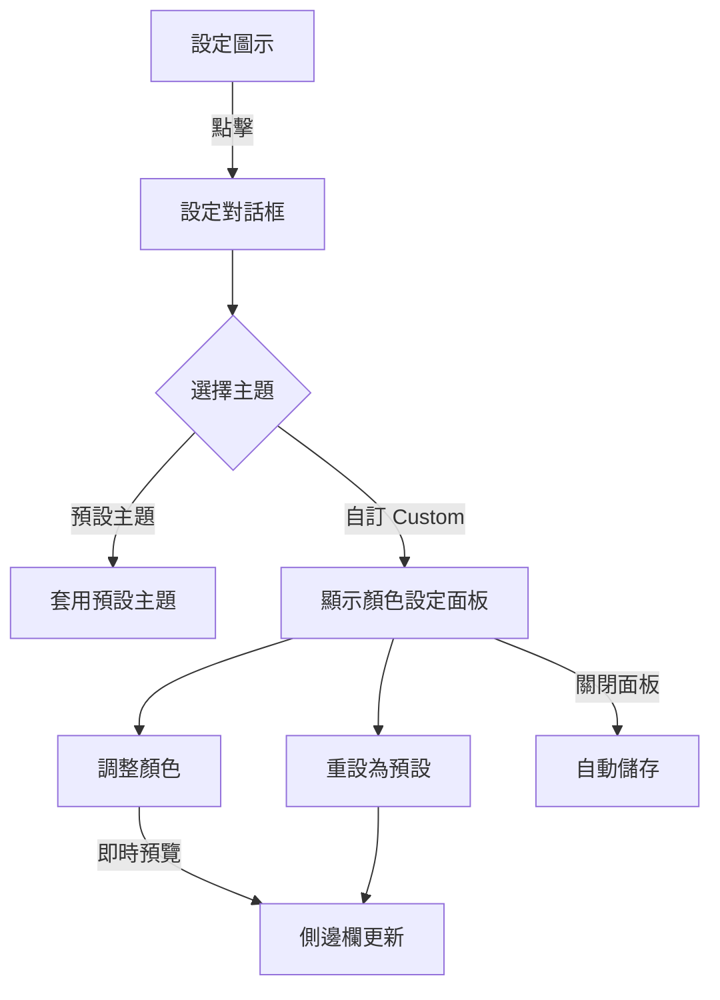

# 自訂主題配色 (Custom Theme Color) PRD

| Attribute | Details |
| :--- | :--- |
| **Version** | v1.1 |
| **Status** | Draft |
| **Author** | Tai-ch0802 |
| **Reviewers** | User |
| **Created** | 2026-01-22 |
| **Last Updated** | 2026-01-22 |
| **Issue Reference** | [Issue #30](https://github.com/Tai-ch0802/arc-like-chrome-extension/issues/30), [Issue #24](https://github.com/Tai-ch0802/arc-like-chrome-extension/issues/24) |

---

## 1. Introduction

### 1.1 Problem Statement

目前擴充功能僅提供 5 種預設主題 (Geek, Google, Darcula, Geek-Blue, Christmas)，使用者無法根據個人偏好或現有 Chrome 主題進行配色調整。這限制了使用者的個人化體驗，尤其對於已使用特定 Chrome 主題的使用者，側邊欄配色可能與整體風格不協調。

### 1.2 Goals & Objectives

1. **提升個人化體驗**: 讓使用者能夠自訂側邊欄的主要配色。
2. **增加視覺整合度**: 使側邊欄配色能與使用者的 Chrome 主題相匹配。
3. **保持操作簡便**: 提供直觀的顏色選擇介面，無需技術知識即可使用。

### 1.3 Success Metrics (KPIs)

- **主觀滿意度**: 使用者回饋表示配色功能易於使用
- **功能採用率**: 有使用者實際啟用自訂主題功能

---

## 2. User Stories

| ID | As a (Role) | I want to (Action) | So that (Benefit) | Priority |
| :--- | :--- | :--- | :--- | :--- |
| US-01 | 側邊欄使用者 | 自訂側邊欄的主要背景顏色 | 與我的 Chrome 主題搭配 | High |
| US-02 | 側邊欄使用者 | 自訂側邊欄的強調色 (Accent Color) | 突顯我喜歡的色調 | High |
| US-03 | 側邊欄使用者 | 設定自訂背景圖片 | 讓側邊欄更具個人風格 | Medium |
| US-04 | 側邊欄使用者 | 隨時切換回預設主題 | 若自訂配色不滿意可快速恢復 | High |
| US-05 | 側邊欄使用者 | 預覽配色變更效果 | 確認效果後再儲存 | Medium |
| US-06 | 側邊欄使用者 | 匯出我的自訂配色並分享給朋友 | 讓社群也能使用我的配色 | Medium |
| US-07 | 側邊欄使用者 | 載入別人分享的配色 | 快速套用社群熱門主題 | Medium |

---

## 3. Functional Requirements

### 3.1 自訂主題選項 (Custom Theme Option)

- **FR-01**: 系統必須在設定面板的主題下拉選單中新增「自訂 (Custom)」選項。
- **FR-02**: 當使用者選擇「自訂」選項時，系統必須顯示顏色設定面板。

### 3.2 顏色選擇器 (Color Picker)

- **FR-03**: 顏色設定面板必須提供以下基本顏色調整：
  - 主背景色 (Main Background Color)
  - 強調色 (Accent Color)
  - 主要文字顏色 (Primary Text Color)
- **FR-04**: 系統必須提供原生 HTML5 顏色選擇器 (`<input type="color">`) 作為顏色輸入方式。
- **FR-05**: 使用者調整顏色時，側邊欄必須即時預覽變更效果。

### 3.3 背景圖片 (Background Image) - Phase 2 考量

> [!NOTE]
> 此功能列為 Medium 優先級，可作為後續迭代實作。

- **FR-06**: 系統可以允許使用者設定背景圖片 URL。
- **FR-07**: 系統可以提供背景圖片的透明度調整功能。

### 3.4 儲存與恢復

- **FR-08**: 使用者的自訂配色必須儲存於 `chrome.storage.sync`，以便跨裝置同步。
- **FR-09**: 系統必須提供「重設為預設」按鈕，讓使用者能快速恢復至未自訂狀態。
- **FR-10**: 當使用者選擇預設主題後再切換回「自訂」時，系統必須載入使用者先前儲存的自訂配色。

### 3.5 社群分享 (Community Sharing)

- **FR-11**: 系統必須提供「匯出」功能，將自訂配色儲存為 JSON 檔案。
- **FR-12**: 系統必須提供「載入」功能，允許使用者匯入 JSON 檔案以套用社群分享的配色。
- **FR-13**: JSON Schema 必須保留未來可儲存「背景圖片」路徑的欄位，以確保向前相容。

#### JSON Schema 設計

```json
{
  "$schema": "https://json-schema.org/draft/2020-12/schema",
  "type": "object",
  "properties": {
    "version": { "type": "string", "description": "Schema version for compatibility" },
    "name": { "type": "string", "description": "Theme name defined by user" },
    "colors": {
      "type": "object",
      "properties": {
        "mainBgColor": { "type": "string", "format": "color" },
        "accentColor": { "type": "string", "format": "color" },
        "primaryTextColor": { "type": "string", "format": "color" }
      },
      "required": ["mainBgColor", "accentColor", "primaryTextColor"]
    },
    "backgroundImage": {
      "type": "object",
      "description": "Reserved for future use",
      "properties": {
        "url": { "type": "string", "format": "uri" },
        "opacity": { "type": "number", "minimum": 0, "maximum": 1 }
      }
    }
  },
  "required": ["version", "colors"]
}
```

### 3.6 輔助顏色演算法 (Complementary Color Algorithm)

> [!IMPORTANT]
> 使用者僅需設定 3 個核心顏色，系統將自動計算其餘 CSS 變數，確保配色和諧且人眼可辨識。

- **FR-14**: 系統必須根據使用者選擇的核心顏色，自動計算衍生色 (Derived Colors)。
- **FR-15**: 衍生色演算法必須確保文字與背景之間具備足夠的對比度 (WCAG AA 標準: 4.5:1)。
- **FR-16**: 衍生色演算法應基於 HSL 色彩模型，透過調整明度 (Lightness) 與飽和度 (Saturation) 來產生單色組合 (Monochromatic) 色票。

#### 衍生色對照表

| 使用者輸入 | 衍生的 CSS 變數 | 演算法描述 |
|:---|:---|:---|
| `--main-bg-color` | `--element-bg-color` | 背景色明度 +5% |
| `--main-bg-color` | `--element-bg-hover-color` | 背景色明度 +10% |
| `--main-bg-color` | `--element-bg-active-color` | 背景色明度 +15% |
| `--main-bg-color` | `--modal-overlay-bg-color` | 背景色 + 80% 透明度 |
| `--accent-color` | `--accent-color-hover` | 強調色明度 +10% |
| `--accent-color` | `--border-color-accent` | 同 `--accent-color` |
| `--accent-color` | `--info-color` | 同 `--accent-color` |
| `--text-color-primary` | `--text-color-secondary` | 主文字色明度 -20% |
| `--text-color-primary` | `--text-color-placeholder` | 主文字色明度 -30% |
| `--text-color-primary` | `--text-color-light` | 主文字色明度 +10% |
| (固定值) | `--danger-color` | `#f38ba8` (保持固定以確保辨識度) |
| (固定值) | `--warning-color` | `#f9ab00` (保持固定以確保辨識度) |

---

## 4. Acceptance Criteria

### AC for FR-01 & FR-02 (自訂選項)

```gherkin
Given 使用者在設定面板中
When 使用者點擊主題下拉選單
Then 選單中應顯示「自訂 (Custom)」選項

Given 使用者在主題下拉選單中
When 使用者選擇「自訂 (Custom)」選項
Then 系統應顯示顏色設定面板
And 面板中應包含至少 3 個顏色選擇器
```

### AC for FR-03, FR-04, FR-05 (顏色選擇器)

```gherkin
Given 使用者在顏色設定面板中
When 使用者使用顏色選擇器更改「主背景色」
Then 側邊欄背景應即時更新為所選顏色
And 無需點擊「儲存」按鈕即可預覽

Given 使用者在顏色設定面板中
When 使用者調整「強調色」
Then 當前分頁的左側邊框和標題應即時更新為新的強調色
```

### AC for FR-08, FR-09, FR-10 (儲存與恢復)

```gherkin
Given 使用者已調整自訂配色
When 使用者關閉設定面板
Then 自訂配色應自動儲存至 chrome.storage.sync

Given 使用者已儲存自訂配色
When 使用者重新開啟側邊欄
Then 側邊欄應自動載入並套用先前的自訂配色

Given 使用者在顏色設定面板中
When 使用者點擊「重設為預設」按鈕
Then 所有顏色選擇器應恢復為預設主題的值
And 側邊欄應即時套用預設主題配色
```

### AC for FR-11, FR-12, FR-13 (社群分享)

```gherkin
Given 使用者已調整自訂配色
When 使用者點擊「匯出」按鈕
Then 系統應下載一個 JSON 檔案
And 檔案名稱應包含 "arc-sidebar-theme" 前綴
And JSON 內容應符合定義的 Schema

Given 使用者有一個有效的主題 JSON 檔案
When 使用者點擊「載入」按鈕並選擇該檔案
Then 系統應解析 JSON 並套用其中的配色
And 側邊欄應即時更新為載入的配色

Given 使用者載入一個格式錯誤的 JSON 檔案
When 系統解析該檔案
Then 系統應顯示錯誤提示
And 不應修改當前配色
```

### AC for FR-14, FR-15, FR-16 (輔助顏色演算法)

```gherkin
Given 使用者在顏色設定面板中
When 使用者更改「主背景色」
Then 所有衍生背景色 (element-bg, hover, active, modal) 應自動更新
And 衍生色應與原色保持視覺和諧

Given 使用者選擇一個深色背景
When 系統計算衍生色
Then 主要文字顏色應自動調整為淺色
And 文字與背景的對比度應 >= 4.5:1

Given 使用者選擇一個淺色背景
When 系統計算衍生色
Then 主要文字顏色應自動調整為深色
And 文字與背景的對比度應 >= 4.5:1
```

---

## 5. User Experience (UI/UX)

### 5.1 設定流程



### 5.2 UI 設計原則

1. **簡潔**: 顏色選擇器使用原生 HTML5 元件，減少學習成本。
2. **即時回饋**: 所有顏色變更立即反映在側邊欄上。
3. **安全感**: 隨時可透過「重設」按鈕恢復，降低使用者嘗試的心理負擔。

---

## 6. Non-Functional Requirements

- **Performance**: 顏色變更應在 100ms 內反映至 UI。
- **Compatibility**: 需支援 Chrome 114+ (Manifest V3 最低需求)。
- **Storage**: 自訂配色資料應小於 8KB (chrome.storage.sync 限制)。

---

## 7. Out of Scope

以下功能不在本次實作範圍內：

- 多組自訂主題切換 (僅支援一組自訂配色)
- 自訂字體或字體大小
- 主題社群平台 (僅提供檔案形式的匯出/匯入，不提供線上分享平台)

---

## Revision History

| Version | Date | Author | Changes |
|---------|------|--------|---------|
| v1.0 | 2026-01-22 | Tai-ch0802 | Initial draft |
| v1.1 | 2026-01-22 | Tai-ch0802 | Added community sharing (FR-11~FR-13), complementary color algorithm (FR-14~FR-16), and corresponding ACs |
