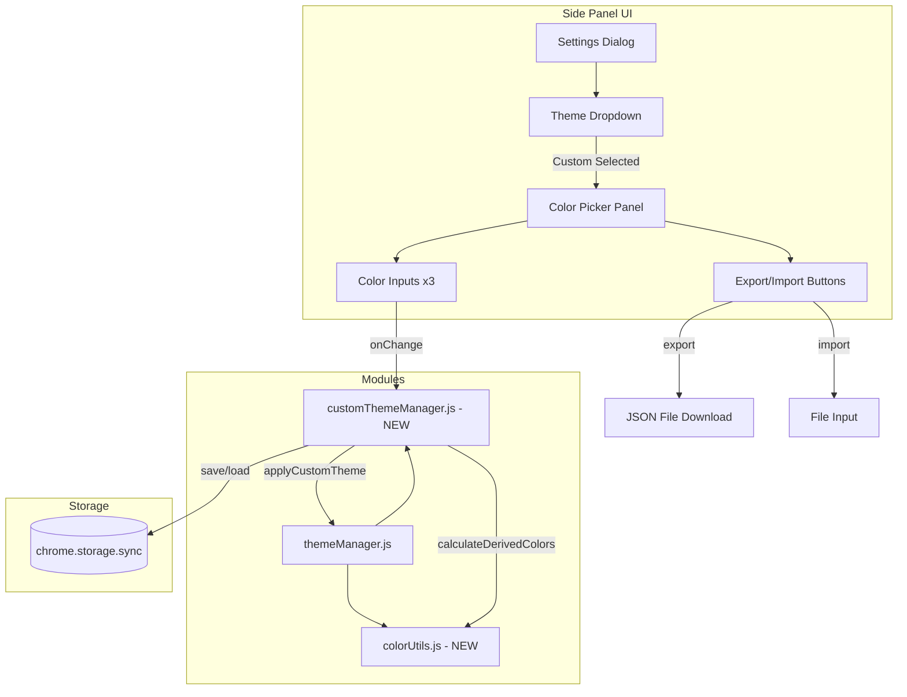
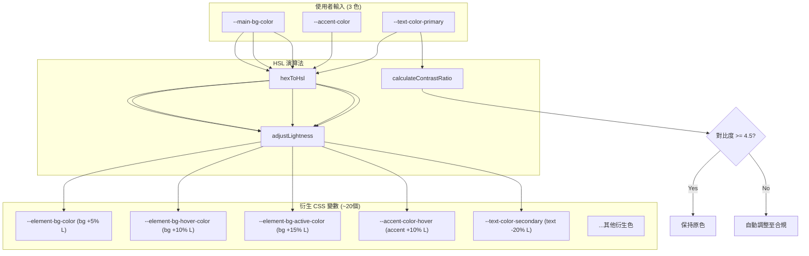
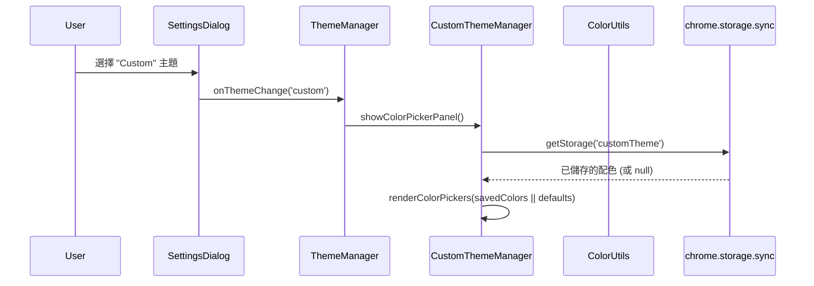
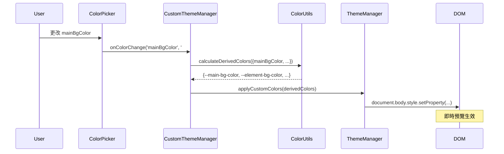
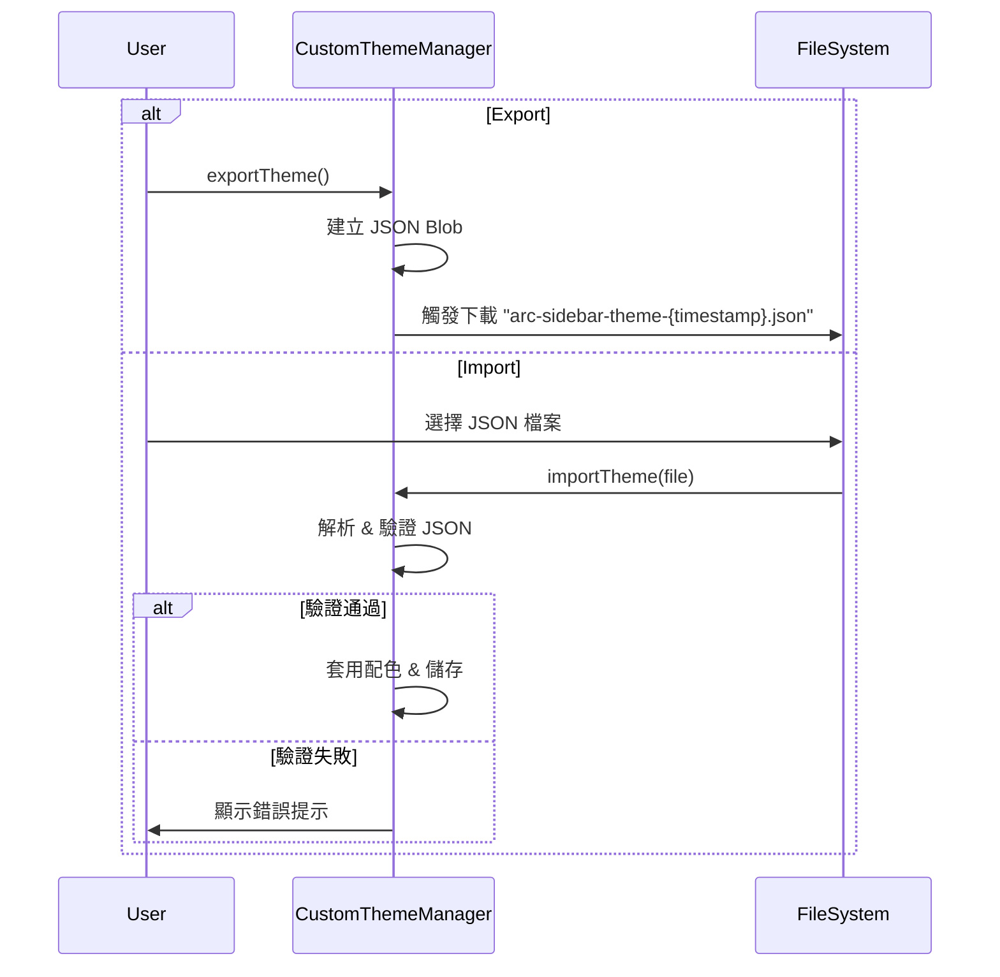

# 自訂主題配色 (Custom Theme Color) System Design Document

| Attribute | Details |
| :--- | :--- |
| **Version** | v1.0 |
| **Status** | Draft |
| **Author** | Tai-ch0802 |
| **Related PRD** | [PRD_spec.md](./PRD_spec.md) |
| **PRD Version** | v1.1 |
| **Created** | 2026-01-22 |
| **Last Updated** | 2026-01-22 |

---

## 1. Overview

### 1.1 Scope

本文件涵蓋「自訂主題配色」功能的技術設計，包含：

- 顏色選擇器 UI 與即時預覽
- HSL 輔助顏色演算法
- 自訂主題儲存與載入
- JSON 匯出/匯入功能

**不包含**：
- 背景圖片功能 (Phase 2 實作)
- 線上主題分享平台

### 1.2 Architecture Diagram



---

## 2. Requirement Traceability

> [!IMPORTANT]
> 此表格建立 PRD 需求與 SA 設計的追溯關係，確保每個需求都有對應的技術實現。

| Req ID | PRD Section | SA Section | Implementation File | Test File |
|--------|-------------|------------|---------------------|-----------|
| FR-01 | 3.1 自訂主題選項 | 3.1 themeManager | `modules/ui/themeManager.js` | Manual |
| FR-02 | 3.1 自訂主題選項 | 3.1 themeManager | `modules/ui/themeManager.js` | Manual |
| FR-03 | 3.2 顏色選擇器 | 3.2 customThemeManager | `modules/ui/customThemeManager.js` [NEW] | Manual |
| FR-04 | 3.2 顏色選擇器 | 3.2 customThemeManager | `modules/ui/customThemeManager.js` [NEW] | Manual |
| FR-05 | 3.2 顏色選擇器 | 3.2 customThemeManager | `modules/ui/customThemeManager.js` [NEW] | Manual |
| FR-08 | 3.4 儲存與恢復 | 3.2 customThemeManager | `modules/ui/customThemeManager.js` [NEW] | Manual |
| FR-09 | 3.4 儲存與恢復 | 3.2 customThemeManager | `modules/ui/customThemeManager.js` [NEW] | Manual |
| FR-10 | 3.4 儲存與恢復 | 3.2 customThemeManager | `modules/ui/customThemeManager.js` [NEW] | Manual |
| FR-11 | 3.5 社群分享 | 3.3 Export/Import | `modules/ui/customThemeManager.js` [NEW] | Manual |
| FR-12 | 3.5 社群分享 | 3.3 Export/Import | `modules/ui/customThemeManager.js` [NEW] | Manual |
| FR-13 | 3.5 社群分享 | 3.3 Export/Import | `modules/ui/customThemeManager.js` [NEW] | Manual |
| FR-14 | 3.6 輔助顏色演算法 | 3.4 colorUtils | `modules/utils/colorUtils.js` [NEW] | Unit Test |
| FR-15 | 3.6 輔助顏色演算法 | 3.4 colorUtils | `modules/utils/colorUtils.js` [NEW] | Unit Test |
| FR-16 | 3.6 輔助顏色演算法 | 3.4 colorUtils | `modules/utils/colorUtils.js` [NEW] | Unit Test |

---

## 3. Component Design

### 3.1 themeManager.js [MODIFY]

**修改範圍**：

- 在 `themeOptions` 陣列中新增 `{ value: 'custom', labelKey: 'themeOptionCustom' }` 選項
- 當選擇 `custom` 時，呼叫 `customThemeManager.showColorPickerPanel()`
- 修改 `applyTheme()` 函式以支援動態 CSS 變數注入

**新增 Public Methods**：

```javascript
/**
 * 將自訂顏色應用到 document.body 的 CSS 變數。
 * @param {Object} colors - 包含所有 CSS 變數的物件。
 */
export function applyCustomColors(colors) {
    Object.entries(colors).forEach(([key, value]) => {
        document.body.style.setProperty(key, value);
    });
}
```

---

### 3.2 customThemeManager.js [NEW]

**位置**: `modules/ui/customThemeManager.js`

**職責**：
- 管理顏色選擇器面板的 UI
- 處理使用者輸入並觸發即時預覽
- 呼叫 `colorUtils` 計算衍生色
- 儲存/載入自訂主題至 `chrome.storage.sync`

**Dependencies**：
- `modules/apiManager.js` (getStorage, setStorage, getMessage)
- `modules/modalManager.js` (showCustomDialog)
- `modules/utils/colorUtils.js` (calculateDerivedColors, hexToHsl, hslToHex)
- `modules/ui/themeManager.js` (applyCustomColors)

**Public Methods**：

```javascript
/**
 * 顯示顏色選擇器面板。
 * @param {HTMLElement} parentElement - 面板要插入的容器元素。
 */
export function showColorPickerPanel(parentElement);

/**
 * 載入已儲存的自訂主題並套用。
 * @returns {Promise<boolean>} 是否成功載入。
 */
export async function loadAndApplyCustomTheme();

/**
 * 將當前自訂主題匯出為 JSON 檔案。
 */
export function exportTheme();

/**
 * 從 JSON 檔案匯入主題並套用。
 * @param {File} file - 使用者選擇的 JSON 檔案。
 * @returns {Promise<boolean>} 是否成功匯入。
 */
export async function importTheme(file);

/**
 * 重設自訂主題為預設值。
 */
export async function resetCustomTheme();
```

---

### 3.3 colorUtils.js [NEW]

**位置**: `modules/utils/colorUtils.js`

**職責**：
- 提供 HSL/HEX 顏色轉換函式
- 實作輔助顏色演算法
- 計算 WCAG 對比度

**Pure Functions (易於單元測試)**：

```javascript
/**
 * 將 HEX 顏色轉換為 HSL。
 * @param {string} hex - HEX 顏色 (e.g., "#1e1e2e")
 * @returns {{h: number, s: number, l: number}}
 */
export function hexToHsl(hex);

/**
 * 將 HSL 顏色轉換為 HEX。
 * @param {number} h - 色相 (0-360)
 * @param {number} s - 飽和度 (0-100)
 * @param {number} l - 明度 (0-100)
 * @returns {string} HEX 顏色
 */
export function hslToHex(h, s, l);

/**
 * 調整顏色明度。
 * @param {string} hexColor - 原始 HEX 顏色
 * @param {number} amount - 明度調整量 (-100 to 100)
 * @returns {string} 調整後的 HEX 顏色
 */
export function adjustLightness(hexColor, amount);

/**
 * 計算兩個顏色之間的對比度 (WCAG)。
 * @param {string} foreground - 前景色 HEX
 * @param {string} background - 背景色 HEX
 * @returns {number} 對比度比值 (1-21)
 */
export function calculateContrastRatio(foreground, background);

/**
 * 根據 3 個核心顏色計算所有衍生 CSS 變數。
 * @param {Object} coreColors - { mainBgColor, accentColor, primaryTextColor }
 * @returns {Object} 包含所有 CSS 變數的物件
 */
export function calculateDerivedColors(coreColors);
```

### 3.4 衍生色計算邏輯



---

## 4. Data Design

### 4.1 Storage Schema

**Storage Key**: `customTheme`
**Storage Area**: `chrome.storage.sync` (跨裝置同步)

```typescript
interface CustomThemeData {
  version: string;        // Schema version, e.g., "1.0"
  name?: string;          // User-defined theme name
  colors: {
    mainBgColor: string;       // HEX, e.g., "#1e1e2e"
    accentColor: string;       // HEX, e.g., "#00ff41"
    primaryTextColor: string;  // HEX, e.g., "#a0e8a0"
  };
  backgroundImage?: {     // Reserved for Phase 2
    url?: string;
    opacity?: number;
  };
}
```

### 4.2 Export JSON Schema

```json
{
  "$schema": "https://json-schema.org/draft/2020-12/schema",
  "type": "object",
  "properties": {
    "version": { "type": "string", "const": "1.0" },
    "name": { "type": "string", "maxLength": 50 },
    "colors": {
      "type": "object",
      "properties": {
        "mainBgColor": { "type": "string", "pattern": "^#[0-9a-fA-F]{6}$" },
        "accentColor": { "type": "string", "pattern": "^#[0-9a-fA-F]{6}$" },
        "primaryTextColor": { "type": "string", "pattern": "^#[0-9a-fA-F]{6}$" }
      },
      "required": ["mainBgColor", "accentColor", "primaryTextColor"]
    },
    "backgroundImage": {
      "type": "object",
      "properties": {
        "url": { "type": "string", "format": "uri" },
        "opacity": { "type": "number", "minimum": 0, "maximum": 1 }
      }
    }
  },
  "required": ["version", "colors"]
}
```

---

## 5. Sequence Flows

### 5.1 選擇自訂主題流程



### 5.2 調整顏色並預覽流程



### 5.3 匯出/匯入主題流程



---

## 6. i18n (國際化)

需新增以下 i18n keys 至 `_locales/*/messages.json`：

| Key | zh-TW | en |
|-----|-------|-----|
| `themeOptionCustom` | 自訂 | Custom |
| `customThemePanelTitle` | 自訂配色 | Custom Colors |
| `labelMainBgColor` | 主背景色 | Main Background |
| `labelAccentColor` | 強調色 | Accent Color |
| `labelPrimaryTextColor` | 主要文字色 | Primary Text |
| `buttonExportTheme` | 匯出主題 | Export Theme |
| `buttonImportTheme` | 載入主題 | Import Theme |
| `buttonResetTheme` | 重設為預設 | Reset to Default |
| `errorInvalidThemeFile` | 無效的主題檔案格式 | Invalid theme file format |
| `successThemeImported` | 主題已成功載入 | Theme imported successfully |

---

## 7. Testing Strategy

### 7.1 Test Impact Analysis

| Test File | Impact | Action Required |
|-----------|--------|-----------------|
| 無現有測試直接涉及 themeManager | Low | 無需修改現有測試 |
| `colorUtils.js` [NEW] | New | 新增 `colorUtils.test.js` 單元測試 |

### 7.2 Verification Plan

#### Unit Tests (`colorUtils.test.js`)

新增檔案: `usecase_tests/unit_tests/colorUtils.test.js`

**測試案例**：

```javascript
describe('colorUtils', () => {
  describe('hexToHsl', () => {
    it('should convert black to HSL(0, 0, 0)', () => {});
    it('should convert white to HSL(0, 0, 100)', () => {});
    it('should convert red to HSL(0, 100, 50)', () => {});
  });
  
  describe('hslToHex', () => {
    it('should convert HSL back to HEX correctly', () => {});
  });
  
  describe('adjustLightness', () => {
    it('should increase lightness correctly', () => {});
    it('should decrease lightness correctly', () => {});
    it('should clamp lightness to 0-100 range', () => {});
  });
  
  describe('calculateContrastRatio', () => {
    it('should return 21 for black on white', () => {});
    it('should return ~4.5 for WCAG AA compliant colors', () => {});
  });
  
  describe('calculateDerivedColors', () => {
    it('should generate all required CSS variables', () => {});
    it('should ensure text-background contrast >= 4.5', () => {});
  });
});
```

**執行指令**：

```bash
npm test -- --grep "colorUtils"
```

#### Manual Verification (UI 測試)

| 步驟 | 預期結果 |
|------|----------|
| 1. 開啟設定面板 → 主題下拉 | 看到「自訂 (Custom)」選項 |
| 2. 選擇「自訂」 | 顏色設定面板出現，包含 3 個顏色選擇器 |
| 3. 更改主背景色 | 側邊欄背景即時更新 |
| 4. 更改強調色 | 當前分頁的左邊框和標題即時更新 |
| 5. 關閉面板後重新開啟 | 自訂配色保留 |
| 6. 點擊「匯出主題」 | 下載 JSON 檔案 |
| 7. 切換至預設主題後，選擇「自訂」→「載入主題」→ 選擇下載的 JSON | 配色恢復為先前匯出的設定 |
| 8. 點擊「重設為預設」 | 顏色選擇器恢復為 Geek 主題預設值 |

---

## 8. Security & Performance

### Security

- **輸入驗證**: 匯入的 JSON 必須符合 Schema，拒絕任何不符合 `#XXXXXX` 格式的顏色值
- **XSS 防護**: 不允許使用者輸入的值直接注入 HTML，僅透過 `style.setProperty()` 設定 CSS 變數

### Performance

- **衍生色快取**: 僅在核心顏色變更時重新計算衍生色
- **Debounce**: 顏色選擇器的 `onchange` 事件使用 100ms debounce，避免過度計算
- **Storage 限制**: 自訂主題資料大小 < 1KB，遠低於 `chrome.storage.sync` 的 8KB 限制

---

## Revision History

| Version | Date | Author | Changes |
|---------|------|--------|---------|
| v1.0 | 2026-01-22 | Tai-ch0802 | Initial draft |
