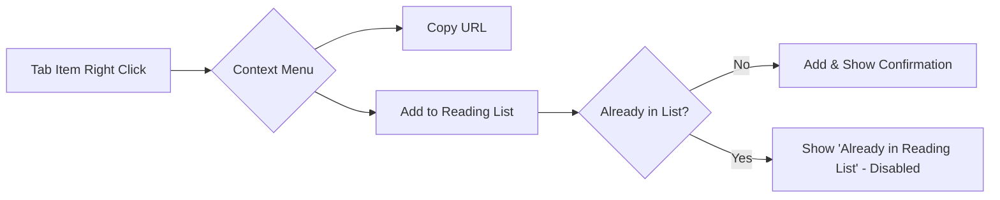

# Reading List Support PRD

| Attribute | Details |
| :--- | :--- |
| **Version** | v1.3 |
| **Status** | Draft |
| **Author** | Antigravity Agent |
| **Reviewers** | @Tai-ch0802 |
| **Issue** | [#49](https://github.com/Tai-ch0802/arc-like-chrome-extension/issues/49) |
| **Created** | 2026-02-02 |
| **Last Updated** | 2026-02-02 |

## 1. Introduction

### 1.1 Problem Statement

目前 Chrome 原生的 Reading List 功能位於側邊面板，使用者必須切換至 Chrome 的 Reading List 面板才能存取其閱讀清單。這與本擴充功能的核心價值——提供統一的側邊欄管理體驗——相違背。

使用者反映 (Issue #49)：
> "Generally, the current Google Chrome UI for the reading list is substandard. Existing Chrome Extensions make it easy to add to the list, but not to view it."

### 1.2 Goals & Objectives

*   **G-01**: 在側邊欄整合 Chrome Reading List，讓使用者無需切換面板即可存取閱讀清單
*   **G-02**: 提供完整的 CRUD 操作 (顯示、新增、刪除、標記已讀/未讀)
*   **G-03**: 優化工作流程：從分頁右鍵選單快速加入閱讀清單
*   **G-04**: 自動分組：從閱讀清單開啟的分頁自動歸類
*   **G-05**: RSS 訂閱整合：自動化將訂閱內容加入閱讀清單

### 1.3 Success Metrics (KPIs)

| Metric | Target |
|--------|--------|
| 功能可用性 | Reading List API 成功整合，無 console 錯誤 |
| UI 一致性 | 與現有分頁/書籤區塊風格統一 |
| 使用者測試 | 核心操作 (新增、刪除、標記已讀) 可在 2 clicks 內完成 |

## 2. User Stories

| ID | As a (Role) | I want to (Action) | So that (Benefit) | Priority |
| :--- | :--- | :--- | :--- | :--- |
| US-01 | 一般使用者 | 在側邊欄看到我的閱讀清單 | 我可以快速瀏覽待讀文章 | **High** |
| US-02 | 一般使用者 | 點擊閱讀清單項目開啟新分頁 | 我可以閱讀該文章 | **High** |
| US-03 | 一般使用者 | 在分頁右鍵選單加入閱讀清單 | 快速收藏目前瀏覽的頁面 | **High** |
| US-04 | 一般使用者 | 將閱讀清單項目標記為已讀/未讀 | 追蹤我的閱讀進度 | **Medium** |
| US-05 | 一般使用者 | 刪除閱讀清單中的項目 | 清理不再需要的文章 | **Medium** |
| US-06 | 一般使用者 | 從閱讀清單開啟的分頁自動分組 | 區分閱讀來源，保持分頁整潔 | **Medium** |
| US-07 | 一般使用者 | 可展開/收合閱讀清單區塊 | 節省畫面空間 | **Low** |
| US-08 | 一般使用者 | 在設定中停用閱讀清單功能 | 如果不使用此功能可隱藏 | **Low** |
| US-09 | 一般使用者 | 訂閱 RSS 並自動加入閱讀清單 | 自動追蹤感興趣的網站更新 | **Medium** |
| US-10 | 一般使用者 | 設定 RSS 訂閱的更新間隔 | 控制閱讀清單的更新頻率 | **Low** |

## 3. Functional Requirements

### 3.1 Reading List Section (閱讀清單區塊)

| ID | Requirement |
|----|-------------|
| **FR-01** | 系統必須在側邊欄顯示一個獨立的「閱讀清單」區塊，位於書籤區塊之後 |
| **FR-02** | 區塊標題必須顯示「Reading List」，並提供對應的 i18n 翻譯 (至少支援 en, zh-TW, ja) |
| **FR-03** | 區塊必須可展開/收合，預設為展開狀態 |
| **FR-04** | 系統必須顯示所有閱讀清單項目，包含標題、網址與已讀狀態 |
| **FR-05** | 已讀項目必須有視覺區分 (如：較淡的文字顏色或刪除線) |

### 3.2 Reading List Item Actions (項目操作)

| ID | Requirement |
|----|-------------|
| **FR-06** | 點擊項目時，系統必須開啟新分頁並導向該 URL |
| **FR-07** | 開啟的分頁必須自動加入名為「來自 閱讀清單」的分頁群組，群組名稱須有對應的 i18n 翻譯 |
| **FR-08** | 若「來自 閱讀清單」群組不存在，系統必須自動建立 |
| **FR-09** | 項目必須提供「標記為已讀」/「標記為未讀」的切換操作。當 FR-06 的行為觸發時，系統必須自動將該項目標記為已讀 |
| **FR-10** | 項目必須提供「刪除」操作 |
| **FR-10a** | 當項目為已讀狀態且存在超過三天時，系統必須顯示提示 label `viewed {count} days ago`，引導使用者自行刪除 |

### 3.3 Add to Reading List (加入閱讀清單)

| ID | Requirement |
|----|-------------|
| **FR-11** | 分頁項目的右鍵選單必須包含「加入到閱讀清單」選項 |
| **FR-12** | 點擊選項後，系統必須將目前分頁的 URL 與標題加入閱讀清單 |
| **FR-13** | 加入成功後必須顯示視覺回饋 (如：提示文字變色) |
| **FR-14** | 若 URL 已存在於閱讀清單，選項必須顯示為禁用狀態，文案顯示「已在閱讀清單中」 |

### 3.4 Settings (設定)

| ID | Requirement |
|----|-------------|
| **FR-15** | 設定面板必須提供「顯示閱讀清單」的開關選項 |
| **FR-16** | 預設值必須為「啟用」 |
| **FR-17** | 當設定為「停用」時，閱讀清單區塊不應渲染於 DOM |

### 3.5 RSS Subscription (RSS 訂閱)

| ID | Requirement |
|----|-------------|
| **FR-20** | 設定面板必須提供「RSS 訂閱」管理區塊 |
| **FR-21** | 使用者必須可以新增 RSS 訂閱連結 |
| **FR-22** | 每個訂閱項目必須可以設定更新間隔，選項為：`1h`, `3h`, `8h`, `12h`, `24h` |
| **FR-23** | 系統必須依據設定的間隔自動抓取 RSS Feed，並將新項目加入閱讀清單 |
| **FR-24** | 使用者必須可以刪除已訂閱的 RSS 連結 |
| **FR-25** | 使用者必須可以暫停/恢復個別 RSS 訂閱的自動抓取 |

### 3.6 Real-time Updates (即時更新)

| ID | Requirement |
|----|-------------|
| **FR-18** | 當 Reading List 發生變更 (新增/刪除/更新) 時，系統必須即時更新 UI |
| **FR-19** | 必須監聽 `chrome.readingList.onEntryAdded`, `onEntryRemoved`, `onEntryUpdated` 事件 |

## 4. Acceptance Criteria

> **[Critical]** 每個 Functional Requirement 必須有對應的 Acceptance Criteria，使用 Given-When-Then 格式。

### AC for FR-01, FR-02 (Reading List Section Rendering)
```gherkin
Given 使用者已開啟側邊欄
And 閱讀清單功能已啟用
When 側邊欄完成載入
Then 應顯示「Reading List」區塊
And 區塊應位於書籤區塊之後
```

### AC for FR-04, FR-05 (Reading List Items Display)
```gherkin
Given 使用者有 3 個閱讀清單項目 (2 未讀, 1 已讀)
When 側邊欄完成載入
Then 應顯示 3 個項目
And 已讀項目應有視覺區分 (opacity 降低或添加 .read 類別)
```

### AC for FR-06, FR-07, FR-08 (Open Reading List Item)
```gherkin
Given 側邊欄顯示閱讀清單項目
When 使用者點擊項目
Then 系統應開啟新分頁並導向該項目的 URL
And 新分頁應被加入「來自 閱讀清單」群組
```

```gherkin
Given 「來自 閱讀清單」群組不存在
When 使用者點擊閱讀清單項目
Then 系統應開啟新分頁並導向該項目的 URL
And 系統應以該分頁建立「來自 閱讀清單」群組
```

### AC for FR-09 (Toggle Read Status & Auto-mark)
```gherkin
Given 側邊欄顯示一個未讀項目
When 使用者點擊「標記為已讀」按鈕
Then 項目的 hasBeenRead 狀態應更新為 true
And UI 應即時反映已讀樣式
```

```gherkin
Given 側邊欄顯示一個未讀項目
When 使用者點擊該項目開啟新分頁
Then 項目的 hasBeenRead 狀態應自動更新為 true
And UI 應即時反映已讀樣式
```

### AC for FR-10 (Delete Item)
```gherkin
Given 側邊欄顯示閱讀清單項目
When 使用者點擊「刪除」按鈕
Then 項目應從 Chrome Reading List 中移除
And 項目應從 UI 中消失
```

### AC for FR-10a (Read Items Age Label)
```gherkin
Given 閱讀清單中有一個已讀項目
And 該項目的 lastUpdateTime 距今已超過 3 天
When 系統執行定期提示檢查
Then 該項目應顯示 label 標籤「viewed {count} days ago」
And label 應顯示正確的天數
```

```gherkin
Given 閱讀清單中有一個已讀項目
And 該項目的 lastUpdateTime 距今為 5 天
When 系統渲染該項目
Then 應顯示「viewed 5 days ago」label
```

```gherkin
Given 閱讀清單中有一個已讀項目
And 該項目的 lastUpdateTime 距今未超過 3 天
When 系統渲染該項目
Then 不應顯示天數 label
```

### AC for FR-11, FR-12, FR-13 (Add to Reading List from Context Menu)
```gherkin
Given 使用者在分頁項目上右鍵點擊
When 右鍵選單出現
Then 應包含「加入到閱讀清單」選項
```

```gherkin
Given 使用者看到「加入到閱讀清單」選項
When 使用者點擊該選項
Then 分頁的 URL 與標題應被加入 Chrome Reading List
And 選項文字應顯示確認訊息 (如：已加入)
```

### AC for FR-14 (Duplicate Prevention)
```gherkin
Given 分頁的 URL 已存在於閱讀清單
When 使用者在該分頁項目上右鍵點擊
Then 「加入到閱讀清單」選項應顯示為禁用狀態
And 文案應顯示「已在閱讀清單中」
```

### AC for FR-15, FR-16, FR-17 (Settings Toggle)
```gherkin
Given 使用者開啟設定面板
When 檢視閱讀清單設定
Then 應顯示「顯示閱讀清單」開關
And 預設值應為「啟用」
```

```gherkin
Given 使用者將「顯示閱讀清單」設為停用
When 返回側邊欄主畫面
Then 閱讀清單區塊不應出現
```

### AC for FR-18, FR-19 (Real-time Updates)
```gherkin
Given 使用者在 Chrome 原生 Reading List 面板新增項目
When 事件傳遞至擴充功能
Then 側邊欄的閱讀清單區塊應即時顯示新項目
```

### AC for FR-20, FR-21, FR-22 (RSS Subscription Management)
```gherkin
Given 使用者開啟設定面板
When 檢視 RSS 訂閱區塊
Then 應顯示訂閱管理介面
And 應包含「新增訂閱」按鈕
```

```gherkin
Given 使用者點擊「新增訂閱」按鈕
When 輸入有效的 RSS 連結並確認
Then 訂閱應被儲存
And 訂閱應顯示在訂閱清單中
And 預設更新間隔應為 24h
```

```gherkin
Given 使用者已有一個 RSS 訂閱
When 使用者修改更新間隔為 1h
Then 系統應儲存新的間隔設定
And 下次更新應依據新間隔執行
```

### AC for FR-23 (RSS Auto-fetch)
```gherkin
Given 使用者已訂閱一個 RSS Feed
And 更新間隔設定為 1h
When 1 小時後 RSS Feed 有新文章
Then 系統應自動將新文章加入閱讀清單
And 文章標題與 URL 應正確對應 RSS 項目
```

```gherkin
Given 使用者已訂閱一個 RSS Feed
When RSS Feed 中的文章 URL 已存在於閱讀清單
Then 系統不應重複加入該文章
```

### AC for FR-24 (Delete RSS Subscription)
```gherkin
Given 使用者已有一個 RSS 訂閱
When 使用者點擊該訂閱的「刪除」按鈕
Then 訂閱應從設定中移除
And 訂閱不應再執行自動抓取
```

### AC for FR-25 (Pause/Resume RSS Subscription)
```gherkin
Given 使用者已有一個啟用中的 RSS 訂閱
When 使用者點擊「暫停」按鈕
Then 訂閱狀態應變更為暫停
And 系統不應執行該訂閱的自動抓取
```

```gherkin
Given 使用者已有一個暫停中的 RSS 訂閱
When 使用者點擊「恢復」按鈕
Then 訂閱狀態應變更為啟用
And 系統應依據設定間隔執行自動抓取
```

## 5. User Experience (UI/UX)

### 5.1 Side Panel Layout

```
┌─────────────────────────────────┐
│  [Search Box]        [Settings] │
├─────────────────────────────────┤
│  ▼ Tabs                         │
│    • Tab 1                      │
│    • Tab 2                      │
├─────────────────────────────────┤
│  ▼ Bookmarks                    │
│    📁 Folder 1                  │
│    🔖 Bookmark 1                │
├─────────────────────────────────┤
│  ▼ Reading List          [NEW!] │  <-- 新增區塊
│    ○ Article 1 (unread)         │
│    ● Article 2 (read)           │
└─────────────────────────────────┘
```

### 5.2 Reading List Item

```
┌──────────────────────────────────────────────┐
│ [Favicon] Article Title           [●][✖]    │
│           example.com                        │
└──────────────────────────────────────────────┘
        │                            │   │
        └───────── 點擊開啟          │   └── 刪除
                                     └────── 切換已讀狀態
```

### 5.3 Context Menu Extension



### 5.4 RSS Subscription Settings

```
┌─────────────────────────────────────────────┐
│  RSS Subscriptions                          │
├─────────────────────────────────────────────┤
│  [+ Add Subscription]                       │
├─────────────────────────────────────────────┤
│  📰 Example Blog                            │
│     https://example.com/rss                 │
│     Interval: [1h ▼]  [⏸ Pause] [✖ Delete] │
├─────────────────────────────────────────────┤
│  📰 Tech News                               │
│     https://technews.com/feed               │
│     Interval: [24h ▼] [▶ Resume] [✖ Delete] │
└─────────────────────────────────────────────┘
```

## 6. Non-Functional Requirements

| Category | Requirement |
|----------|-------------|
| **Security** | 僅使用 `chrome.readingList` API，不儲存敏感資料於 extension storage |
| **Performance** | 初次載入閱讀清單應在 **100ms 內**完成 (假設 < 100 items) |
| **Compatibility** | 需要 Chrome 114+ (readingList API 最低版本要求) |
| **Accessibility** | 所有互動元素必須可透過鍵盤導航 (Tab, Enter, Space) |
| **i18n** | 所有 UI 文字必須支援多語系 (至少 en, zh-TW, ja) |

## 7. Out of Scope

以下功能**不在本次開發範圍**：

*   ❌ 閱讀清單項目的拖曳排序 (API 不支援自訂順序)
*   ❌ 閱讀清單的搜尋功能 (可作為未來增強)
*   ❌ 與書籤的雙向同步
*   ❌ 離線閱讀模式

## 8. Analytics & Tracking

本擴充功能不收集使用者行為數據，因此無 Analytics 埋點需求。

---

## Revision History

| Version | Date | Author | Changes |
|---------|------|--------|---------|
| v1.0 | 2026-02-02 | Antigravity Agent | Initial draft |
| v1.1 | 2026-02-02 | Antigravity Agent | 依據 User Review 修訂：調整區塊位置至書籤之後、新增 i18n 需求、自動標記已讀、自動刪除過期項目、新增 RSS 訂閱功能 |
| v1.3 | 2026-02-02 | Antigravity Agent | 將 FR-10a 從「自動刪除」改為「顯示 label 引導刪除」，並更新對應 AC |
