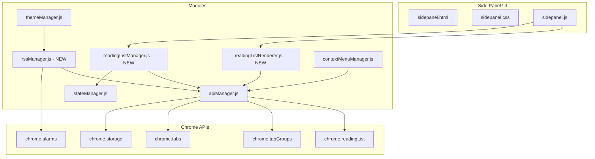
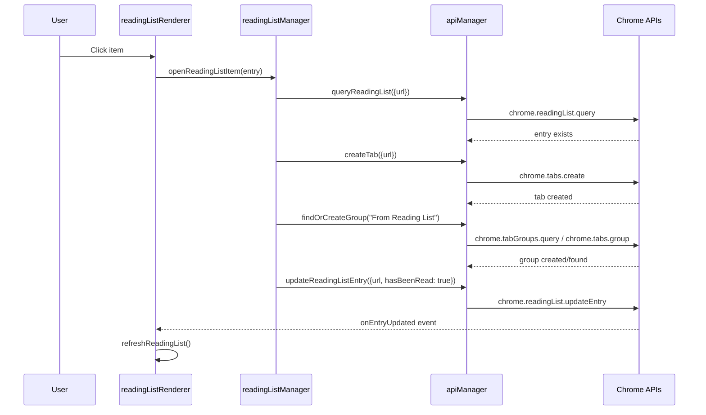
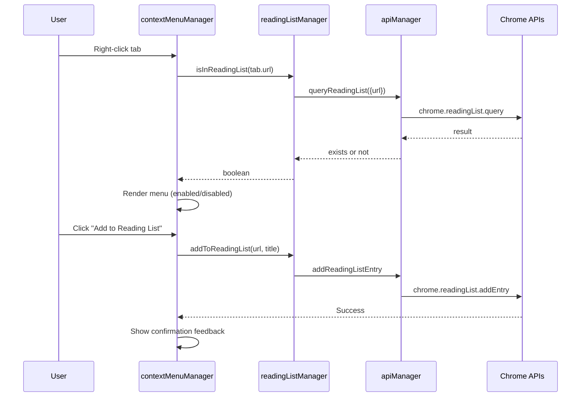

# Reading List Support - System Analysis Document

| Attribute | Details |
| :--- | :--- |
| **Version** | v1.2 |
| **Status** | Draft |
| **Author** | Antigravity Agent |
| **Related PRD** | [PRD_spec.md](./PRD_spec.md) |
| **PRD Version** | v1.3 |
| **Created** | 2026-02-02 |
| **Last Updated** | 2026-02-03 |

## 1. Overview

### 1.1 Scope

本文件涵蓋 Reading List 功能的技術設計，包含：
- 新增模組設計
- Chrome Reading List API 封裝
- UI 渲染邏輯
- RSS 訂閱管理
- Settings 介面擴充

**不包含範圍：**
- 閱讀清單項目拖曳排序 (API 不支援)
- 閱讀清單搜尋功能

### 1.2 Architecture Diagram



## 2. Requirement Traceability

| Req ID | PRD Section | SA Section | Implementation File | Test File |
|--------|-------------|------------|---------------------|-----------|
| FR-01 | 3.1 | 3.1 | `sidepanel.html`, `readingListRenderer.js` | `reading_list.test.js` |
| FR-02 | 3.1 | 3.1, 6.1 | `readingListRenderer.js`, `_locales/*/messages.json` | `reading_list.test.js` |
| FR-03 | 3.1 | 3.1 | `readingListRenderer.js` | `reading_list.test.js` |
| FR-04 | 3.1 | 3.1, 4.1 | `readingListRenderer.js` | `reading_list.test.js` |
| FR-05 | 3.1 | 3.1, 5.1 | `readingListRenderer.js`, `sidepanel.css` | `reading_list.test.js` |
| FR-06 | 3.2 | 3.2 | `readingListManager.js` | `reading_list.test.js` |
| FR-07 | 3.2 | 3.2 | `readingListManager.js` | `reading_list.test.js` |
| FR-08 | 3.2 | 3.2 | `readingListManager.js` | `reading_list.test.js` |
| FR-09 | 3.2 | 3.2 | `readingListManager.js` | `reading_list.test.js` |
| FR-10 | 3.2 | 3.2 | `readingListManager.js` | `reading_list.test.js` |
| FR-10a | 3.2 | 3.2, 4.1 | `readingListRenderer.js` | `reading_list.test.js` |
| FR-11 | 3.3 | 3.3 | `contextMenuManager.js` | `context_menu.test.js` |
| FR-12 | 3.3 | 3.3 | `contextMenuManager.js`, `apiManager.js` | `context_menu.test.js` |
| FR-13 | 3.3 | 3.3 | `contextMenuManager.js` | `context_menu.test.js` |
| FR-14 | 3.3 | 3.3 | `contextMenuManager.js` | `context_menu.test.js` |
| FR-15~17 | 3.4 | 3.4 | `themeManager.js`, `stateManager.js` | `settings_panel.test.js` |
| FR-18~19 | 3.6 | 3.5 | `sidepanel.js` | `reading_list.test.js` |
| FR-20~25 | 3.5 | 3.6 | `rssManager.js`, `themeManager.js` | `rss_subscription.test.js` |

## 3. Component Design

### 3.1 readingListRenderer.js (NEW)

**Description**: 負責 Reading List 區塊的 UI 渲染與用戶互動。

**Responsibilities**:
- 渲染閱讀清單區塊 (標題、展開/收合、批次操作按鈕)
- 渲染閱讀清單項目 (favicon, title, domain, 狀態按鈕, NEW 標籤)
- 計算並顯示 "viewed X days ago" label (≥1 天)
- 處理項目點擊事件 (觸發 `readingListManager`)
- 刪除確認對話框 (使用 `modalManager.showConfirm`)
- 鍵盤導航 (↑↓ 移動, Enter 開啟, Delete 刪除)
- 展開/收合狀態持久化 (`chrome.storage.sync`)
- 新項目標籤 (1 小時內新增 + 未讀 = 顯示 "NEW")
- 空狀態引導 (顯示 "右鍵點擊任何連結可將其加入")
- 批次刪除已讀項目 ("清除所有已讀" 按鈕)

**Dependencies**: `apiManager.js`, `readingListManager.js`, `modalManager.js`, `icons.js`

**Interfaces**:
```javascript
/**
 * Renders the reading list section into the container.
 * @param {ReadingListEntry[]} entries - The entries to render.
 * @param {HTMLElement} containerElement - The container element.
 * @param {Function} refreshCallback - Callback to refresh the list.
 */
export function renderReadingList(entries, containerElement, refreshCallback);

/**
 * Initializes event listeners for the reading list container.
 * @param {HTMLElement} containerElement - The container element.
 */
export function initReadingListListeners(containerElement);

/**
 * Resets reading list listeners. Useful for re-initialization or cleanup.
 */
export function resetReadingListListeners();
```

---

### 3.2 readingListManager.js (NEW)

**Description**: 封裝 Reading List 的業務邏輯，處理與 Chrome API 的互動。

**Responsibilities**:
- 開啟閱讀清單項目 (建立分頁 + 自動分組)
- 標記已讀/未讀
- 刪除項目（同時標記 hash 防止 RSS 重複加入）
- 批次刪除所有已讀項目
- 查詢 URL 是否已存在於閱讀清單

**Dependencies**: `apiManager.js`, `rssManager.js` (for `markAsFetched`)

**Interfaces**:
```javascript
/**
 * Opens a reading list item in a new tab and adds it to the "From Reading List" group.
 * @param {ReadingListEntry} entry - The reading list entry to open.
 * @returns {Promise<chrome.tabs.Tab>} The created tab.
 */
export async function openReadingListItem(entry);

/**
 * Toggles the read status of a reading list entry.
 * @param {string} url - The URL of the entry.
 * @param {boolean} hasBeenRead - The new read status.
 */
export async function toggleReadStatus(url, hasBeenRead);

/**
 * Deletes a reading list entry.
 * Also marks the URL as fetched to prevent RSS from re-adding it.
 * @param {string} url - The URL of the entry to delete.
 */
export async function deleteEntry(url);

/**
 * Deletes all read entries from the reading list.
 * Also marks each URL as fetched to prevent RSS from re-adding them.
 * @returns {Promise<number>} Number of deleted entries.
 */
export async function deleteAllRead();

/**
 * Checks if a URL exists in the reading list.
 * @param {string} url - The URL to check.
 * @returns {Promise<boolean>}
 */
export async function isInReadingList(url);

/**
 * Adds a URL to the reading list.
 * @param {string} url - The URL to add.
 * @param {string} title - The title of the entry.
 * @returns {Promise<void>}
 */
export async function addToReadingList(url, title);

/**
 * Gets all read entries from the reading list.
 * @returns {Promise<ReadingListEntry[]>}
 */
export async function getReadEntries();
```

---

### 3.3 contextMenuManager.js (MODIFY)

**Description**: 擴充現有右鍵選單，新增「加入到閱讀清單」選項。

**Changes**:
- 新增 `addToReadingListOption` 選項
- 在 `showContextMenu` 中查詢 URL 是否已在閱讀清單，決定啟用/禁用狀態

**New Interfaces**:
```javascript
/**
 * Shows context menu with reading list option.
 * @param {number} x - X coordinate.
 * @param {number} y - Y coordinate.
 * @param {Object} tab - Tab object.
 * @param {HTMLElement} originElement - Origin element.
 * @param {Object} options - Additional options.
 * @param {boolean} options.isInReadingList - Whether URL is already in reading list.
 */
export function showContextMenu(x, y, tab, originElement, options = {});
```

---

### 3.4 themeManager.js (MODIFY)

**Description**: 擴充設定對話框，新增 Reading List 開關與 RSS 訂閱管理。

**Changes**:
- 在 `buildSettingsDialogContent` 新增 "Reading List" 設定區塊
- 新增 "RSS Subscriptions" 設定區塊
- 新增對應的事件綁定

---

### 3.5 sidepanel.js (MODIFY)

**Description**: 整合 Reading List 模組至主協調器。

**Changes**:
- Import `readingListRenderer`, `readingListManager`
- 新增 `refreshReadingList()` 函式
- 新增 `chrome.readingList` 事件監聽器
- 在 `initialize()` 中初始化 Reading List

---

### 3.6 rssManager.js (NEW)

**Description**: 管理 RSS 訂閱的儲存、排程與抓取。

**Responsibilities**:
- 儲存/載入 RSS 訂閱設定
- 使用 `chrome.alarms` 排程抓取任務
- 解析 RSS Feed 並加入閱讀清單
- 防止重複加入已存在的 URL

**Dependencies**: `apiManager.js`, `readingListManager.js`

**Interfaces**:
```javascript
/**
 * @typedef {Object} RssSubscription
 * @property {string} id - Unique subscription ID.
 * @property {string} url - RSS feed URL.
 * @property {string} title - Feed title (auto-fetched or user-provided).
 * @property {'1h'|'3h'|'8h'|'12h'|'24h'} interval - Update interval.
 * @property {boolean} enabled - Whether subscription is active.
 * @property {number} lastFetched - Timestamp of last fetch.
 */

/**
 * Initializes RSS manager and sets up alarms.
 */
export async function initRssManager();

/**
 * Adds a new RSS subscription.
 * @param {string} feedUrl - The RSS feed URL.
 * @returns {Promise<RssSubscription>}
 */
export async function addSubscription(feedUrl);

/**
 * Removes an RSS subscription.
 * @param {string} subscriptionId - The subscription ID.
 */
export async function removeSubscription(subscriptionId);

/**
 * Updates subscription settings.
 * @param {string} subscriptionId - The subscription ID.
 * @param {Partial<RssSubscription>} updates - The updates to apply.
 */
export async function updateSubscription(subscriptionId, updates);

/**
 * Gets all subscriptions.
 * @returns {Promise<RssSubscription[]>}
 */
export async function getSubscriptions();

/**
 * Manually triggers a fetch for a subscription.
 * @param {string} subscriptionId - The subscription ID.
 */
export async function fetchNow(subscriptionId);

/**
 * Marks a URL as fetched to prevent RSS from re-adding it.
 * Called by readingListManager when user manually deletes an entry.
 * @param {string} url - The URL to mark as fetched.
 */
export async function markAsFetched(url);
```

## 4. Data Design

### 4.1 Data Models

#### ReadingListEntry (Chrome API)
```typescript
// Provided by chrome.readingList API
interface ReadingListEntry {
  url: string;
  title: string;
  hasBeenRead: boolean;
  creationTime: number;      // ms since epoch
  lastUpdateTime: number;    // ms since epoch
}
```

#### RssSubscription (Custom Storage - Compact Format)

為符合 `chrome.storage.sync` 配額限制 (QUOTA_BYTES_PER_ITEM = 8,192 bytes)，採用緊湊的 pipe-delimiter 格式：

```json
// Stored in chrome.storage.sync under key "rssSubscriptions"
// Format: "id | url | title | interval | enabled | lastFetched"
// Note: Original data containing "|" must be escaped as "\\|"
{
  "rssSubscriptions": [
    "rss_abc123|https://example.com/feed.xml|Example Blog|24h|1|1706860800000"
  ]
}
```

**欄位說明：**
| Index | Field | Type | Description |
|-------|-------|------|-------------|
| 0 | `id` | string | 唯一識別碼 (短 ID，如 `rss_abc123`) |
| 1 | `url` | string | RSS Feed URL |
| 2 | `title` | string | Feed 標題 (需 escape `\|`) |
| 3 | `interval` | enum | `1h`, `3h`, `8h`, `12h`, `24h` |
| 4 | `enabled` | boolean | `1` = true, `0` = false |
| 5 | `lastFetched` | number | Unix timestamp (ms) |

**解析/序列化工具函式：**
```javascript
// rssManager.js
const DELIMITER = '|';
const ESCAPE_CHAR = '\\|';

function serializeSubscription(sub) {
  const escaped = (str) => str.replace(/\|/g, ESCAPE_CHAR);
  return [
    sub.id,
    escaped(sub.url),
    escaped(sub.title),
    sub.interval,
    sub.enabled ? '1' : '0',
    sub.lastFetched
  ].join(DELIMITER);
}

function parseSubscription(str) {
  const parts = str.split(/(?<!\\)\|/); // Split on unescaped |
  const unescape = (s) => s.replace(/\\\|/g, '|');
  return {
    id: parts[0],
    url: unescape(parts[1]),
    title: unescape(parts[2]),
    interval: parts[3],
    enabled: parts[4] === '1',
    lastFetched: parseInt(parts[5], 10)
  };
}
```

#### ReadingListSettings (Custom Storage)
```json
// Stored in chrome.storage.sync under key "readingListSettings"
{
  "readingListSettings": {
    "showReadingList": true
  }
}
```

### 4.2 Storage Strategy

> [!IMPORTANT]
> **chrome.storage.sync 配額限制：**
> - `QUOTA_BYTES`: 102,400 bytes (總容量)
> - `QUOTA_BYTES_PER_ITEM`: 8,192 bytes (單一 key 上限)
> - `MAX_ITEMS`: 512 個 key
> - `MAX_WRITE_OPERATIONS_PER_HOUR`: 1,800 次/小時
>
> 參考：[Chrome Storage API 文件](https://developer.chrome.com/docs/extensions/reference/api/storage?hl=zh-tw#property-sync)

| Data | Storage Area | Reason | Quota Consideration |
|------|--------------|--------|---------------------|
| `readingListSettings` | `chrome.storage.sync` | 跨裝置同步使用者偏好 | ~50 bytes (極小) |
| `rssSubscriptions` | `chrome.storage.sync` | 跨裝置同步訂閱設定 | 採用緊湊格式，每筆約 100-200 bytes |
| Reading List 項目 | Chrome 內建 | 由 `chrome.readingList` API 管理 | N/A (Chrome 自行管理) |

**容量估算：**
- 假設每個 RSS 訂閱約 150 bytes (緊湊格式)
- `QUOTA_BYTES_PER_ITEM` = 8,192 bytes → 約可儲存 **50+ 筆訂閱**
- 若需超過此限制，可採用 **分片儲存** (`rssSubscriptions_0`, `rssSubscriptions_1`, ...)，但目前暫不實作

## 5. Interface Design (API)

### 5.1 apiManager.js Extensions

新增 Reading List API 封裝：

```javascript
// --- Chrome Reading List API Wrappers ---

/**
 * Queries the reading list.
 * @param {QueryInfo} info - Query parameters.
 * @returns {Promise<ReadingListEntry[]>}
 */
export const queryReadingList = (info = {}) => chrome.readingList.query(info);

/**
 * Adds an entry to the reading list.
 * @param {AddEntryOptions} options
 */
export const addReadingListEntry = (options) => chrome.readingList.addEntry(options);

/**
 * Removes an entry from the reading list.
 * @param {RemoveOptions} options
 */
export const removeReadingListEntry = (options) => chrome.readingList.removeEntry(options);

/**
 * Updates a reading list entry.
 * @param {UpdateEntryOptions} options
 */
export const updateReadingListEntry = (options) => chrome.readingList.updateEntry(options);
```

### 5.2 Group Name Constant

定義群組名稱常數 (支援 i18n):

```javascript
// readingListManager.js
const READING_LIST_GROUP_NAME = api.getMessage('readingListGroupName') || 'From Reading List';
```

## 6. I18n Keys (NEW)

需新增至 `_locales/*/messages.json` 的 key：

| Key | EN | ZH-TW | JA |
|-----|----|----|---|
| `readingListHeader` | Reading List | 閱讀清單 | リーディングリスト |
| `readingListGroupName` | From Reading List | 來自 閱讀清單 | 閱讀リストから |
| `addToReadingList` | Add to Reading List | 加入到閱讀清單 | 閱讀リストに追加 |
| `alreadyInReadingList` | Already in Reading List | 已在閱讀清單中 | 閱讀リストにあります |
| `markAsRead` | Mark as Read | 標記為已讀 | 既読にする |
| `markAsUnread` | Mark as Unread | 標記為未讀 | 未読にする |
| `deleteReadingListItem` | Remove from Reading List | 從閱讀清單移除 | 閱讀リストから削除 |
| `viewedDaysAgo` | Viewed $COUNT$ days ago | 已閱讀 $COUNT$ 天前 | $COUNT$ 日前に閲覧 |
| `readingListSettingsHeader` | Reading List | 閱讀清單 | リーディングリスト |
| `showReadingListLabel` | Show Reading List | 顯示閱讀清單 | 閱讀リストを表示 |
| `rssSubscriptionHeader` | RSS Subscriptions | RSS 訂閱 | RSSフィード |
| `addRssSubscription` | Add Subscription | 新增訂閱 | 購読を追加 |
| `rssIntervalLabel` | Update Interval | 更新間隔 | 更新間隔 |
| `rssPauseButton` | Pause | 暫停 | 一時停止 |
| `rssResumeButton` | Resume | 恢復 | 再開 |
| `rssDeleteButton` | Remove | 刪除 | 削除 |
| `confirmDeleteReadingListItem` | Remove this item from reading list? | 確定要從閱讀清單移除此項目嗎？ | この項目を削除しますか？ |
| `confirmClearAllRead` | Remove all read items? | 確定要清除所有已讀項目嗎？ | 既読の項目をすべて削除しますか？ |
| `newItemBadge` | NEW | 新 | 新着 |
| `readingListEmptyGuidance` | Right-click any link to add it here | 右鍵點擊任何連結可將其加入 | リンクを右クリックして追加 |
| `clearAllRead` | Clear all read | 清除已讀 | 既読を削除 |

## 7. Sequence Flows

### 7.1 Open Reading List Item



### 7.2 Add to Reading List from Context Menu



## 8. Testing Strategy

### 8.1 Test Impact Analysis

| Test File | Impact | Action Required |
|-----------|--------|-----------------|
| `settings_panel.test.js` | New collapsible sections | Add tests for Reading List & RSS sections |
| - | New feature | Create `reading_list.test.js` |
| - | New feature | Create `rss_subscription.test.js` |
| - | New feature | Create `context_menu_reading_list.test.js` |

### 8.2 Verification Plan

#### Automated Tests (Puppeteer E2E)

**Test File: `reading_list.test.js`**

| Test Case | Description |
|-----------|-------------|
| `should display reading list section after bookmarks` | 確認閱讀清單區塊在書籤之後 |
| `should show reading list items with correct status` | 確認項目顯示正確的已讀/未讀狀態 |
| `should open item in new tab and mark as read` | 點擊項目開啟分頁並自動標記已讀 |
| `should toggle read status when clicking button` | 切換已讀狀態按鈕功能正常 |
| `should delete item when clicking delete button` | 刪除按鈕功能正常 |
| `should show "viewed X days ago" for old read items` | 超過 3 天的已讀項目顯示 label |

**Test File: `context_menu_reading_list.test.js`**

| Test Case | Description |
|-----------|-------------|
| `should show "Add to Reading List" in context menu` | 右鍵選單包含「加入到閱讀清單」 |
| `should disable option when URL already in list` | URL 已存在時選項禁用 |
| `should add to reading list on click` | 點擊後成功加入閱讀清單 |

**Command to Run Tests:**
```bash
npm test -- --testPathPattern="reading_list|context_menu_reading_list"
```

#### Manual Verification

1. **閱讀清單區塊顯示**
   - 載入擴充功能側邊欄
   - 確認「Reading List」區塊顯示在書籤區塊之後
   - 確認區塊可展開/收合

2. **項目操作**
   - 在 Chrome Reading List 新增測試項目
   - 確認側邊欄即時顯示新項目
   - 點擊項目，確認開啟新分頁並加入「來自 閱讀清單」群組
   - 確認項目自動標記為已讀

3. **右鍵選單**
   - 右鍵點擊分頁項目
   - 確認出現「加入到閱讀清單」選項
   - 對已在清單中的分頁，確認選項顯示禁用

4. **設定面板**
   - 開啟設定面板
   - 確認有「顯示閱讀清單」開關
   - 關閉開關，確認閱讀清單區塊消失

5. **RSS 訂閱** (如時間允許)
   - 開啟設定面板的 RSS 區塊
   - 新增測試 RSS 連結
   - 確認可設定更新間隔
   - 確認可暫停/恢復訂閱

## 9. Security & Performance

### 9.1 Security Considerations

- **XSS Prevention**: 所有用戶輸入 (RSS URL, 標題) 必須經過 `escapeHtml()` 處理
- **URL Validation**: RSS URL 須驗證格式正確性
- **CORS**: RSS 抓取需考慮 CORS 限制，可能需透過 background script 處理

### 9.2 Performance Considerations

- **Debouncing**: Reading List 事件監聽使用 debounce 防止過度渲染
- **Lazy Rendering**: 僅渲染可見項目 (如項目超過 50 個)
- **Alarm Efficiency**: RSS 抓取使用 `chrome.alarms` 而非 `setInterval`，以節省背景資源

## 10. File Changes Summary

### New Files

| File | Description |
|------|-------------|
| `modules/readingListRenderer.js` | Reading List UI 渲染模組 |
| `modules/readingListManager.js` | Reading List 業務邏輯模組 |
| `modules/rssManager.js` | RSS 訂閱管理模組 |
| `usecase_tests/puppeteer_tests/reading_list.test.js` | E2E 測試 |
| `usecase_tests/puppeteer_tests/context_menu_reading_list.test.js` | Context Menu E2E 測試 |

### Modified Files

| File | Changes |
|------|---------|
| `manifest.json` | 新增 `readingList` 權限 |
| `sidepanel.html` | 新增 Reading List 區塊容器 |
| `sidepanel.css` | 新增 Reading List 樣式 |
| `sidepanel.js` | 整合 Reading List 模組 |
| `modules/apiManager.js` | 新增 Reading List API 封裝 |
| `modules/ui/contextMenuManager.js` | 新增「加入到閱讀清單」選項 |
| `modules/ui/themeManager.js` | 新增設定區塊 |
| `modules/icons.js` | 新增 Reading List 相關圖示 |
| `_locales/*/messages.json` | 新增 i18n 翻譯 (14 locales) |

---

## Revision History

| Version | Date | Author | Changes |
|---------|------|--------|---------|
| v1.0 | 2026-02-02 | Antigravity Agent | Initial draft |
| v1.1 | 2026-02-02 | Antigravity Agent | 依據 User Review 修訂：`rssSubscriptions` 改用 `chrome.storage.sync`，採用緊湊 pipe-delimiter 格式最小化資料量，新增配額限制說明 |
| v1.2 | 2026-02-03 | Antigravity Agent | UX 優化逆向更新：新增刪除確認對話框、鍵盤導航、展開/收合狀態持久化、NEW 標籤、空狀態引導、批次刪除已讀、`deleteAllRead()` API、`markAsFetched()` 導出防止 RSS 重複加入 |
