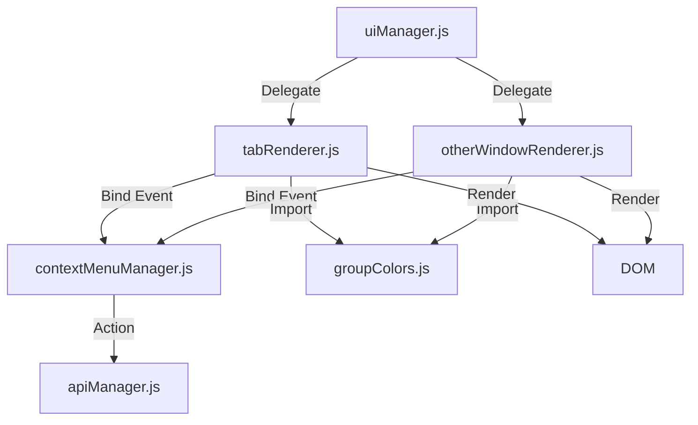
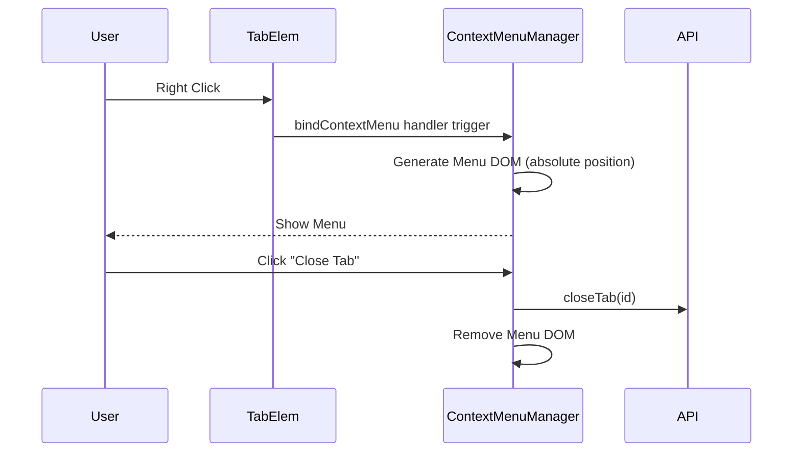

# [Fix] Code Refactoring: Tab Renderer & Context Menu System Design

| Attribute | Details |
| :--- | :--- |
| **Status** | Approved |
| **Author** | AntiGravity Agent |
| **Related PRD** | `./PRD_spec.md` |
| **Test Impact** | `perf_benchmark.test.js`, `perf_optimization.test.js` |

## 1. Overview
### 1.1 Scope
本重構將 `modules/ui/tabRenderer.js` 拆分為三個部分：
1.  `modules/ui/tabRenderer.js` (保留核心分頁列表與 Group 渲染)
2.  `modules/ui/otherWindowRenderer.js` (負責其他視窗列表渲染)
3.  `modules/ui/contextMenuManager.js` (負責所有右鍵選單邏輯)

### 1.2 Architecture Diagram


## 2. Component Design
### 2.1 Tab Renderer (`modules/ui/tabRenderer.js`)
*   **Responsibilities**: 專注於 Current Window 的 Tab 與 Tab Group 渲染。
*   **Keep**: `renderTabsAndGroups`, `createTabElement`.
*   **Remove**: `extract` 其他視窗的邏輯與 `showContextMenu` 實作。
*   **Change**: 在 `createTabElement` 中使用 `contextMenuManager.bindContextMenu` 取代原有的 inline event handler。

### 2.2 Other Window Renderer (`modules/ui/otherWindowRenderer.js`)
*   **New Module**: 
    *   目的：從 `tabRenderer` 分離出 "Other Windows" 的渲染邏輯，這部分 UI 結構與操作邏輯與主視窗不同 (e.g. 唯讀/切換)。
    *   Functions: `renderOtherWindowsSection`, `createOtherWindowTabElement`。

### 2.3 Context Menu Manager (`modules/ui/contextMenuManager.js`)
*   **New Module**:
    *   目的：集中管理右鍵選單的 UI 生成、定位與事件處理。原先放置於 `input` 目錄的考量是它處理輸入事件，但考量它主要產出 UI DOM，且與其他 renderer 緊密配合，故放置於 `modules/ui` 以保持目錄結構扁平一致。
    *   Functions:
        *   `bindContextMenu(element, data)`: 綁定事件。
        *   `showContextMenu(x, y, data)`: 顯示選單。
        *   `handleAction(action, context)`: 執行對應動作。

### 2.4 Group Colors (`modules/ui/groupColors.js`)
*   **New Module**:
    *   目的：集中管理 Tab Group 的顏色常數與相關工具函式，避免在多個 Renderer 重複定義。
    *   Exports:
        *   `GROUP_COLORS`: 群組顏色對應表 (grey, blue, red, yellow, green, pink, purple, cyan, orange)。
        *   `hexToRgba(hex, alpha)`: 將 HEX 顏色轉換為 RGBA 格式。

## 3. Data Design
### 3.1 Dependencies
*   `contextMenuManager` 需引用 `apiManager` 執行 `closeTab`, `addToGroup` 等動作。
*   `tabRenderer` 與 `otherWindowRenderer` 需引用 `groupColors` 取得 `GROUP_COLORS` 與 `hexToRgba`。
*   `uiManager` 作為 Facade，需匯出新的 Renderer 函式。

## 4. Interface Design (API)
### 4.1 Internal API
```javascript
// uiManager.js (Facade updates)
import * as oWindow from './ui/otherWindowRenderer.js';

export function renderOtherWindowsSection(...) {
    return oWindow.renderOtherWindowsSection(...);
}
```

```javascript
// contextMenuManager.js
/**
 * Bind context menu to a DOM element.
 * @param {HTMLElement} element 
 * @param {Object} contextData - { tabId, windowId, type: 'tab'|'group' }
 */
export function bindContextMenu(element, contextData) {
    element.addEventListener('contextmenu', (e) => {
        e.preventDefault();
        showContextMenu(e.clientX, e.clientY, contextData);
    });
}
```

## 5. Sequence Flows
### 5.1 Right Click Flow


## 6. Testing Strategy
### 6.1 Impact Analysis (Existing Tests)
調查發現以下測試文件直接依賴 `tabRenderer.js` 的內部實作，重構時必須同步更新：

1.  **Tests identifying specific modules**:
    *   `usecase_tests/puppeteer_tests/perf_benchmark.test.js`
    *   `usecase_tests/puppeteer_tests/perf_optimization.test.js`
    *   **Action**: 這些測試使用 `import('./modules/ui/tabRenderer.js')` 並呼叫 `renderOtherWindowsSection`。需修改為 import `uiManager.js` (Facade) 或新的 `otherWindowRenderer.js`。

2.  **DOM Selection Tests**:
    *   `usecase_tests/puppeteer_tests/other_windows.test.js`
    *   **Constraint**: 依賴 CSS Selectors `#other-windows-list`, `.window-folder`, `.folder-content`。
    *   **Action**: 重構必須保證 `renderOtherWindowsSection` 生成的 DOM 結構 ID 與 Class Name **完全不變**，以確保此 E2E 測試通過。

### 6.2 New Test Coverage
*   **Context Menu**: 驗證 Context Menu Manager 能正確處理 `closeTab`, `duplicate`, `addToGroup` 等事件，且在點擊外部時正確銷毀 DOM。

### 6.3 Regression
*   執行 `npm test`，確保上述修正後的測試全數通過。
