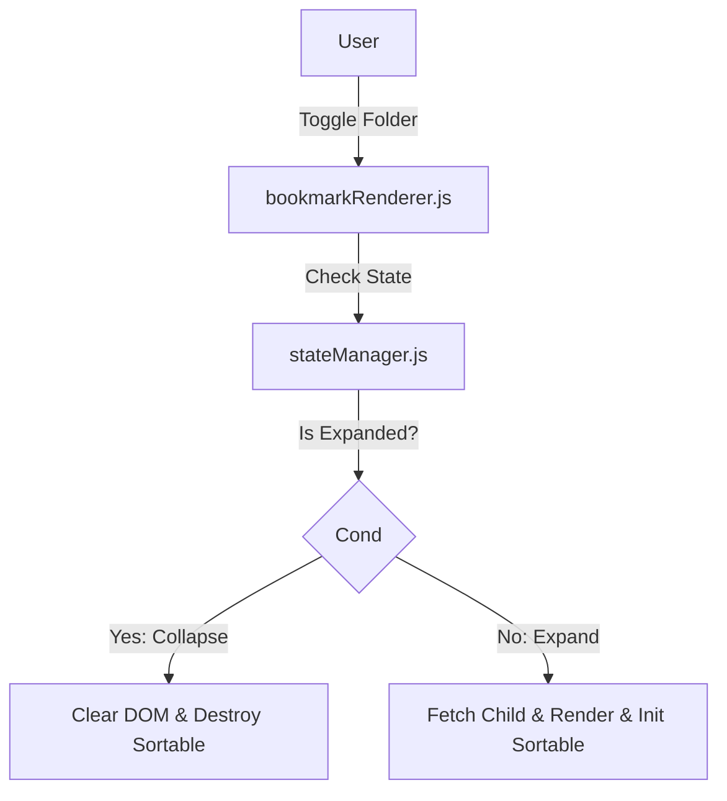
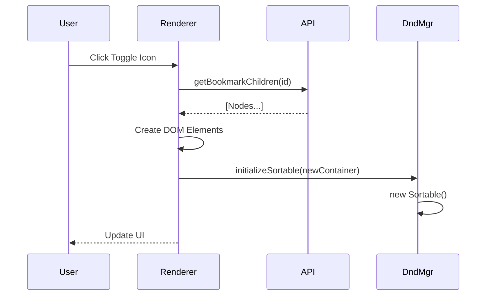

# [Fix] Virtual Scroll Drag & Drop Compatibility System Design

| Attribute | Details |
| :--- | :--- |
| **Status** | Approved (Reverse Engineered) |
| **Author** | AntiGravity Agent |
| **Related PRD** | `./PRD_spec.md` |

## 1. Overview
### 1.1 Scope
本方案為 "Plan G: Lazy Rendering"。涉及移除大量舊代碼與重構 `bookmarkRenderer.js`。

### 1.2 Architecture Diagram


## 2. Component Design
### 2.1 Bookmark Renderer (`bookmarkRenderer.js`)
*   **Functions**:
    *   `renderBookmarksLegacy()`: 恢復遞迴渲染邏輯。
    *   `toggleFolder()`: 控制 DOM 的生成與銷毀。
*   **Removal**: 移除 `renderBookmarksVirtual`, `createVirtualBookmarkItem`。

### 2.2 Drag & Drop Manager (`dragDropManager.js`)
*   **Functions**:
    *   `initializeSortableForContainer(element)`: 為動態生成的 `.folder-content` 初始化拖曳功能。

### 2.3 State Manager (`stateManager.js`)
*   **Cleanup**: 移除 `isVirtualScrolling` flag 及相關 getter/setter。

## 3. Data Design
### 3.1 DOM Structure
```html
<!-- Folder Structure -->
<div class="bookmark-item folder">
  <div class="folder-header">...</div>
  <div class="folder-content" data-parent-id="123">
     <!-- Children rendered here ONLY when expanded -->
  </div>
</div>
```

## 4. Interface Design (API)
### 4.1 Internal API
```javascript
// bookmarkRenderer.js
async function toggleFolder(folderId, element) {
  if (isExpanded) {
     element.innerHTML = ''; // Cleanup
  } else {
     const children = await api.getChildren(folderId);
     render(children, element);
     initSortable(element);
  }
}
```

## 5. Sequence Flows
### 5.1 Expand Folder


## 6. Security & Performance
*   **Memory**: 收合資料夾時必須銷毀 Sortable 實例與 DOM，避免 Memory Leak。
