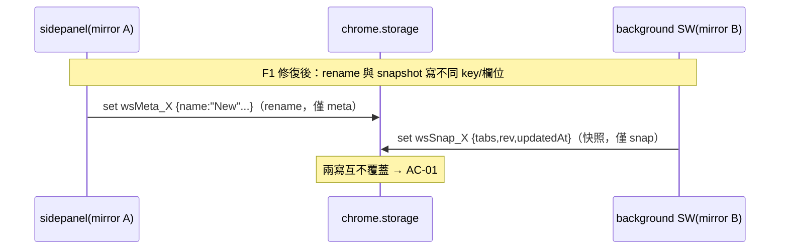

# [Fix/T2] Workspace 持久化與 Drive 同步互動重設計 — SA

| Attribute | Details |
| :--- | :--- |
| **Status** | Approved（同 PRD：#162 全修指示覆寫事前 gate） |
| **PRD** | `PRD_spec.md` v1.0 |
| **Version** | v1.0 (2026-06-10) |

## 1. Storage Schema Diff（v1 → v2）

### Before（v1）
```
chrome.storage.sync.workspaceMetadata   = { [id]: {id,name,color,icon,bookmarkFolderId,lastActiveAt,rev,updatedAt,syncEnabled} }
chrome.storage.local.workspaceSnapshots = { [id]: TabSnapshot[] }
chrome.storage.local.windowWorkspaceMap = { [windowId]: id }
chrome.storage.local.workspaces         = Phase-6 legacy（保留備援）
```

### After（v2）
```
chrome.storage.sync["wsMeta_"+id]  = { id, name, color, icon, bookmarkFolderId, syncEnabled, lastActiveAt }
chrome.storage.local["wsSnap_"+id] = { tabs: TabSnapshot[], rev, updatedAt }
chrome.storage.local.windowWorkspaceMap = key 不變，但**所有寫入改走 mutateWindowMap（delta + read→merge→write）**
chrome.storage.local.workspaces / workspaceSnapshots = legacy 保留備援（僅 sync 的 workspaceMetadata 遷移後刪除）
```

> **v1.0 → v1.1 修訂**：原設計「windowWorkspaceMap 接受全表寫入（綁定可自癒）」被
> E2E 直接證偽 —— `setActiveWorkspace` 改 in-memory map 後、persist 前的 await 空檔，
> 同 context 的 debounced `initWorkspaces()` 會把 module map 換成 storage 舊值，
> 隨後的全表 persist 把 `{}` 寫回 storage、綁定蒸發。修正：map 寫入一律
> `mutateWindowMap(mutator)` —— 讀 storage 現值 → 套 delta → 寫回，
> in-memory map 同步為合併結果；E2E 加入 `mapInStorage` 迴歸斷言。

**設計理由**：
1. per-id key → 不同 id 的寫入永不互踩（chrome.storage.set 以 key 為單位原子）；同 id 競態縮小為單一 hop 且各路徑寫的欄位不重疊（rename 寫 meta、快照寫 snap）。→ FR-01/AC-01/AC-02
2. rev/updatedAt 移入 local snap record → 快照路徑零 sync 寫入。lastActiveAt 留在 meta（只在使用者切換時變動）。auto-snapshot **不再** bump lastActiveAt（背景快照非使用者活動，不應擾動切換器排序）。→ FR-02/AC-05
3. ids 由 sync 區 `wsMeta_` prefix 掃描推導（sync 區小，get(null) 可行；local 嚴禁 get(null) — 自訂背景圖可達 MB）。

### 遷移（initWorkspaces 內，一次性）
1. 讀 sync get(null) → 無任何 `wsMeta_*` 且存在 legacy `workspaceMetadata` → 觸發遷移。
2. Phase-6 `workspaces` → 先按 v1 規則展開（沿用既有邏輯）。
3. 對每個 id 組 v2 record：meta（strip rev/updatedAt）＋ snap `{tabs, rev: meta.rev||1, updatedAt: meta.updatedAt||lastActiveAt||now}`。
4. 單一 `setStorageStrict('sync', allMetaKeys)` ＋ 單一 `setStorage('local', allSnapKeys)`（單次 set = 1 quota op）。
5. 成功後 `removeStorage('sync', 'workspaceMetadata')`（停止混版互寫）；local legacy 保留。
6. 失敗 → 保留 legacy、本次以 legacy 資料建 mirror，下次啟動重試（沿用 Phase-9 模式）。

## 2. Module Impact Map

| 模組 | 變更 |
|---|---|
| `modules/apiManager.js` | 新增 `removeStorage(area, keys)` |
| `modules/workspace/workspaceManager.js` | initWorkspaces v2 讀取＋遷移；`persistWorkspace(id)`/`persistSnapshotOnly(id)`/`persistMetaOnly(id)`/`removePersisted(id)` 取代全表 `persistWorkspaces()`；`applyRemoteWorkspace` 增 `keepLocalSnapshot`；`setActiveWorkspace` 單一綁定不變式；`matchWindowsToWorkspaces` 增 `margin`（預設 0.15） |
| `modules/workspace/workspaceLifecycle.js` | 無邏輯變更（margin 經 manager 預設值生效） |
| `modules/workspace/workspaceUI.js` | storage.onChanged 過濾改 prefix（`wsSnap_`/`wsMeta_`/`windowWorkspaceMap`） |
| `background.js` | `handleWorkspaceStorageChange` 改 per-key diff（id 取自 key 後綴；tombstone = sync key 移除且 oldValue.syncEnabled）；`engineWriteEcho` 值改 `{rev, updatedAt}`；`applyRemoteSnapshot` dep 以 `isWorkspaceBound` 分支傳 `keepLocalSnapshot` |
| `modules/sync/syncEngine.js` | 僅註解更新（update-local 的 live-bound 語意改由 dep 實現；engine 流程不變、無 SCHEMA_VERSION bump） |

## 3. 關鍵流程（Message/Data Flow）



**F3/F4（dep 層）**：`applyRemoteSnapshot(id, fileJson)` → `liveBound = isWorkspaceBound(id)` → echo.set(id, `{rev, updatedAt: effUpdatedAt}`) → `applyRemoteWorkspace(..., {keepLocalSnapshot: liveBound})`。liveBound 時保留本地 tabs、**採納遠端 rev/updatedAt**（排序權對齊：下一個本地快照 bump 到 remote+1，本地內容才合法推送 — 避免 rev 永遠落後導致內容永不上傳）。`restoreWorkspace` 路徑同樣分支（live-bound 下整顆套用本就會被下一次快照覆蓋，無意義）。

**F2**：`matchWindowsToWorkspaces(windows, candidates, {threshold=0.6, margin=0.15})` — 對每個視窗取 top-2 候選分數，`best - second < margin` 即放棄該視窗全部配對（兩個 1.0 並列 → 都不綁）。

## 4. Test Impact Analysis

| 測試 | 動作 |
|---|---|
| `unit_tests/workspaceMatching.test.mjs` | 增 margin 案例（AC-03：並列拒綁、領先足夠才綁、單一候選不受 margin 影響） |
| `unit_tests/workspacePersistence.test.mjs`（新） | jest.isolateModules 雙 module 實例 + fake chrome.storage：AC-01/02 競態、AC-04 keepLocalSnapshot、AC-05 sync 寫入計數=0、AC-06 v1→v2 遷移（含 Phase-6 legacy 與失敗重試路徑） |
| `unit_tests/workspaceGroups.test.mjs` | 不受影響（純函式未動） |
| `puppeteer_tests/happy_path_workspace_group_restore.test.js` | 應持續全綠（switchWorkspace 介面不變） |
| `puppeteer_tests/happy_path_drive_sync_section.test.js` | 應持續全綠（engine deps 介面不變） |

## 5. Traceability

| FR | 實作點 | 驗證 |
|---|---|---|
| FR-01 | workspaceManager per-id persist | AC-01/02 |
| FR-02 | persistSnapshotOnly + lastActiveAt 不動 | AC-05 |
| FR-03 | matchWindowsToWorkspaces margin | AC-03 |
| FR-04 | applyRemoteWorkspace keepLocalSnapshot | AC-04 |
| FR-05 | engineWriteEcho {rev,updatedAt} | persistence test |
| FR-06 | setActiveWorkspace 去重 | persistence test |
| FR-07 | initWorkspaces 遷移 | AC-06 |
